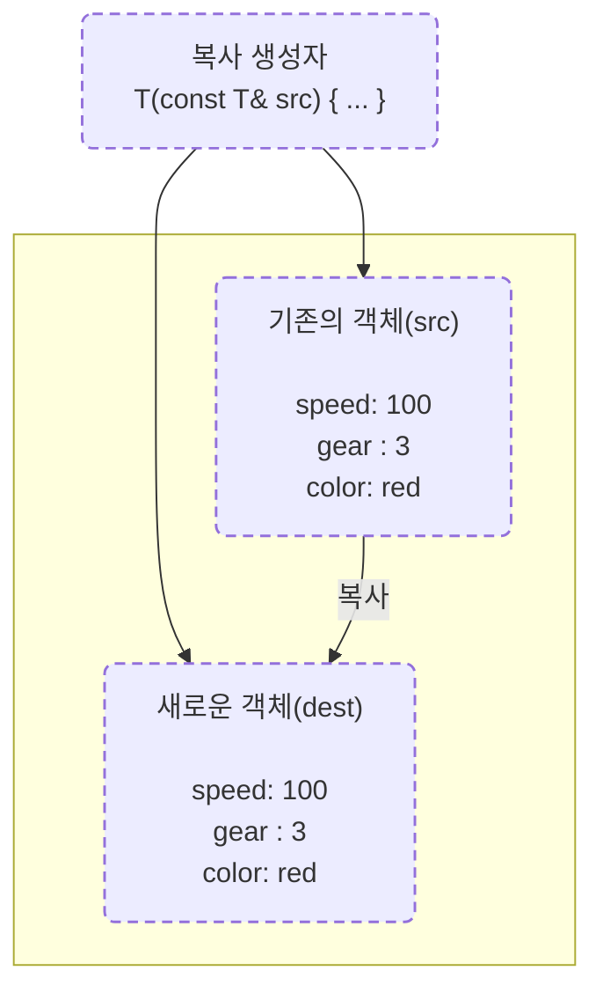

# 📚 C++ 복사 생성자(Copy Constructor) 
- 개념, 그림, 예제, 베스트프랙티스

복사 생성자는 **같은 클래스의 다른 객체로부터 새 객체를 초기화** 할 때 호출되는 *특별한 생성자* 입니다.

```cpp
class Sample {
public:
    Sample(const Sample& other);  // 복사 생성자
};
```

- “없던 객체를 **만드는**” 순간에 동작합니다. (복사 **대입**과 다름)
- 한 클래스에 **시그니처는 하나** 면 충분합니다: `T(const T&)`
- 값 전달/반환 시에도 호출될 수 있습니다(C++17부터는 최적화로 생략 가능).

---

## 🖨️ 그림으로 이해하기

### 1) 개념: 기존 객체를 **복사 생성자**가 찍어낸다


### 2) 동작 흐름(예: `Circle dest(src);`)
```
(1) Circle src(30);              ──▶ src.radius = 30

(2) Circle dest(src);            ──▶ dest 메모리 공간 할당

(3) 복사 생성자 호출:
    Circle::Circle(const Circle& c) {
        this->radius = c.radius; ──▶ dest.radius = 30
    }
```


```cpp
class Circle {
    int radius;
public:
    Circle(int r) : radius(r) {}
    Circle(const Circle& c) : radius(c.radius) {}
};
```

### 3) 얕은 복사 vs 깊은 복사 (포인터 보유 시)
```
얕은 복사(디폴트):                      깊은 복사(사용자 정의):
   dest.name ─┐                           dest.name ─▶ [새 버퍼 "Kitae"]
              └─▶ [버퍼 "Kitae"]                       
   src.name  ─┘                           src.name  ─▶ [버퍼 "Kitae"]

※ 얕은 복사에선 동일 버퍼를 가리켜서
   두 객체가 둘 다 delete[] 하면 '이중 해제' 발생!
```

---

## ✍️ 선언과 기본 예제

```cpp
class Sample {
public:
    Sample(const Sample& s); // 선언
};

Sample::Sample(const Sample& s) {
    // s의 상태를 이용해 자신(this)을 초기화
}
```

간단 예:
```cpp
#include <iostream>
class Circle {
    int radius = 1;
public:
    Circle() = default;
    Circle(int r) : radius(r) {}
    Circle(const Circle& c) {               // 복사 생성자
        std::cout << "Circle copy constructor\n";
        radius = c.radius;
    }
    double area() const { return 3.14 * radius * radius; }
};

int main() {
    Circle src(30);
    Circle dest(src);                        // 복사 생성자 호출
    std::cout << src.area()  << "\n";
    std::cout << dest.area() << "\n";
}
```

---

## ⚠️ 복사 생성자를 **정의하지 않으면** (얕은 복사 문제)

컴파일러는 멤버 단위 복사(얕은 복사)를 하는 **디폴트 복사 생성자** 를 만듭니다.  
멤버에 **소유 포인터** 가 있으면 매우 위험합니다.

```cpp
#include <cstring>

class Person {
    char* name = nullptr; // 힙 메모리 소유
    int id;
public:
    Person(const char* n, int id) : id(id) {
        size_t len = std::strlen(n);
        name = new char[len + 1];
        std::strcpy(name, n);
    }
    ~Person() { delete[] name; }

    // 복사 생성자 미정의 → 디폴트 얕은 복사
};

int main() {
    Person a("jhjeong", 1);
    Person b(a);       // name 포인터가 얕게 복사되어 둘 다 같은 버퍼를 가리킴
    // 두 객체가 파괴되면서 같은 버퍼를 두 번 delete[] → 런타임 에러 가능
}
```

---

## ✅ 깊은 복사(Deep Copy) 복사 생성자

소유 자원을 가진 타입은 **깊은 복사**를 구현해야 안전합니다.  
(아래는 복사 생성자 + 복사 대입 연산자까지 구현 — *Rule of Three*)

```cpp
#include <cstring>
#include <utility>
#include <iostream>

class Person {
    char* name = nullptr;
    int id = 0;

public:
    Person(const char* n, int id) : id(id) {
        size_t len = std::strlen(n);
        name = new char[len + 1];
        std::strcpy(name, n);
    }

    // 복사 생성자 (깊은 복사)
    Person(const Person& other) : id(other.id) {
        size_t len = std::strlen(other.name);
        name = new char[len + 1];
        std::strcpy(name, other.name);
        std::cout << "Person copy constructor\n";
    }

    // 복사 대입 연산자 (깊은 복사)
    Person& operator=(const Person& other) {
        if (this == &other) return *this;
        char* newbuf = nullptr;
        if (other.name) {
            size_t len = std::strlen(other.name);
            newbuf = new char[len + 1];
            std::strcpy(newbuf, other.name);
        }
        delete[] name;
        name = newbuf;
        id = other.id;
        return *this;
    }

    ~Person() { delete[] name; }

    void changeName(const char* n) {
        char* newbuf = nullptr;
        if (n) {
            size_t len = std::strlen(n);
            newbuf = new char[len + 1];
            std::strcpy(newbuf, n);
        }
        delete[] name;    // 기존 버퍼 정리 (버그 주의: this->name을 지워야 함)
        name = newbuf;
    }

    const char* getName() const { return name; }
    int getId() const { return id; }
};
```

### 사용 예:
```cpp
int main() {
    Person father("Kitae", 1);   // (1) 원본 생성
    Person daughter(father);     // (2) 복사 생성자 호출
    std::cout << daughter.getName() << "\n"; // Kitae

    daughter.changeName("Grace"); // (3) 다른 버퍼로 안전하게 변경
    std::cout << father.getName()   << "\n"; // Kitae
    std::cout << daughter.getName() << "\n"; // Grace
}
```

### 동작 그림
```
(1) father ─▶ ["K","i","t","a","e","\0"]

(2) daughter(father) 호출 시
    daughter ─▶ [새 버퍼 "Kitae"]   // 깊은 복사

(3) daughter.changeName("Grace")
    daughter ─▶ [새 버퍼 "Grace"]   // father와 완전히 독립
```

---

## 🧪 언제 호출되나요? (값 전달/반환도 포함)

```cpp
void f(Person p) {            // 값 전달 → 복사 생성자
    p.changeName("dummy");
}

Person g() {                  // 값 반환 → 복사 생성자(최적화로 사라질 수 있음)
    Person tmp("jhjeong", 2);
    return tmp;               // C++17: 복사 생략(보장된 RVO)
}

int main() {
    Person p1("jhjeong", 1);
    f(p1);                    // 복사 생성자 호출
    Person p2 = p1;           // 복사 생성자 호출
    Person p3 = g();          // (대부분 RVO, 필요 시 복사 생성자)
}
```

> C++17부터 **보장된 복사 생략(RVO)** 이 적용되어, `return tmp;` 패턴에서 복사 생성자 호출이 사라질 수 있습니다.

---

## 🪄 Rule of Three / Five / Zero

- **Rule of Three**: 소멸자, 복사 생성자, 복사 대입 연산자를 함께 고려.
- **Rule of Five**(C++11+): + 이동 생성자, 이동 대입 연산자도 함께.
- **Rule of Zero**: **소유 자원은 표준 타입에 맡겨서** 복사/이동/소멸을 직접 구현하지 않게 설계.

### 가장 쉬운 해결: 표준 타입 사용
```cpp
#include <string>

class Person {
    std::string name;   // 깊은 복사 자동
    int id = 0;
public:
    Person(std::string n, int id) : name(std::move(n)), id(id) {}
    // 복사/이동/소멸 모두 안전하게 자동 생성
};
```

---

## 🚫 복사를 막고 싶다면

```cpp
class NonCopyable {
public:
    NonCopyable() = default;
    NonCopyable(const NonCopyable&) = delete;
    NonCopyable& operator=(const NonCopyable&) = delete;
};
```
> 소켓/파일 핸들 등 **복사 의미가 모호한 리소스**는 복사 금지 + 이동 전용으로 설계합니다.

---

## ✅ 체크리스트 요약

- [x] 소유 포인터/리소스가 있다 → **깊은 복사** 구현(또는 Rule of Zero로 설계)
- [x] `changeName` 등 **버퍼 갱신 시 기존 버퍼 해제** 잊지 않기
- [x] 복사 생성자와 **복사 대입 연산자**를 함께 고려
- [x] 값 전달/반환에서도 복사 생성자가 **호출될 수 있음**
- [x] 가능하면 `std::string`/`std::vector`/스마트 포인터 사용

---


