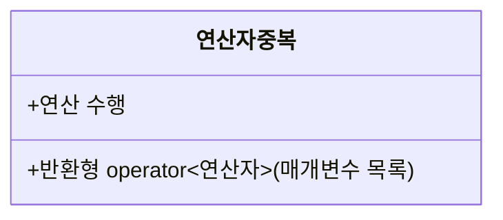

# ⚙️ C++ 연산자 오버로딩(Operator Overloading) 한눈에 정리

> **연산자 오버로딩**은 C에서 제공하는 연산자에 **사용자 정의 타입**에 맞는 의미를 부여해
> 더 자연스럽고 가독성 높은 코드를 작성하는 문법입니다.  
> 연산자도 결국 **함수**이므로, “연산자 함수(operator function)”로 구현합니다.


### ![개념 요약]


---

## 1) 기본 형태

```cpp
반환형 operator연산자(매개변수 리스트);
```

- **멤버 함수** 또는 **전역(비멤버)+`friend`** 로 선언/정의할 수 있습니다.
- 함수 이름 대신 `operator` 키워드 뒤에 실제 연산자를 씁니다.  
  예) `operator+`, `operator==`, `operator[]`, `operator()` …


| 연산자 | 중복 함수 이름 |
|-----|---------------------|
| +   | `operator+()` |
| -   | `operator-()` |
| \*  | `operator*()` |
| /   | `operator/()` |


### 동작 원리
```
┌───────────────────┐
│   연산자 중복      │
│      v1 + v2      │
└─────────┬─────────┘
          │
   ┌──────┴───────────────────────────┐
   │                                  │
┌──▼──────────────────────┐    ┌─────▼────────────────────────┐
│  멤버 함수의 구현        │    │     비 멤버 함수(전역)의 구현  │
│  v1.operator+(v2)       │    │  operator+(v1, v2)           │
└─────────────────────────┘    └──────────────────────────────┘
```

```
{  V1   +   V2  }   ───────────▶   [ Compiler ]   ───────────▶   V1.operator+( V2 )

                ↑                                              └─ 컴파일러가 연산자를
           토큰(피연산자/연산자)                                   함수 호출로 치환하여 호출
```
---
```

┌──────────────┐           (컴파일러가 연산자를 함수 호출로 변환)          ┌──────────────────────────┐
│   c = a + b  │ ────────────────────────────────────────────────────▶  │   c = a.operator+( b )   │
└──────────────┘                                                         └──────────────────────────┘
                                                                               ▲
                                                                               │ 호출 대상(좌변: a)
```
```cpp
// 멤버 함수로 정의된 '+' 연산자 예
class Sum {
    int a;
    int b;
public:
    Sum(int x = 0, int y = 0) : a(x), b(y) {}
    Sum operator+(const Sum& rhs) const {     // a.operator+(rhs)
        return Sum(a + rhs.a, b + rhs.b);
    }
};
```
---


## 2) 언제/왜 쓰나?

- 일상적인 기호(`+`, `-`, `==` …)로 **자연스러운 의미 전달**  
  예) `Point a, b; Point c = a + b;`
- **다형성**과 **가독성** 향상
- 단, **본래 의미를 크게 벗어나는 오버로딩은 금물** (유지보수 악화)

---

## 3) 멤버 함수로 구현

```cpp
#include <iostream>
using std::cout; using std::endl;

class Point {
    int x, y;
public:
    Point(int _x = 0, int _y = 0) : x(_x), y(_y) {}
    void showPosition() const { cout << x << " " << y << endl; }

    // p1 + p2  →  p1.operator+(p2)
    Point operator+(const Point& p) const {
        return Point(x + p.x, y + p.y);
    }
};

int main() {
    Point p1(1, 2), p2(2, 1);
    Point p3 = p1 + p2;
    p3.showPosition();   // 3 3
}
```

### 멤버 함수 방식의 특징
- 좌변(`lhs`)이 **반드시 해당 클래스 타입**이어야 함.
- `const` 멤버 함수로 선언하면 **읽기 연산**임을 보장.

---

## 4) 전역 함수(+ friend)로 구현

```cpp
#include <iostream>
using std::cout; using std::endl;

class Point {
    int x, y;
public:
    Point(int _x = 0, int _y = 0) : x(_x), y(_y) {}
    void showPosition() const { cout << x << " " << y << endl; }

    // 전역 operator+가 x,y에 접근할 수 있도록 승인
    friend Point operator+(const Point& p1, const Point& p2);
};

// p1 + p2  →  operator+(p1, p2)
Point operator+(const Point& p1, const Point& p2) {
    return Point(p1.x + p2.x, p1.y + p2.y);
}

int main() {
    Point p1(1, 2), p2(2, 1);
    Point p3 = p1 + p2;
    p3.showPosition();   // 3 3
}
```
### 동작 원리

```
┌────┐   ┌───┐   ┌────┐
│ V1 │   │ + │   │ V2 │   (토큰)
└────┘   └───┘   └────┘
        │
        ▼
┌────────────────┐            ┌────────────────────────┐
│   Compiler     │  ───────▶ │  operator+( V1, V2 )   │
└────────────────┘            └────────────────────────┘
           └─ 연산자를 함수 호출로 치환하여 호출
```


### 비멤버(+friend) 방식의 장점
- **양쪽 피연산자 모두**에 대해 **암시적 변환**을 허용(대칭 연산에 유리).  
  예: `Scalar + Point`, `Point + Scalar` 같은 변환이 자연스럽게 동작.

> 규칙: **대칭적 이항 연산자(+, -, ==, !=, <, >, …)** 는
> 가능하면 **비멤버**로 정의하는 것이 일반적인 모범 사례입니다.

---

## 5) 오버로딩 가능한/불가능한 연산자

### ✅ 가능
```
+  -  *  /  %  ^  &  |  ~  !  =  <  >  += -= *= /= %= ^= &= |=
<< >> <<= >>=  == != <= >=  && ||  ++ --  ,  ->*  ->  ()  []
new delete new[] delete[]
```

|         |            |      |      |       |      |        |          |
| ------- | ---------- | ---- | ---- | ----- | ---- | ------ | -------- |
| `+`     | `-`        | `*`  | `/`  | `%`   | `^`  | `&`    | `\|`     |
| `~`     | `!`        | `=`  | `<`  | `>`   | `+=` | `-=`   | `*=`     |
| `/=`    | `%=`       | `^=` | `&=` | `\|=` | `<<` | `>>`   | `>>=`    |
| `<<=`   | `==`       | `!=` | `>=` | `<=`  | `&&` | `\|\|` | `++`     |
| `--`    | `->*`      | `,`  | `->` | `[]`  | `()` | `new`  | `delete` |
| `new[]` | `delete[]` |      |      |       |      |        |          |


> 조건: **최소 한쪽 피연산자가 사용자 정의 타입**이어야 합니다.

### ❌ 불가 (언어 규칙 고정)
```
::   .   .*   ?:   sizeof   typeid   alignof   noexcept
static_cast  dynamic_cast  const_cast  reinterpret_cast
decltype     co_await
```


| 연산자  | 설명            |
| ---- | ------------- |
| `.`  | 멤버 접근 연산자     |
| `.*` | 멤버 포인터 접근 연산자 |
| `::` | 범위 지정 연산자     |
| `?:` | 3항(조건) 연산자    |


---

## 6) 주의 사항 & 팁

- **연산자 우선순위/결합 규칙은 바꿀 수 없음** (언어 규칙 고정)
- **매개변수 개수**는 연산자 의미에 고정 → **디폴트 인자**로 개수를 바꿀 수 없음
- 연산자의 **순수한 의미**를 해치지 말 것 (예: `+`를 곱셈처럼 쓰지 않기)
- 가능한 한 **`const` 정확성**(읽기 연산은 `const`)을 유지
- 비교 연산자는 **쌍으로** 제공(예: `==`면 `!=`도), 또는 C++20 **`<=>`** 활용
- 성능을 위해 **값 복사 대신 참조**를 적절히 사용 (`const T&` 등)

---

## 7) 멤버 vs 비멤버 선택 기준 (요약)

| 케이스 | 권장 방식 |
|---|---|
| 대칭 이항 연산자(+, -, ==, …) | **비멤버**(+필요 시 `friend`) |
| 단항 연산자(++/--/단항 - 등) | 멤버 또는 비멤버(상황에 따라) |
| `operator[]`, `operator()`, `operator->` | **멤버**만 가능 |
| 복합 대입(+=, -=, …) | 멤버 선호(좌변을 수정하므로) |

---

## 8) 예: 비교/입출력 오버로딩 스니펫

```cpp
#include <ostream>
struct Point { int x{}, y{}; };

// 대칭 비교: 비멤버가 깔끔
inline bool operator==(const Point& a, const Point& b) { return a.x == b.x && a.y == b.y; }
inline bool operator!=(const Point& a, const Point& b) { return !(a == b); }

// 출력 스트림
inline std::ostream& operator<<(std::ostream& os, const Point& p) {
    return os << "(" << p.x << "," << p.y << ")";
}
```

---

## 체크리스트

- [x] 연산자 의미가 **타입의 직관**과 일치하는가?
- [x] 대칭 연산은 **비멤버**로, 좌변 수정 연산(복합 대입)은 **멤버**로?
- [x] `const` 정확성/예외 안전성/성능(불필요한 복사 방지) 고려?
- [x] 가능/불가 연산자 목록 확인했는가?

필요하면 위 내용을 GitHub README로 그대로 사용하셔도 됩니다. 🙌
