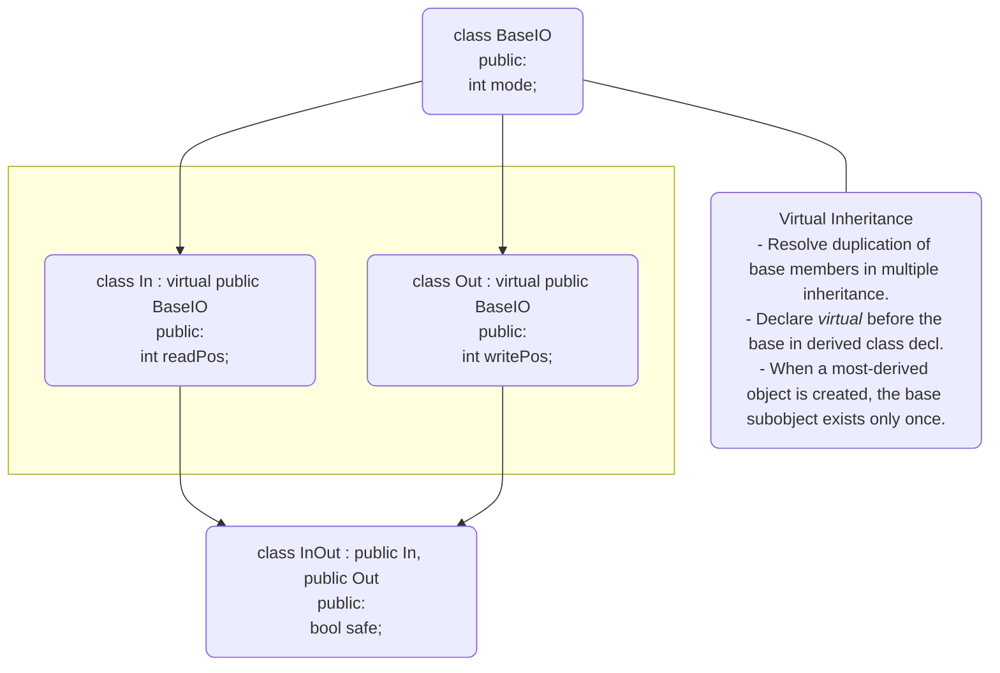

# 📘 C++에서의 가상 상속 (Virtual Inheritance)

## 🔍 개념 요약
가상 상속은 다중 상속 시 기본 클래스의 멤버 중복 문제를 해결하기 위한 C++의 기능입니다.
특히, 여러 파생 클래스가 동일한 기본 클래스를 상속할 때, 기본 클래스의 멤버가 중복 생성되는 문제를 방지합니다.

## 🧠 핵심 원리
- 파생 클래스 선언 시 virtual 키워드를 기본 클래스 앞에 붙이면 가상 상속이 됩니다.
- 최종 파생 클래스에서 객체를 생성할 때, 기본 클래스의 멤버는 단 한 번만 생성됩니다.
- 이를 통해 모호성 문제를 해결하고, 메모리 낭비를 줄일 수 있습니다.

## 🧱 예제 코드
```cpp
class BaseIO {
public:
    BaseIO() {
        std::cout << "BaseIO Constructor called" << std::endl;
    }
    int mode;
};

class In : virtual public BaseIO {
public:
    int readPos;
};

class Out : virtual public BaseIO {
public:
    int writePos;
};

class InOut : public In, public Out {
public:
    bool safe;
};

int main() {
    InOut ioObj;
    ioObj.readPos = 10;
    ioObj.writePos = 20;
    ioObj.safe = true;
    ioObj.mode = 5;
}
```

🧾 출력 결과
```
BaseIO Constructor called
```


## 📌 설명
| 클래스 | 상속 방식 | 멤버 | 
|--------|---------|-------|
| BaseIO | 기본 클래스 | mode | 
| In | virtual public BaseIO | readPos | 
| Out | virtual public BaseIO | writePos | 
| InOut | public In, public Out | safe | 


- In과 Out은 BaseIO를 가상 상속하므로, InOut 객체 생성 시 BaseIO의 생성자는 한 번만 호출됩니다.
- mode 멤버는 InOut 객체에서 모호하지 않게 하나만 존재합니다.

## 🖼️ 참고 이미지
A diagram in the image illustrates virtual inheritance in C++ through class hierarchy diagrams, a brief explanation, and a sample code snippet along with its output.





