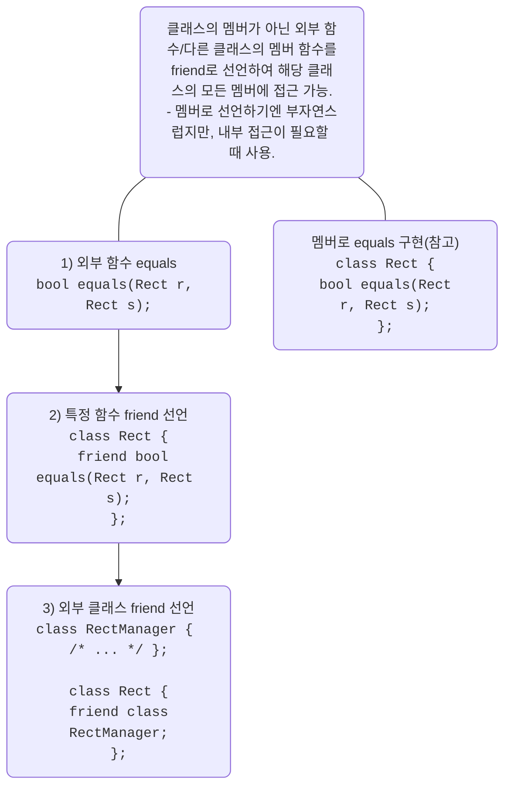
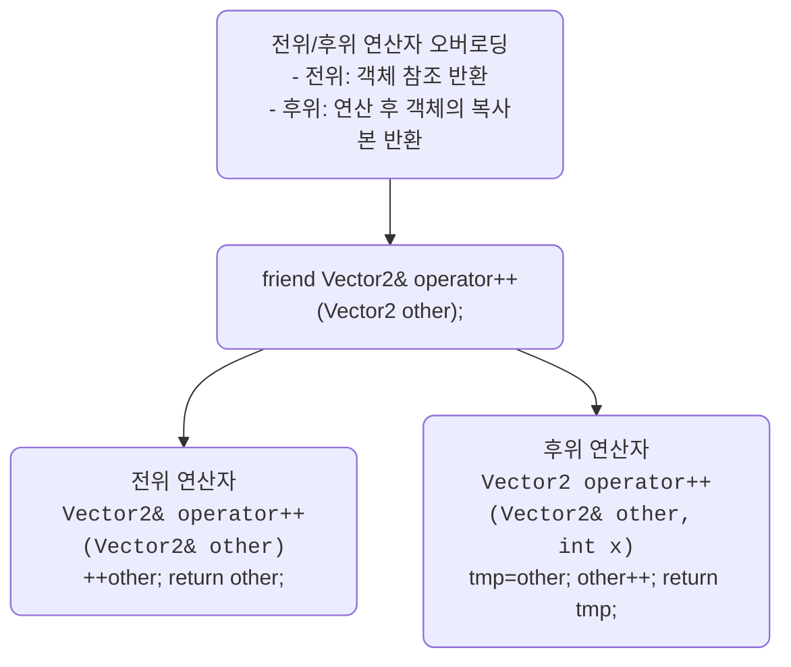

# C++ friend 함수와 클래스 상세 정리
## 🔧 friend 함수란?
- 클래스의 멤버 함수가 아닌 외부 함수
- 전역 함수
- 다른 클래스의 멤버 함수
- friend 키워드로 클래스 내부에 선언
- 해당 함수는 클래스의 모든 멤버에 접근 가능

## 📌 friend 선언이 필요한 경우
- 외부 함수가 클래스의 모든 멤버에 접근해야 할 때
- 클래스 내부에 멤버로 선언하기에는 역할이 애매하거나 독립적인 함수일 때

## 🧪 세 가지 friend 선언 방식
| 케이스 | 선언 방식 | 접근 대상 |
|-------|----------|---------| 
| Case 1 | friend bool equals(Rect r, Rect s); | 외부 전역 함수 equals | 
| Case 2 | friend RectManager::equals(Rect r, Rect s); | 외부 클래스 RectManager의 특정 멤버 함수 | 
| Case 3 | friend class RectManager; | 외부 클래스 RectManager의 모든 멤버 함수 | 

## 그림 참조


---

## 🧠 추가 예시: 연산자 오버로딩
```cpp
class Vector2d {
private:
    double x, y;
public:
    Vector2d(double x, double y) : x(x), y(y) {}
    friend ostream& operator<<(ostream& os, const Vector2d& v);
};
```

- operator<<는 외부 함수지만 friend로 선언되어 x, y에 접근 가능

## 🔄 전위/후위 연산자 오버로딩

### 🧠 핵심 차이
| 구분 | 반환값 | 연산 시점 | 사용 예 |
|----|-------|-------------|----------------------------------------| 
| 전위 연산자 ++a | 참조 (Vector2&) | 먼저 증가 후 반환 | b = ++a; → a와 b 모두 증가된 값 | 
| 후위 연산자 a++ | 복사본 (Vector2) | 복사 후 증가 | b = a++; → b는 증가 전 값, a는 증가된 값 | 

```cpp
friend Vector2& operator++(Vector2& other);     // 전위
friend Vector2 operator++(Vector2& other, int); // 후위
```
- 외부 연산자 함수가 Vector2의 private 멤버에 접근 가능

### 그림 참조




### 📌 코드 비교
#### ✅ 전위 연산자
```cpp
friend Vector2& operator++(Vector2& other);

Vector2& operator++(Vector2& other) {
    other.x++;
    other.y++;
    return other;
}
```
- 객체 자체를 수정하고 참조 반환
- 성능상 유리 (복사 없음)
#### ✅ 후위 연산자
```cpp
friend Vector2 operator++(Vector2& other, int);

Vector2 operator++(Vector2& other, int) {
    Vector2 tmp = other;
    other.x++;
    other.y++;
    return tmp;
}
```

- 복사본 반환 후 객체 수정
- int 매개변수는 후위 연산자임을 구분하기 위한 형식적 인자

#### 🧪 실행 결과 예시
```
Vector2 a(3, 5), b;
b = ++a; // a: (4,6), b: (4,6)
b = a++; // a: (5,7), b: (4,6)
```

