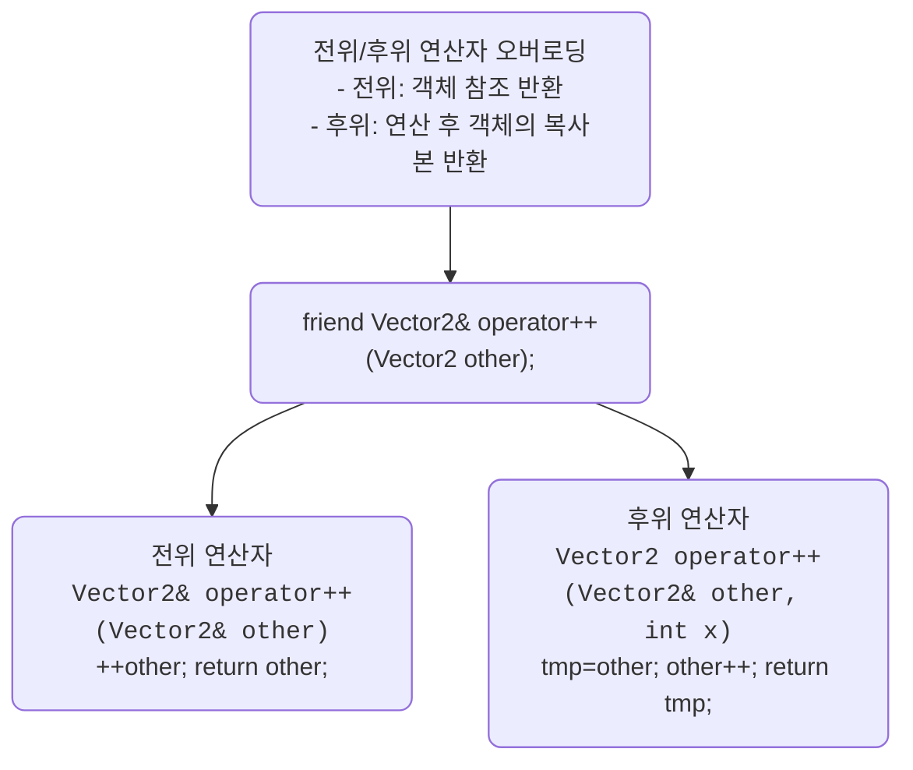

## 📌 전위/후위 연산자 오버로딩

### 📌 핵심 차이
| 구분 | 반환값 | 연산 시점 | 사용 예 |
|----|-------|-------------|----------------------------------------| 
| 전위 연산자 ++a | 참조 (Vector2&) | 먼저 증가 후 반환 | b = ++a; → a와 b 모두 증가된 값 | 
| 후위 연산자 a++ | 복사본 (Vector2) | 복사 후 증가 | b = a++; → b는 증가 전 값, a는 증가된 값 | 

```cpp
friend Vector2& operator++(Vector2& other);     // 전위
friend Vector2 operator++(Vector2& other, int); // 후위
```
- 외부 연산자 함수가 Vector2의 private 멤버에 접근 가능

### 그림 참조


### 📌 코드 비교
#### ✅ 전위 연산자
```cpp
friend Vector2& operator++(Vector2& other);

Vector2& operator++(Vector2& other) {
    other.x++;
    other.y++;
    return other;
}
```
- 객체 자체를 수정하고 참조 반환
- 성능상 유리 (복사 없음)
#### ✅ 후위 연산자
```cpp
friend Vector2 operator++(Vector2& other, int);

Vector2 operator++(Vector2& other, int) {
    Vector2 tmp = other;
    other.x++;
    other.y++;
    return tmp;
}
```

- 복사본 반환 후 객체 수정
- int 매개변수는 후위 연산자임을 구분하기 위한 형식적 인자

#### 📌 실행 결과 예시
```
Vector2 a(3, 5), b;
b = ++a; // a: (4,6), b: (4,6)
b = a++; // a: (5,7), b: (4,6)
```
----

