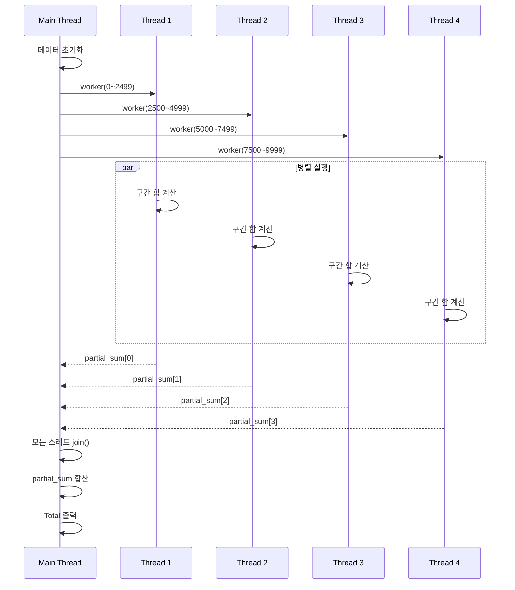

# C++ Thread 인자 전달 예제

C++11부터 `<thread>` 헤더를 통해 멀티스레드를 간단하게 구현할 수 있습니다.  
스레드 함수의 형태와 인자 개수는 자유롭게 지정할 수 있으며, OS에 상관없이 동일하게 동작합니다.

---

## 1) 기본 사용법

```cpp
#include <thread>
#include <iostream>

void ThreadFunc(int nVal)
{
    std::cout << nVal << std::endl;
}

int main()
{
    std::thread th1(ThreadFunc, 100); // 스레드 생성 및 인자 전달
    th1.join();                       // 스레드 종료 대기
}
```

- `std::thread` 객체를 생성하면서 실행할 함수와 인자를 전달
- `join()`은 해당 스레드가 종료될 때까지 대기

---

## 2) 함수 객체(펑터)·멤버 함수 실행

```cpp
#include <thread>
#include <string>
#include <iostream>

class MyPrint
{
public:
    explicit MyPrint(const std::string& text) : myWord(text) {}

    void operator()(const std::string& szText) const
    {
        std::cout << myWord << std::endl;
        std::cout << szText << std::endl;
    }

    void PrintFunc() const
    {
        std::cout << myWord << std::endl;
    }

private:
    std::string myWord;
};

int main()
{
    // 함수 객체로 실행 + 추가 인자 전달
    std::thread th1(MyPrint("Hello, World!"), "Bye, World!");
    th1.join();
    /*
    출력:
    Hello, World!
    Bye, World!
    */

    // 멤버 함수 실행
    MyPrint c("C++11 thread");
    std::thread th2(&MyPrint::PrintFunc, c); // 필요 시 &MyPrint::PrintFunc, std::ref(c) 가능
    th2.join();
    // 출력: C++11 thread
}
```

- **함수 객체**를 사용하면 생성자로 안전하게 초기화 가능
- 멤버 함수 실행 시 `&Class::Method` 형태 사용, 객체(혹은 참조)를 첫 인자로 전달
- 추가 인자도 자유롭게 전달 가능

---

## 3) 구간 합 계산 예제 (스레드 4개 분할)

0부터 9999까지의 합을 4개의 스레드로 분할 계산한 후 합산하는 예제입니다.

```cpp
#include <thread>
#include <vector>
#include <iostream>
#include <cstdio>

using std::thread;
using std::vector;

void worker(vector<int>::iterator start, vector<int>::iterator end, int* result)
{
    int sum = 0;
    for (auto itr = start; itr < end; ++itr) {
        sum += *itr;
    }
    *result = sum;
    thread::id this_id = std::this_thread::get_id();
    std::printf("thread id %zx from %5d to %5d : result %5d\n",
                std::hash<thread::id>{}(this_id), *start, *(end - 1), sum);
}

int main()
{
    vector<int> data(10000);
    for (int i = 0; i < 10000; ++i) data[i] = i;

    vector<int> partial_sums(4);
    vector<thread> workers;

    // 4개 스레드로 작업 분할
    for (int i = 0; i < 4; ++i) {
        workers.emplace_back(worker,
                             data.begin() + i * 2500,
                             data.begin() + (i + 1) * 2500,
                             &partial_sums[i]);
    }

    for (auto& th : workers) th.join();

    int total = 0;
    for (auto sum : partial_sums) total += sum;

    std::cout << "Total Sum : " << total << std::endl;
    // Total Sum : 49995000
}
```

예시 출력:
```
thread  id 2294 from  2500 to  4999 : result  9373750
thread  id 6b94 from  7500 to  9999 : result 21873750
thread  id 624c from     0 to  2499 : result  3123750
thread  id 3e40 from  5000 to  7499 : result 15623750
Total Sum : 49995000
```

> **참고**: 스레드 ID는 구현마다 표시 형식이 다를 수 있습니다. 위 예제에서는 `std::hash<std::thread::id>`를 이용해 출력합니다.

---

## 4) 스레드 실행 흐름 다이어그램 (Sequence)




---

### 핵심 요약
- `std::thread`는 생성 시 실행 함수와 인자를 자유롭게 전달 가능
- 함수, 함수 객체, 멤버 함수 모두 실행 가능
- `join()`으로 안전하게 종료 동기화
- 작업을 분할해 병렬로 처리하여 성능 향상 가능

---

### 추가 팁
- **예외 처리**: 스레드 함수 내부 예외는 스레드 경계에서 포착되지 않으므로 `try/catch`로 처리하거나 `std::future`/`std::async` 등을 고려하세요.
- **자원 관리**: `join()` 누락 방지를 위해 RAII 헬퍼(예: `struct joiner { std::thread& t; ~joiner(){ if(t.joinable()) t.join(); } };`)를 사용하면 안전합니다.
- **동기화**: 공유 데이터는 `std::mutex`, `std::lock_guard`, `std::atomic` 등으로 보호하세요.
