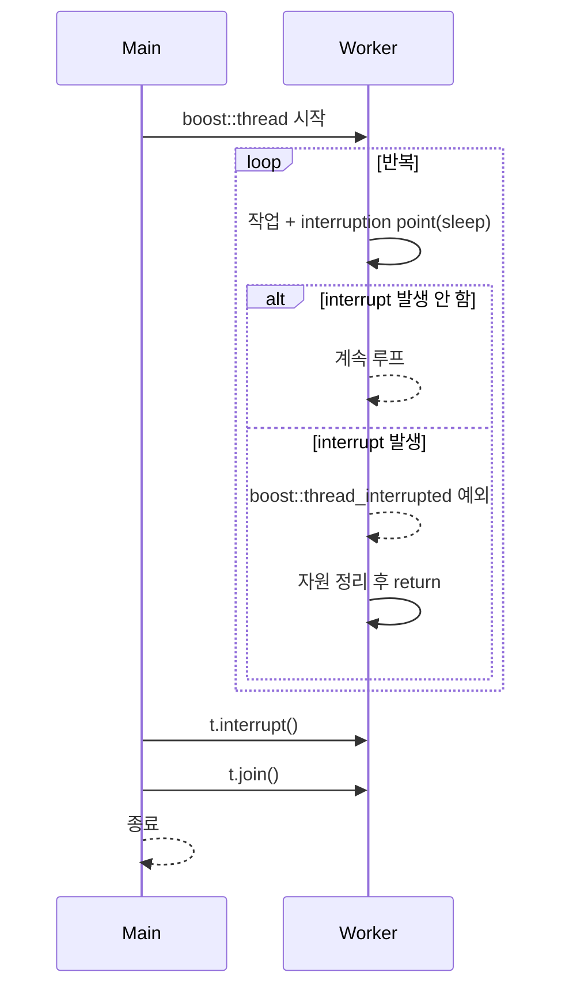
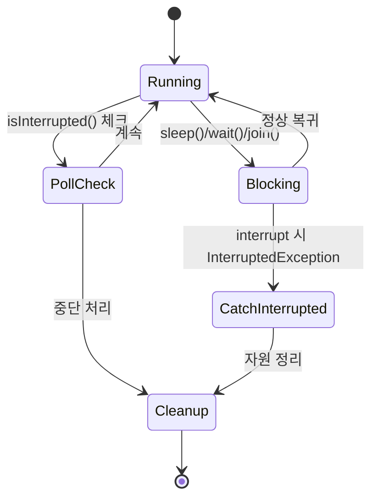

# Thread Interrupt 정리 (Boost C++ vs Java)

스레드를 “강제 종료”하는 표준 C++ API는 없습니다. 대신 **협력적(cooperative) 중단**을 사용해야 합니다.  
- **Boost C++**: `thread::interrupt()` + *interruption point*에서 `boost::thread_interrupted` 예외 발생  
- **Java**: `Thread.interrupt()`로 **인터럽트 플래그**를 세우고, 블로킹 호출에서 `InterruptedException` 발생

> 참고: C++20에는 예외 기반 interrupt는 없지만, **`std::jthread` + `std::stop_token`**으로 협력적 중단을 공식 지원합니다(아래 “C++20 대안” 참조).

---

## 1) Boost C++: interrupt 패턴

### 핵심 개념
- `t.interrupt()` 호출 → 타겟 스레드가 **interruption point**(예: `sleep`, `condition_variable::wait` 등)에 진입할 때 `boost::thread_interrupted` 예외가 발생.
- 예외를 **캣치해서 정리하고 종료**해야 함(자원 정리 후 `return`).

### 예제 (사용자 제공 코드 기반)
```cpp
#include <iostream>
#include <boost/thread.hpp>

void ThreadFunction()
{
    int counter = 0;
    for (;;)
    {
        std::cout << "thread iteration " << ++counter << std::endl;
        try
        {
            // interruption point
            boost::this_thread::sleep(boost::posix_time::milliseconds(500));
        }
        catch (boost::thread_interrupted&)
        {
            std::cout << "Thread is stopped" << std::endl;
            return; // 자원 정리 후 종료
        }
    }
}

int main() {
    boost::thread t(&ThreadFunction);

    // 메인 스레드에서 5초 대기
    boost::this_thread::sleep(boost::posix_time::milliseconds(5000));

    // 중단 요청 (협력적)
    t.interrupt();

    // 실제 종료까지 대기
    t.join();
    std::cout << "main: thread ended" << std::endl;
}
```

### 주의/팁
- **루프가 interruption point를 전혀 호출하지 않으면** 즉시 멈추지 않습니다. 주기적으로 `sleep`, `this_thread::interruption_point()` 같은 포인트를 넣어 주세요.
- 긴 계산 루프에는 다음처럼 **수동 interruption point**를 추가할 수 있습니다:
  ```cpp
  for (...) {
      // ... heavy work ...
      boost::this_thread::interruption_point(); // 여기서 예외 발생 가능
  }
  ```
- 자원 정리는 **예외 안전**하게: RAII(스마트 포인터, 스코프 가드 등)를 적극 사용.

---

## 2) Java: interrupt 패턴

### 핵심 개념
- `thread.interrupt()` → 대상 스레드의 **인터럽트 플래그**가 세팅.
- 스레드가 `Thread.sleep`, `wait`, `join` 등 **블로킹 호출** 중이면 `InterruptedException` 발생.
- 바쁜 루프에서는 주기적으로 `Thread.currentThread().isInterrupted()`를 확인해야 함.

### 예제 (사용자 제공 코드 기반, 요지 보정)
```java
public class ThreadStopMainV2 {
    public static void main(String[] args) {
        Thread thread = new Thread(new MyTask(), "work");
        thread.start();
        sleep(4000);                // 4초 후
        thread.interrupt();         // 인터럽트 요청
        System.out.println("State1 isInterrupted=" + thread.isInterrupted());
    }

    static class MyTask implements Runnable {
        @Override
        public void run() {
            try {
                while (true) {
                    System.out.println("작업 중");
                    Thread.sleep(3000); // 블로킹 → 인터럽트 시 InterruptedException
                }
            } catch (InterruptedException e) {
                // InterruptedException이 발생하면 플래그는 자동으로 내려감(clear)
                System.out.println("State2 isInterrupted=" + Thread.currentThread().isInterrupted());
                System.out.println("interrupt message=" + e.getMessage());
                System.out.println("state=" + Thread.currentThread().getState());
            }
            System.out.println("자원 정리");
            System.out.println("자원 종료");
        }
    }

    static void sleep(long ms) {
        try { Thread.sleep(ms); } catch (InterruptedException ignored) {}
    }
}
```

### 주의/팁
- `InterruptedException`이 발생하면 **인터럽트 플래그가 자동 해제**됩니다. 상위로 전달하고 싶다면 **현재 스레드의 플래그를 다시 세팅**하는 관용구를 사용:
  ```java
  catch (InterruptedException e) {
      Thread.currentThread().interrupt(); // 플래그 복구
      return;
  }
  ```
- 바쁜 루프에서는:
  ```java
  while (!Thread.currentThread().isInterrupted()) {
      // work...
  }
  ```

---

## 3) Boost vs Java: 개념 비교

| 항목 | Boost C++ | Java |
|---|---|---|
| 중단 요청 | `t.interrupt()` | `thread.interrupt()` |
| 감지 방식 | **interruption point**에서 `thread_interrupted` 예외 | 블로킹 호출에서 `InterruptedException` 또는 `isInterrupted()` 폴링 |
| 플래그 처리 | 예외 기반(명시적 catch 필요) | 플래그 세팅; 예외 발생 시 자동 clear |
| 루프 처리 | `interruption_point()` 수동 호출로 폴링 대체 가능 | `isInterrupted()` 폴링 필요(블로킹 없음 가정) |
| 안전 종료 | 예외 캐치 후 자원 정리/return | 예외 캐치 후 정리, 필요 시 `interrupt()` 재설정 |
| 강제 종료 | 지원 안 함(협력적) | 지원 안 함(협력적) |

---

## 4) C++20 대안: `std::jthread` + `std::stop_token` (권장)

표준 C++에는 interrupt 예외는 없지만, **중단 요청을 전달하는 공식 인터페이스**가 생겼습니다.

```cpp
#include <thread>
#include <stop_token>
#include <chrono>
#include <iostream>

void work(std::stop_token st) {
    using namespace std::chrono_literals;
    int counter = 0;
    while (!st.stop_requested()) {
        std::cout << "iteration " << ++counter << "\n";
        std::this_thread::sleep_for(500ms); // 필요 시 예외 없음, 폴링 기반
    }
    std::cout << "stopped\n";
}

int main() {
    std::jthread t(work); // 자동 join
    std::this_thread::sleep_for(std::chrono::seconds(5));
    t.request_stop();     // 협력적 중단 요청
} // jthread 소멸 시 자동 join
```

### 장점
- **예외 없이** 깔끔한 중단 신호 전달 (`stop_token`).
- `std::jthread`는 소멸 시 자동 `join()`: 누락으로 인한 리소스 문제 방지.
- 라이브러리 콜백/루프에 `stop_token`만 흘려보내면 어디서든 중단 가능.

---

## 5) 상태·흐름 다이어그램

### (Mermaid) Boost interrupt 흐름


### (Mermaid) Java interrupt 상태 개요


---

## 6) 실무 팁 체크리스트
- **강제 종료 금지**: 프로세스/스레드 강제 kill은 데이터 손상·교착·리소스 누수 유발.
- **자원 정리**: 파일/소켓/락 해제는 **RAII** 또는 `try/finally(자바)`로 보장.
- **중단 지점 배치**: 긴 루프/연산에 **주기적 중단 체크**(Boost: `interruption_point()`, 자바: `isInterrupted()`).
- **라이브러리 사용 시**: 블로킹 호출이 인터럽트 대응하는지 확인(자바는 대부분 대응, C++/Boost는 문서 확인).
- **로깅**: 중단 경로와 정상 경로를 구분하여 로그 남기기.

---

### 결론
- **Boost C++**: 예외 기반 interrupt. *interruption point*에 의존 → 주기적 체크 필수.  
- **Java**: 플래그 + 예외로 광범위하게 지원. 폴링 + 블로킹 예외 처리 병행.  
- **최신 C++**: 가능하면 **`std::jthread` + `std::stop_token`**으로 마이그레이션해, 예외 없이 명시적·협력적 중단을 구현하는 것을 권장합니다.
