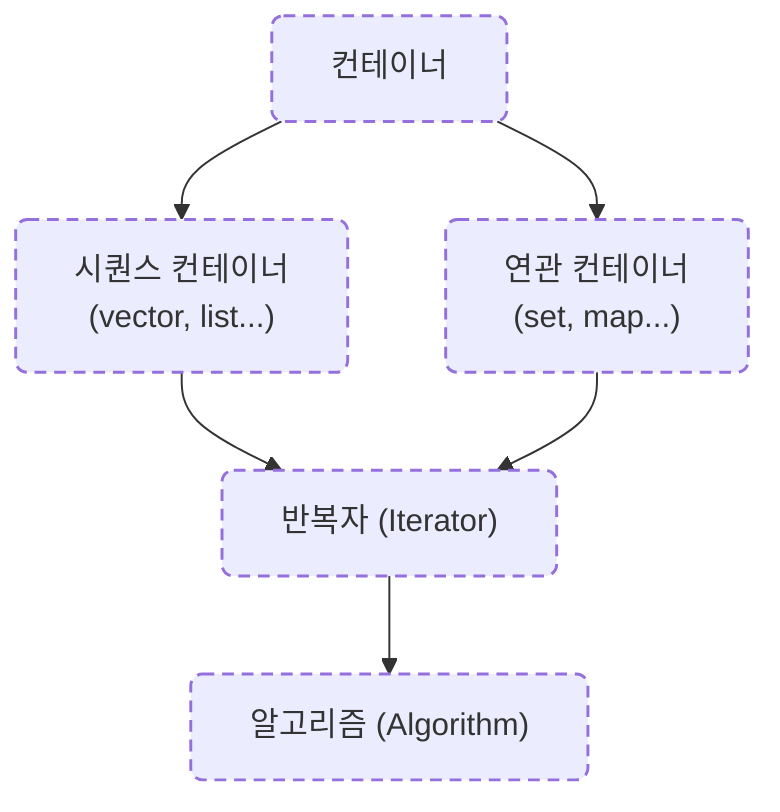

# 📌 STL (Standard Template Library) 개요

**STL** 은 C++ 표준 라이브러리의 한 구성 요소로,  
다양한 **제네릭(Template 기반)** 클래스와 함수들을 제공하여  
데이터 저장과 처리, 검색, 변형 등을 효율적으로 수행할 수 있도록 지원합니다.

---

## 1. STL의 핵심 특징
- **템플릿 기반**: 자료형에 구애받지 않고 재사용 가능
- **컨테이너와 알고리즘의 분리**: 자료 저장 구조와 처리 로직을 독립적으로 구현
- **반복자(Iterator)** 를 통해 컨테이너와 알고리즘을 연결
- **전문가에 의해 최적화 및 검증된 표준 코드**
- **객체 지향**과 **일반화 프로그래밍(Generic Programming)** 기법 적용

> 주요 키워드:  
> Powerful, Reusable, Adaptable, Generic, Huge

---

## 2. STL 구성 요소

### 📦 컨테이너 (Container)
데이터를 저장하는 객체로, 자료구조를 템플릿 클래스로 구현  

- **시퀀스 컨테이너**: 데이터의 순서를 유지
  - `array`, `vector`, `deque`, `list`, `forward_list`
- **연관 컨테이너**: 키-값 기반 검색에 최적화
  - `set`, `multiset`, `map`, `multimap`
- **컨테이너 어댑터**: 특정 용도에 맞게 동작을 제한
  - `stack`, `queue`, `priority_queue`

> 각 컨테이너 사용 시 해당 헤더 파일을 포함해야 함

```cpp
#include <vector>
#include <map>
#include <set>
```

---

### ⚙ 알고리즘 (Algorithm)
컨테이너 요소를 다루기 위한 표준 함수 모음  
(복사, 검색, 변환, 삭제, 정렬 등)
- 예: `find`, `max`, `reverse`, `remove`, `transform`, `count`, `accumulate`, `sort`  
- 대부분 `<algorithm>` 또는 `<numeric>` 헤더에 포함

---

### 🔁 반복자 (Iterator)
- **컨테이너 요소에 접근**하기 위한 객체 (포인터와 유사)
- 컨테이너와 알고리즘을 연결하는 **다리 역할**
- 종류:
  - 입력 반복자(Input Iterator)
  - 출력 반복자(Output Iterator)
  - 순방향 반복자(Forward Iterator)
  - 양방향 반복자(Bidirectional Iterator)
  - 임의 접근 반복자(Random Access Iterator)

> 반복자는 `++`, `*` 연산자를 통해 순회 및 값 접근 가능

---

## 3. STL 구조 다이어그램



---

## 4. STL의 장점
- 코드 재사용성 극대화
- 다양한 자료형과 호환
- 검증된 표준 구현
- 효율적인 메모리 관리 및 성능
