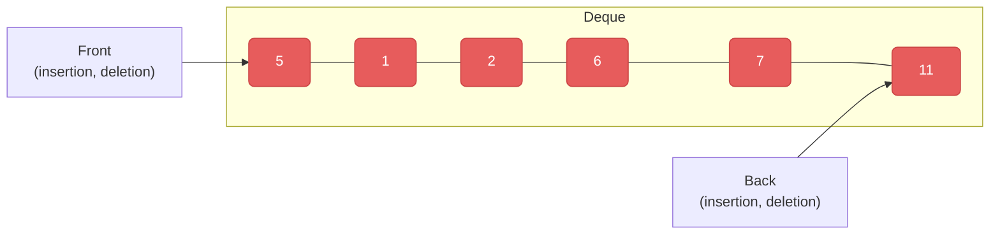
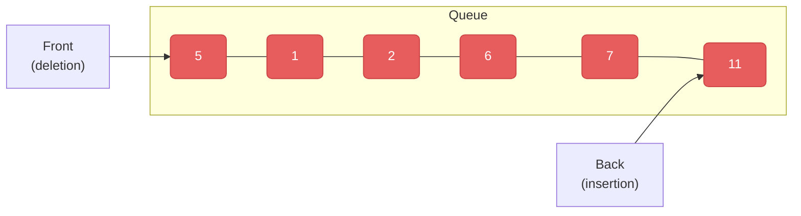

## 📘 `deque` & `queue` 정리

### 📌 개요

- **deque**(double-ended queue): 양쪽 끝에서 **삽입/삭제** 가 가능한 **동적 배열 컨테이너**  
- **queue**: 한쪽에서 넣고 다른 쪽에서 꺼내는 **FIFO** 구조의 **컨테이너 어댑터** (기본 구현은 `deque`)


### 📌 deque 한눈에 보기



- `push_front`, `push_back`, `pop_front`, `pop_back` 등 **양끝 조작** 지원
- 중간 위치의 `insert/erase`도 가능 (성능은 컨테이너 특성에 의존)

#### 📦 내부 메모리 모델


- 여러 **고정 크기 블록** 을 연결해 관리 → `vector`와 달리 확장 시 전체 복사가 감소
- 그 결과, **앞쪽 연산도 효율적** 이며 확장 시 재할당 비용이 낮음

#### 📦 간단 예제
```cpp
#include <iostream>
#include <deque>

int main() {
    std::deque<int> dq = {1, 2, 3, 4, 5};

    dq.pop_front();
    for (auto& n : dq) std::cout << n << " ";
    std::cout << "\n";   // 2 3 4 5

    dq.push_back(11);
    for (auto& n : dq) std::cout << n << " ";
    std::cout << "\n";   // 2 3 4 5 11
}
```

#### 📦 생성/연산 요약
- 생성자: `deque<T>()`, `deque<T>(n)`, `deque<T>(n, value)`, 복사/이동 생성 등
- 비교 연산자: `==`, `!=`, `<`, `>`, `<=`, `>=`
- 주요 멤버:
  - 접근: `at(i)`, `operator[]`, `front()`, `back()`
  - 수정: `push_front()`, `push_back()`, `pop_front()`, `pop_back()`, `insert`, `erase`, `clear()`
  - 크기: `size()`, `resize(n[, value])`
  - 반복자: `begin()`, `end()`, `rbegin()`, `rend()`
  - 기타: `swap()`, `assign()`  
- **주의**: `deque`에는 `capacity()`가 없습니다.

#### 📦 반복자 & 무효화
- 앞/뒤 삽입·삭제 시, 해당 위치와 **이후 일부 반복자가 무효화** 될 수 있음
- `insert/erase` 후에는 반환되는 반복자를 사용해 갱신할 것

---

### 📌 queue 한눈에 보기



- **FIFO(First-In, First-Out)**  
- 내부적으로 `deque`(기본) 또는 `list`/`vector` 등으로 구성 가능한 **컨테이너 어댑터**

#### 📦 기본 사용
```cpp
#include <iostream>
#include <queue>
int main() {
    std::queue<int> que;
    for (int i = 0; i < 5; ++i) que.push(i);

    int output = que.front();
    que.pop(); // 꺼낸 요소: output

    while (!que.empty()) {
        std::cout << que.front() << " ";
        que.pop();
    }
}
```

### 📌 멤버 함수 표
| 함수 | 설명 |
|---|---|
| `empty()` | 비어 있으면 `true` |
| `size()` | 원소 수 반환 |
| `front()` | 맨 앞 원소 참조 |
| `back()` | 맨 뒤 원소 참조 |
| `push(x)` | 맨 뒤에 원소 추가 |
| `pop()` | 맨 앞 원소 제거 |


### 📌 deque vs vector (요점 정리)
- **양끝 조작**: `deque`는 앞·뒤 모두 효율적 / `vector`는 **뒤쪽** 이 효율적
- **메모리 모델**: `deque`는 **블록 기반**, `vector`는 **연속 메모리**
- **랜덤 접근**: 둘 다 `O(1)` (하지만 `deque`는 블록 인덱싱 비용이 약간 더 큼)
- **capacity**: `vector`는 `capacity()` 제공 / `deque`는 없음


### 📌 요약
- `deque`: 양쪽 끝에 강한 동적 배열, 블록 기반이라 확장 비용이 낮음
- `queue`: FIFO 어댑터, 기본 구현 컨테이너는 `deque`
- 상황에 맞게 `vector`/`deque`/`queue`를 선택하고, **반복자 무효화** 를 항상 고려

---
