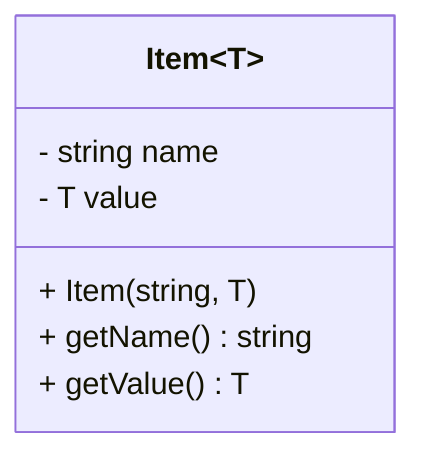

# C++ Templates — 개념과 활용

## 1. 개요
템플릿(Template)은 **함수나 클래스의 동작을 일반화**하여, 데이터 타입에 구애받지 않고 재사용 가능한 코드를 작성하는 C++의 기능입니다.  
즉, **형틀**을 만들어 두고, 컴파일 시점에 구체적인 타입을 지정하여 함수를 생성합니다.

---

## 2. 템플릿의 특징

| 장점 | 단점 |
|------|------|
| 코드 재사용성 증가 | 컴파일 시간 증가 |
| 타입 안정성 확보 | 컴파일러 호환성 문제 가능 |
| 중복 코드 제거 | 디버깅이 어려울 수 있음 |

---

## 3. 함수 템플릿 (Function Template)

### 기본 형태
```cpp
template<typename T>
T getMax(T x, T y) {
    return (x > y) ? x : y;
}
```

### 사용 예시
```cpp
int main() {
    int a = getMax(1, 3);          // int 버전 생성
    double b = getMax(1.2, 3.4);   // double 버전 생성
    std::cout << a << ", " << b << std::endl;
}
```

### 템플릿 없이 구현 시 (중복 코드 발생)
```cpp
int getMax(int x, int y) { return (x > y) ? x : y; }
double getMax(double x, double y) { return (x > y) ? x : y; }
```

---

## 4. 클래스 템플릿 (Class Template)

### 기본 형태
```cpp
template<typename T>
class Item {
private:
    std::string name;
    T value;
public:
    Item(const std::string& n, T v) : name(n), value(v) {}
    std::string getName() const { return name; }
    T getValue() const { return value; }
};
```

### 사용 예시
```cpp
Item<int> item1("Count", 42);
Item<double> item2("Length", 3.14);
```

---

## 5. 다중 타입 클래스 템플릿
```cpp
template<class T1, class T2>
class Pair {
    T1 first;
    T2 second;
public:
    Pair(T1 a, T2 b) : first(a), second(b) {}
    T1 getFirst() const { return first; }
    T2 getSecond() const { return second; }
};
```

---

## 6. 비타입(non-type) 템플릿 매개변수
```cpp
template<typename T, int N>
class Array {
    T data[N];
public:
    int size() const { return N; }
};
Array<int, 5> arr; // 크기 5
```

---

## 7. 함수 중복(overload) vs 템플릿 우선순위
```cpp
template<class T>
void print(T arr[], int n) {
    for(int i=0; i<n; ++i) std::cout << arr[i] << ", ";
}

void print(char arr[], int n) {
    std::cout << "char 배열" << std::endl;
}
```
> **같은 시그니처의 중복 함수가 있으면 일반 함수가 템플릿보다 우선 호출**됩니다.

---

## 8. 템플릿 특수화 (Specialization)
```cpp
template<>
std::string getMax<std::string>(std::string a, std::string b) {
    return (a.size() > b.size()) ? a : b;
}
```

---

## 9. 주의 사항
- 템플릿 구현은 **헤더 파일**에 작성해야 함  
  (링크 에러 방지)
- 사용하지 않는 타입에 대해서는 코드가 생성되지 않음
- 과도한 사용은 컴파일 시간 증가

---

## 10. 다이어그램 예시

### 함수 템플릿 호출 흐름
```mermaid
graph LR
%% 이건 주석입니다. 렌더링되지 않습니다.
A["template&lt;typename T&gt; | T getMax(T x, T y)"]
A -->|int|    B["int getMax(int, int)"]
A -->|double| C["double getMax(double, double)"]
```

### 클래스 템플릿 구조

