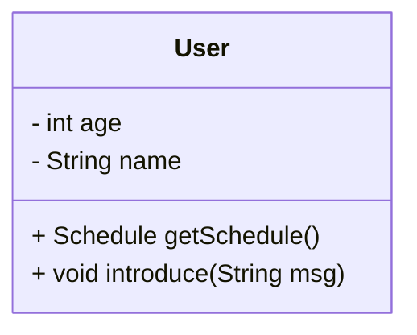
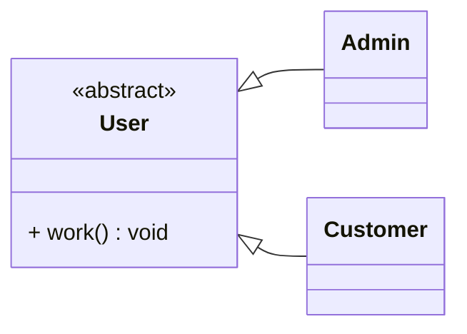
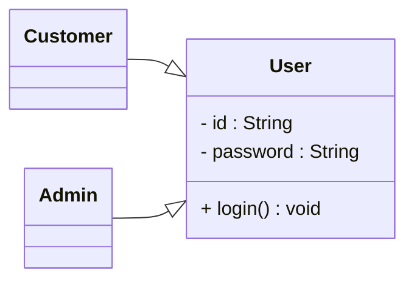
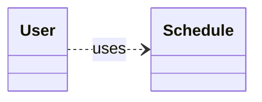
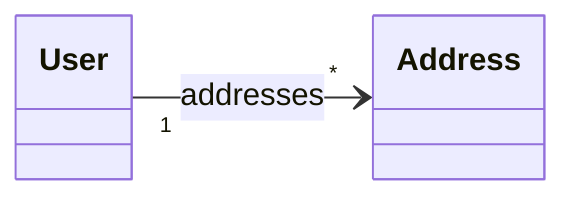
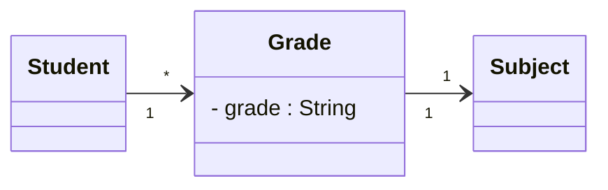
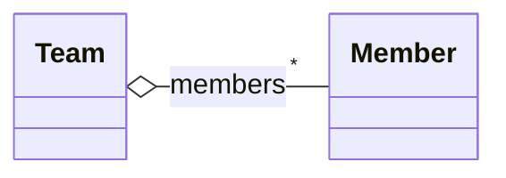
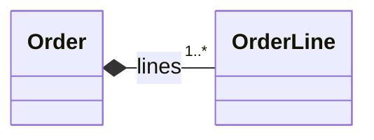
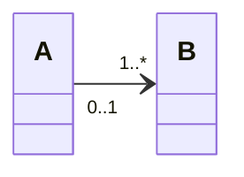
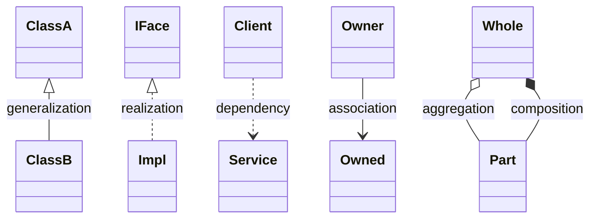

# UML 클래스 다이어그램 가이드 (실전 중심)

> **UML (Unified Modeling Language)** 는 소프트웨어 구조와 행위를 **표준 기호**로 표현하는 모델링 언어입니다.  
> 여기서는 가장 많이 쓰이는 **클래스 다이어그램**을 중심으로, “언제/어떻게”를 **예제 + Mermaid 다이어그램**으로 정리했습니다.
> Java를 기반으로 설명 하였습니다. 실제 가장 객체 지향 언어에 가깝기 때문에 Java를 이용하였습니다.  


---

## 1) 언제 UML 을 쓰면 좋은가?

- 팀 공통 언어가 필요할 때 (아키텍처 리뷰, 설계 문서, 코드 리팩터링 제안)
- 복잡한 도메인(엔터티/값객체/서비스) 간 **관계**를 빠르게 파악해야 할 때
- **인터페이스와 구현 분리**, **추상화/상속 계층**을 설명할 때
- API/라이브러리의 **사용자 관점** 모델이 필요할 때

> **과하면 독**: 모든 클래스, 모든 메서드를 그리기보다 **핵심 개념/관계**만. 코드는 언제라도 최신이지만, 다이어그램은 문서 유지비가 듭니다.

---

## 2) 클래스 정의(속성/연산)



```java
public class User {
  private int age;
  private String name;

  public Schedule getSchedule() { /* ... */ return null; }
  public void introduce(String msg) { /* ... */ }
}
```

---

## 3) 스테레오타입 (interface, utility …)

```mermaid
classDiagram
direction LR
class Developer <<interface>> {
  + writeCode() void
}

class Math <<utility>> {
  + PI : double {readOnly}
  + sin(theta: double) double
  + cos(theta: double) double
}
Developer <|.. SomeDev  : realizes
SomeDev : +writeCode()
```

```java
public interface Developer {
  void writeCode();
}
public final class Math {
  public static final double PI = 3.14159;
  public static double sin(double t) { /* ... */ return 0; }
  public static double cos(double t) { /* ... */ return 0; }
}
```

---

## 4) 추상 클래스



```java
public abstract class User {
  public abstract void work();
}
```

---

## 5) 관계(Association 계열) 한눈에 보기

| 관계 | UML 표기(대략) | Mermaid |
|---|---|---|
| 일반화(상속) | 실선 + 속빈 삼각형 | `Child --|> Parent` 또는 `Parent <|-- Child` |
| 실체화(인터페이스 구현) | 점선 + 속빈 삼각형 | `Impl ..|> IFace` |
| 의존 | 점선 화살표 | `A ..> B` |
| 연관(참조) | 실선 | `A --> B` / `B --> A` |
| 집합(Aggregation) | 속빈 마름모 | `Whole o-- Part` |
| 합성(Composition) | 채워진 마름모 | `Whole *-- Part` |

> 다중성(카디널리티)은 `"1"`, `"0..1"`, `"*"` 같은 라벨로 화살표 옆에 표기합니다.

---

## 6) 일반화 (상속)



```java
public class User { /* ... */ }
public class Customer extends User { /* ... */ }
public class Admin extends User { /* ... */ }
```

---

## 7) 실체화 (interface 구현)

```mermaid
classDiagram
direction LR
interface AuthService {
  + login(id:String, pw:String) : Token
}
class BasicAuth
BasicAuth ..|> AuthService
```

---

## 8) 의존(Dependency)

- 메서드 **파라미터/리턴/지역변수**로 잠깐 등장하는 관계입니다. 필드로 보관하지 않습니다.



```java
public class User {
  public Schedule createSchedule() { return new Schedule(); }
  public void useSchedule(Schedule s) { /* ... */ }
}
```

---

## 9) 연관(Association)

- 보통 “**필드로 참조**”할 때 사용합니다. 방향이 있으면 **Directed Association**.



```java
import java.util.List;
public class User {
  private List<Address> addresses;
}
```

### 연관 클래스로 속성 이동 (Association Class)



---

## 10) 집합(Aggregation) vs 합성(Composition)

### Aggregation (Shared, 약한 소유)
- **파트 객체의 수명**을 **전체(Whole)** 가 책임지지 않습니다. 공유될 수 있습니다.



### Composition (Composite, 강한 소유)
- **Whole 이 Part 의 전체 수명**을 책임집니다. Part 는 **공유 불가**.



```java
public class Order {
  private final List<OrderLine> lines = new ArrayList<>();
  // Order가 생성/소멸 시 OrderLine도 함께 관리
}
```

---

## 11) 다중성(카디널리티) 표기 팁

- `0..1`(옵셔널), `1`(필수 단일), `*`(여러 개), `1..*`(최소 1개 이상)
- 방향은 **탐색 가능성**(navigation)을 의미합니다. 단방향 참조만 있으면 단방향 화살표.



---

## 12) 실전 작성 요령 (Do / Don’t)

**Do**
- 핵심 도메인 타입, 인터페이스 경계, 상속/합성 구조만 우선 그리기
- 공통 인터페이스와 구체 구현을 **실체화**로 명확히 분리
- 다중성/방향/소유(aggregation vs composition)로 **정확한 의미 전달**
- 클래스명/연산명은 **도메인 언어**를 사용

**Don’t**
- 모든 private 필드/게터세터를 다 그리지 않기 (가독성↓, 유지비용↑)
- 연관을 무조건 양방향으로 그리지 않기 (불필요한 결합↑)
- 집합/합성의 의미를 혼동하지 않기 (수명/소유 기준으로 결정)

---

## 13) Mermaid 치트시트



---

## 14) 샘플: 도메인 미니 모델

```mermaid
classDiagram
direction LR
class User {
  - id : String
  - name : String
  + introduce(msg:String) void
}
class Schedule {
  + getByYear(y:int) Schedule
}
class Address {
  - city : String
  - zip  : String
}
interface Notifier {
  + send(to:String, msg:String) void
}
class EmailNotifier
EmailNotifier ..|> Notifier

User --> "*" Address : addresses
User ..> Schedule : uses
```

---

## 15) GitHub 에서 보기

- GitHub는 Mermaid를 지원합니다. README에 위의 코드블록을 그대로 붙여 넣으면 렌더링됩니다.
- 프라이빗 레포/기업 내부 위키에서도 동일하게 사용 가능합니다.

---

## 부록) 참고 규칙 메모

- 속성/연산 표기: `+ public`, `# protected`, `- private`
- 정적 멤버: 밑줄/밑줄 주석으로 표기하거나 스테레오타입 «static»을 사용할 수 있음
- 제네릭은 `List<String>` 같이 **텍스트로 충분**

---

