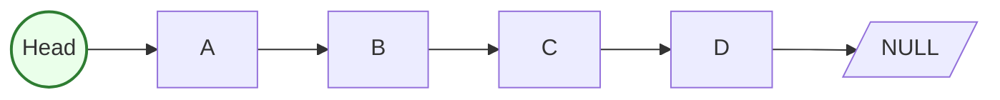
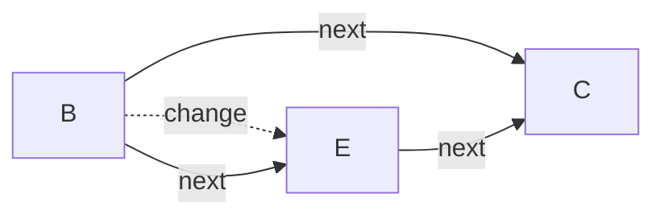
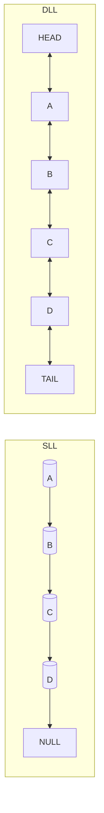

# 📚 Linked List Study (C++): Singly & Doubly

> 깃허브에 바로 올릴 수 있는 정리 파일입니다.  
> 단방향(SLL) / 양방향(DLL) 연결 리스트 개념, 삽입/삭제 알고리즘, **안전하고 현대적인 C++ 예제 코드**를 포함합니다.

---

## 1) Linked List란?

- **연결 리스트(Linked List)** 는 노드들이 포인터로 서로 연결된 **선형 자료구조**입니다.
- 배열과 달리 **연속된 메모리가 아니어도** 되며, 필요한 만큼 노드를 동적으로 추가/삭제할 수 있습니다.
- 반면, 임의 접근(Random Access)가 불가능하여 **탐색은 O(n)** 입니다.

### 구조 개요



- 각 노드는 `data`와 **다음 노드**를 가리키는 `next` 포인터를 가집니다.

---

## 2) Singly Linked List (SLL)

### 핵심 포인트

- 보통 **head 포인터**만 유지합니다. (필요 시 **더미(sentinel) head**를 둘 수 있음)
- 삽입/삭제 시 **앞/뒤 링크 단 하나**만 조정하면 됩니다.
- 임의 위치 삭제는 **직전 노드(prev)** 를 알아야 합니다.

### 삽입 예시 (중간 삽입)





### 삭제 예시 (중간 삭제)



---

### ✅ 안전한 SLL 구현 (헤드 포인터 방식)

```cpp
#include <iostream>
#include <utility>

struct Node {
    int data{};
    Node* next{nullptr};
    explicit Node(int v) : data(v), next(nullptr) {}
};

// push_front: O(1)
void push_front(Node*& head, int v) {
    Node* n = new Node(v);
    n->next = head;
    head = n;
}

// print: O(n)
void print(const Node* head) {
    for (auto* cur = head; cur; cur = cur->next) {
        std::cout << cur->data << (cur->next ? ' ' : '\n');
    }
}

// insert_after (첫 번째 key 뒤에 삽입): O(n)
bool insert_after(Node* head, int key, int v) {
    for (auto* cur = head; cur; cur = cur->next) {
        if (cur->data == key) {
            Node* n = new Node(v);
            n->next = cur->next;
            cur->next = n;
            return true;
        }
    }
    return false; // key not found
}

// delete_first (첫 번째 key 삭제): O(n)
bool delete_first(Node*& head, int key) {
    if (!head) return false;
    if (head->data == key) {
        Node* tmp = head;
        head = head->next;
        delete tmp;
        return true;
    }
    for (auto* cur = head; cur->next; cur = cur->next) {
        if (cur->next->data == key) {
            Node* tmp = cur->next;
            cur->next = cur->next->next;
            delete tmp;
            return true;
        }
    }
    return false;
}

// free all
void clear(Node*& head) {
    while (head) {
        Node* tmp = head;
        head = head->next;
        delete tmp;
    }
}

int main() {
    Node* head = nullptr;
    push_front(head, 1);
    push_front(head, 2);
    push_front(head, 3); // list: 3 2 1
    print(head);

    insert_after(head, 2, 99); // 3 2 99 1
    print(head);

    delete_first(head, 3); // 2 99 1
    print(head);

    clear(head);
}
```

**개선 포인트(원문 대비):**  
- `new Node()` 를 무의미하게 여러 번 할당하지 않습니다.  
- `head == nullptr` 처리와 경계 조건을 모두 체크합니다.  
- 메모리 누수 방지를 위해 `clear` 함수를 제공합니다.

---

## 3) Doubly Linked List (DLL)

- 각 노드는 `prev` 와 `next` 를 모두 가집니다.
- 보통 **더미 head/tail** 를 두면 경계 처리가 단순해집니다.


### DLL에 노드 E 삽입 (B와 C 사이)



### DLL에서 B 삭제



---

### ✅ 안전한 DLL 클래스 (센티넬 사용)

```cpp
#include <iostream>

class DLL {
    struct Node {
        int data{};
        Node* prev{nullptr};
        Node* next{nullptr};
        Node() = default;
        explicit Node(int v) : data(v) {}
    };

    Node* head; // sentinel
    Node* tail; // sentinel
    size_t n{0};

public:
    DLL() : head(new Node), tail(new Node) {
        head->next = tail;
        tail->prev = head;
    }

    ~DLL() { clear(); delete head; delete tail; }

    bool empty() const { return head->next == tail; }
    size_t size() const { return n; }

    // O(1)
    void push_front(int v) {
        insert_after(head, v);
    }

    // O(1)
    void push_back(int v) {
        insert_before(tail, v);
    }

    // O(n) – 첫 번째 key 뒤에 삽입
    bool insert_after_value(int key, int v) {
        for (Node* cur = head->next; cur != tail; cur = cur->next) {
            if (cur->data == key) {
                insert_after(cur, v);
                return true;
            }
        }
        return false;
    }

    // O(n) – 첫 번째 key 삭제
    bool erase_first(int key) {
        for (Node* cur = head->next; cur != tail; cur = cur->next) {
            if (cur->data == key) {
                unlink(cur);
                delete cur;
                --n;
                return true;
            }
        }
        return false;
    }

    void print() const {
        for (Node* cur = head->next; cur != tail; cur = cur->next) {
            std::cout << cur->data << (cur->next != tail ? ' ' : '\n');
        }
    }
    void print_reverse() const {
        for (Node* cur = tail->prev; cur != head; cur = cur->prev) {
            std::cout << cur->data << (cur->prev != head ? ' ' : '\n');
        }
    }

    void clear() {
        Node* cur = head->next;
        while (cur != tail) {
            Node* nx = cur->next;
            delete cur;
            cur = nx;
        }
        head->next = tail;
        tail->prev = head;
        n = 0;
    }

private:
    void insert_after(Node* pos, int v) {
        Node* node = new Node(v);
        node->prev = pos;
        node->next = pos->next;
        pos->next->prev = node;
        pos->next = node;
        ++n;
    }
    void insert_before(Node* pos, int v) { insert_after(pos->prev, v); }

    static void unlink(Node* node) {
        node->prev->next = node->next;
        node->next->prev = node->prev;
    }
};
```

---

## 4) 연산 정리표

| 연산 | SLL 시간복잡도 | DLL 시간복잡도 | 비고 |
|---|---:|---:|---|
| `push_front` | O(1) | O(1) | |
| `push_back` | O(n)\* | O(1)\*\* | SLL은 tail 포인터 없으면 O(n), DLL은 tail/센티넬로 O(1) 가능 |
| 중간 삽입(노드 참조 있음) | O(1) | O(1) | |
| 값으로 삽입(탐색 필요) | O(n) | O(n) | |
| 중간 삭제(직전/해당 노드 참조) | O(1) | O(1) | DLL은 `prev` 덕분에 직전 노드가 필요 없음 |
| 값으로 삭제(탐색 필요) | O(n) | O(n) | |
| 탐색 | O(n) | O(n) | |

---

## 5) 흔한 실수 & 베스트 프랙티스

- ❌ **불필요한 `new Node()`** 를 만들고 바로 다른 포인터를 대입(메모리 누수 위험).  
  → **필요할 때만 `new`**, 사용 후 **반드시 `delete`** 또는 `clear` 제공.
- ❌ 삭제 시 **경계(첫/마지막 노드)** 누락.  
  → 센티넬(head/tail) 사용으로 조건 단순화.
- ✅ 멤버 함수에서 **예외/조기 반환**으로 분기 단순화.
- ✅ `size()` 유지로 상태 확인을 O(1)로.

---

## 6) 추가 도식 (Mermaid)



---

## 7) 사용 예 (DLL)

```cpp
int main() {
    DLL dll;
    dll.push_front(1);
    dll.push_front(2);
    dll.push_front(3); // 3 2 1
    dll.print();
    dll.print_reverse(); // 1 2 3

    dll.insert_after_value(2, 99); // 3 2 99 1
    dll.print();

    dll.erase_first(3); // 2 99 1
    dll.print();
    std::cout << "size: " << dll.size() << "\n";
}
```

---
