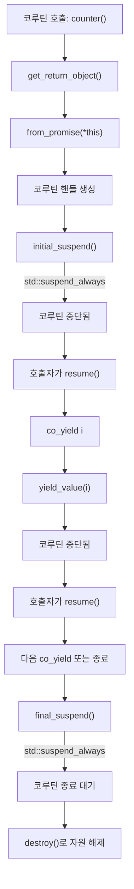
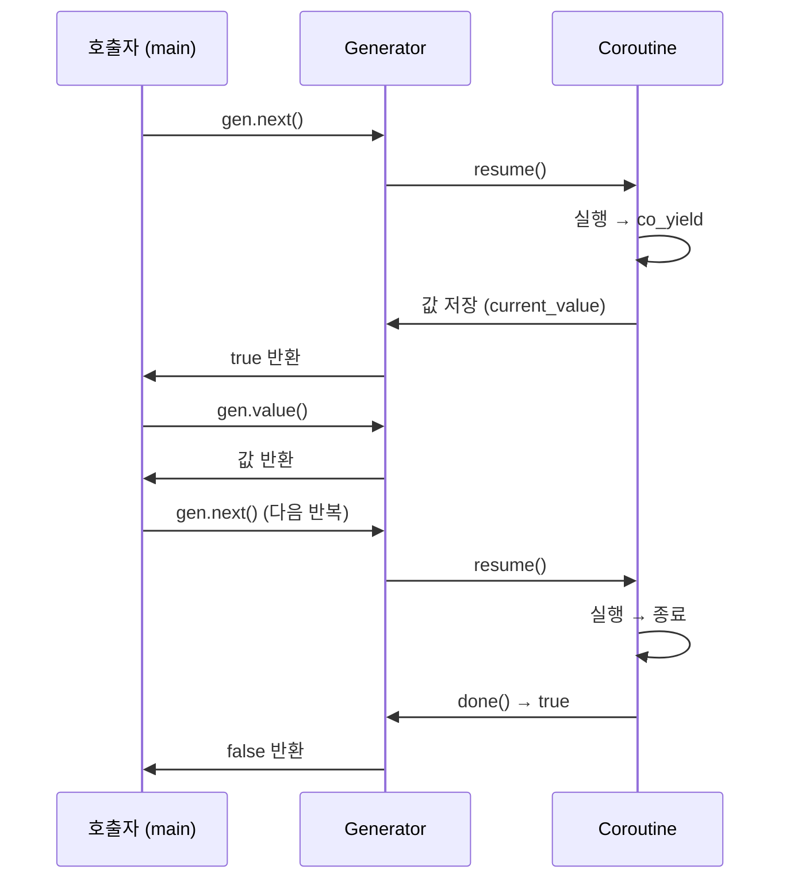

# 🧵 코루틴이란?
코루틴은 함수의 실행을 중단하고 다시 재개할 수 있는 함수입니다.  일반 함수는 호출되면 끝날 때까지 실행되지만,  코루틴은 co_await, co_yield, co_return 같은 키워드를 통해 중간에 멈췄다가 다시 이어서 실행할 수 있습니다.

## 🏗️ Boost Coroutine vs C++ Coroutine
| 특징 | Boost Coroutine | C++20/23 Coroutine |
|------|-----------------|--------------------| 
| 구현 방식 | 스택 기반 (stackful) | 스택리스 (stackless), 컴파일러 지원 | 
| 키워드 지원 | 없음 | co_await, co_yield, co_return | 
| 표준 지원 여부 | 외부 라이브러리 필요 | C++20부터 표준 지원 | 
| 제어 흐름 | push_type, pull_type로 명시적 제어 | co_await로 비동기 흐름 제어 가능 | 
| 예외 처리 | 수동 처리 | try/catch와 co_await 연동 가능 | 


## 🚀 C++20/23 Coroutine 기본 구조
```cpp
#include <coroutine>
#include <iostream>

struct Generator {
    struct promise_type;
    using handle_type = std::coroutine_handle<promise_type>;

    struct promise_type {
        int current_value;
        auto get_return_object() { return Generator{handle_type::from_promise(*this)}; }
        auto initial_suspend() { return std::suspend_always{}; }
        auto final_suspend() noexcept { return std::suspend_always{}; }
        auto yield_value(int value) {
            current_value = value;
            return std::suspend_always{};
        }
        void return_void() {}
        void unhandled_exception() { std::exit(1); }
    };

    handle_type coro;

    Generator(handle_type h) : coro(h) {}
    ~Generator() { if (coro) coro.destroy(); }

    bool next() {
        if (!coro.done()) {
            coro.resume();
            return true;
        }
        return false;
    }

    int value() const { return coro.promise().current_value; }
};

Generator counter(int start, int end) {
    for (int i = start; i <= end; ++i)
        co_yield i;
}
```

## 🧪 사용 예시
```cpp
int main() {
    auto gen = counter(1, 3);
    while (gen.next()) {
        std::cout << gen.value() << std::endl;
    }
}
```

## 📤 출력:
```
1
2
3
```


## 🧵 std::suspend_always와 std::suspend_never
이 둘은 코루틴의 중단(suspend) 동작을 정의하는 타입입니다.  코루틴은 특정 지점에서 실행을 멈추고, 나중에 다시 재개할 수 있는데, 이 suspend 객체들이 그 타이밍을 결정해요.
### 🔹 std::suspend_always
```cpp
auto initial_suspend() { return std::suspend_always{}; }
```

- 코루틴이 시작되자마자 중단됨
- 외부에서 resume()을 호출해야 실행됨
- 주로 제어권을 호출자에게 넘기고 싶을 때 사용
### 🔸 std::suspend_never
```cpp
auto initial_suspend() { return std::suspend_never{}; }
```

- 코루틴이 생성되면 즉시 실행됨
- 중단 없이 바로 본문으로 진입
- 주로 즉시 실행되는 코루틴에 사용

### 🔧 from_promise
코루틴은 내부적으로 promise_type이라는 구조체를 통해 상태를 관리합니다.  from_promise는 이 promise_type에서 **코루틴 핸들(coroutine_handle)**을 생성하는 정적 함수입니다.
```cpp
auto get_return_object() {
    return Generator{std::coroutine_handle<promise_type>::from_promise(*this)};
}
```

### ✅ 역할
- promise_type 인스턴스를 기반으로 코루틴 핸들 생성
- 핸들을 통해 코루틴을 resume(), destroy() 등으로 제어 가능
- *this는 현재 promise_type 객체를 가리킴

### 🧠 전체 흐름 요약
```cpp
struct promise_type {
    auto get_return_object();     // 코루틴 핸들 반환
    auto initial_suspend();       // 시작 시 중단 여부 결정
    auto final_suspend();         // 종료 시 중단 여부 결정
    auto yield_value(T value);    // co_yield 시 동작 정의
    void return_void();           // co_return 시 동작 정의
    void unhandled_exception();   // 예외 처리
};
```

- initial_suspend() → 코루틴 시작 시 중단 여부
- final_suspend() → 코루틴 종료 시 중단 여부
- from_promise() → 코루틴 핸들 생성
- yield_value() → co_yield 시 값 저장 및 중단

## 🎯 실전 팁
- std::suspend_always는 제어권을 호출자에게 넘기고 싶을 때 유용
- from_promise는 코루틴 핸들을 안전하게 생성하는 핵심
- 이들을 잘 활용하면 범위 기반 반복자, 비동기 작업, 데이터 스트리밍 등 다양한 패턴을 구현할 수 있어요

## 동작 원리


### 🔍 설명 요약
- get_return_object()에서 from_promise를 통해 코루틴 핸들이 생성됩니다.
- initial_suspend()에서 std::suspend_always를 반환하면 코루틴은 즉시 중단되고, 호출자가 resume()을 통해 제어합니다.
- co_yield는 값을 생성하고 yield_value()를 통해 저장한 뒤 다시 중단됩니다.
- 반복적으로 resume()을 호출하면 다음 값을 생성하거나 종료로 진입합니다.
- final_suspend()에서도 std::suspend_always를 반환하면 종료 직전 상태에서 대기합니다.
- 마지막으로 destroy()를 호출해 코루틴 자원을 해제합니다.


## 🔁 gen.next()의 역할
```cpp
while (gen.next()) {
    std::cout << gen.value() << std::endl;
}
```

### 🎯 핵심 기능
- 코루틴을 재개: 중단된 코루틴을 다시 실행
- 다음 co_yield까지 진행: 다음 값을 생성하고 중단
- 종료 여부 반환: 더 이상 생성할 값이 없으면 false 반환

### 🧠 내부 동작 흐름
```cpp
bool next() {
    if (!coro.done()) {
        coro.resume();   // 코루틴 재개
        return true;     // 아직 값이 있음
    }
    return false;        // 코루틴 종료됨
}
```

- coro.done()은 코루틴이 종료되었는지 확인
- coro.resume()은 코루틴을 재개하여 다음 co_yield까지 실행
- 값은 promise_type.current_value에 저장되어 value()로 접근

### 🧬 gen.next() 동작



### 🧪 예시 흐름
```cpp
Generator<int> gen = countUpTo(2);
gen.next(); // → co_yield 0
gen.value(); // → 0
gen.next(); // → co_yield 1
gen.value(); // → 1
gen.next(); // → co_yield 2
gen.value(); // → 2
gen.next(); // → 종료됨 → false
```


### 🧩 요약
| 메서드 | 역할 |
|------|------| 
| next() | 코루틴 재개, 다음 값 생성 | 
| value() | 현재 생성된 값 반환 | 
| done() | 코루틴 종료 여부 확인 | 
| resume() | 내부적으로 코루틴 실행 트리거 | 


## 🆕 C++23 개선 사항
C++23에서는 코루틴 관련 기능이 더 안정화되고, 표준 라이브러리와의 통합이 강화되었습니다:
- std::generator가 제안됨 (표준화 진행 중)
- std::task, std::async_generator 같은 고수준 코루틴 타입이 등장
- co_await와 std::future, std::stop_token 등과의 연동이 강화됨

## 🎯 요약
- Boost Coroutine은 스택 기반으로 명시적 흐름 제어가 가능하지만, 복잡하고 유지보수가 어려움
- C++20/23 Coroutine은 컴파일러가 직접 관리하며, co_await, co_yield를 통해 비동기 프로그래밍에 최적화됨
- C++23에서는 표준 라이브러리와의 통합이 강화되어 실무에서 더 쉽게 활용 가능
---
