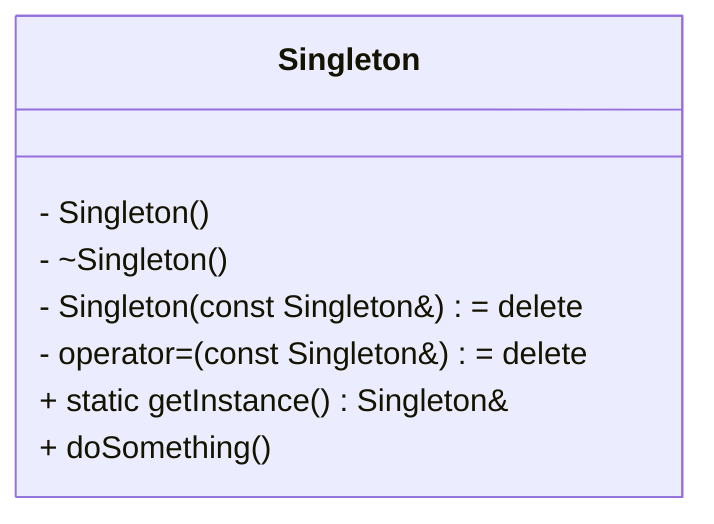

# Singleton
- C++에서 싱글턴(Singleton) 은 프로그램 전체에서 하나의 인스턴스만 존재하도록 보장하는 디자인 패턴입니다.  
- 주로 전역 상태 관리나 리소스 공유(예: 로그 시스템, 설정 객체, DB 연결 등)에 사용됩니다.

## 📌 Singleton 개념
- 핵심 아이디어: 클래스의 인스턴스를 하나만 만들고, 어디서든 접근할 수 있도록 한다.
- 구현 포인트:
    - 생성자를 private 또는 protected로 막아 외부에서 new 불가.
    - 정적 메서드(getInstance)를 통해 유일한 객체를 반환.
    - 복사/이동 생성자와 대입 연산자를 삭제(delete)해서 중복 생성 방지.

## 📌 기본 구현 (Raw Pointer 버전)
```cpp
#include <iostream>

class Singleton {
private:
    Singleton() { std::cout << "Singleton created\n"; }
    ~Singleton() { std::cout << "Singleton destroyed\n"; }

    // 복사/이동 금지
    Singleton(const Singleton&) = delete;
    Singleton& operator=(const Singleton&) = delete;

public:
    static Singleton& getInstance() {
        static Singleton instance; // 프로그램 종료 시 자동 소멸
        return instance;
    }

    void doSomething() {
        std::cout << "Singleton doing something\n";
    }
};
```
```cpp
int main() {
    Singleton& s1 = Singleton::getInstance();
    Singleton& s2 = Singleton::getInstance();

    s1.doSomething();
    std::cout << "Same instance? " << (&s1 == &s2) << "\n";
}
```

### 출력:
```
Singleton created
Singleton doing something
Same instance? 1
Singleton destroyed
```


## 📌 스마트 포인터 연동 버전
싱글턴을 **스마트 포인터(std::unique_ptr)** 로 관리하면, 자원 해제가 더 명확해지고, 필요 시 커스텀 소멸자도 붙일 수 있습니다.
```cpp
#include <iostream>
#include <memory>

class Singleton {
private:
    Singleton() { std::cout << "Singleton created\n"; }
    ~Singleton() { std::cout << "Singleton destroyed\n"; }

    // 복사/이동 금지
    Singleton(const Singleton&) = delete;
    Singleton& operator=(const Singleton&) = delete;

public:
    static Singleton& getInstance() {
        static std::unique_ptr<Singleton> instance{new Singleton()};
        return *instance;
    }

    void doSomething() {
        std::cout << "Singleton doing something\n";
    }
};
```
```cpp
int main() {
    Singleton& s1 = Singleton::getInstance();
    Singleton& s2 = Singleton::getInstance();

    s1.doSomething();
    std::cout << "Same instance? " << (&s1 == &s2) << "\n";
}
```


## 📊 Singleton 구현 비교

| 구현 방식                  | 특징 |
|----------------------------|------|
| static Singleton instance  | 가장 단순, 프로그램 종료 시 자동 소멸, 성능 오버헤드 없음 |
| static unique_ptr<Singleton> | 자원 관리 유연, 커스텀 소멸자 가능, 동적 생성 제어 가능 |


## ✅ 요약
- Singleton은 인스턴스를 하나만 보장하는 패턴.
- 스마트 포인터 연동을 통해 자원 관리와 소멸을 더 안전하게 할 수 있음.
- 실무에서는 static 객체 버전이 가장 흔하지만, 스마트 포인터 버전은 확장성이 필요할 때 유용합니다.

## 클래스 다이아 그램

---

## thread-safe

- 싱글턴을 멀티스레드 환경에서 안전하게 만들려면 thread-safe 초기화가 핵심입니다. 
- C++11 이후에는 정적 지역 변수(static) 초기화가 컴파일러 차원에서 thread-safe로 보장되므로, 별도의 락을 쓰지 않아도 안전합니다.

## 📌 Thread-safe Singleton (C++11 이후)
```cpp
#include <iostream>
#include <memory>

class Singleton {
private:
    Singleton() { std::cout << "Singleton created\n"; }
    ~Singleton() { std::cout << "Singleton destroyed\n"; }

    // 복사/이동 금지
    Singleton(const Singleton&) = delete;
    Singleton& operator=(const Singleton&) = delete;

public:
    static Singleton& getInstance() {
        // C++11 이후 정적 지역 변수 초기화는 thread-safe 보장
        static Singleton instance;
        return instance;
    }

    void doSomething() {
        std::cout << "Singleton doing something\n";
    }
};
```
```cpp
int main() {
    Singleton& s1 = Singleton::getInstance();
    Singleton& s2 = Singleton::getInstance();

    s1.doSomething();
    std::cout << "Same instance? " << (&s1 == &s2) << "\n";
}
```
## 📌 스마트 포인터 연동 + thread-safe
- 스마트 포인터를 쓰고 싶다면 std::call_once 와 std::once_flag를 이용해 초기화를 보장할 수 있습니다.
```cpp
#include <iostream>
#include <memory>
#include <mutex>

class Singleton {
private:
    Singleton() { std::cout << "Singleton created\n"; }
    ~Singleton() { std::cout << "Singleton destroyed\n"; }

    // 복사/이동 금지
    Singleton(const Singleton&) = delete;
    Singleton& operator=(const Singleton&) = delete;

    static std::unique_ptr<Singleton> instance;
    static std::once_flag initFlag;

public:
    static Singleton& getInstance() {
        std::call_once(initFlag, []() {
            instance.reset(new Singleton());
        });
        return *instance;
    }

    void doSomething() {
        std::cout << "Singleton doing something\n";
    }
};
```
```cpp
// 정적 멤버 정의
std::unique_ptr<Singleton> Singleton::instance;
std::once_flag Singleton::initFlag;

int main() {
    Singleton& s1 = Singleton::getInstance();
    Singleton& s2 = Singleton::getInstance();

    s1.doSomething();
    std::cout << "Same instance? " << (&s1 == &s2) << "\n";
}
```


## 📊 Thread-safe Singleton 구현 비교

| 구현 방식                  | 특징 |
|----------------------------|------|
| static Singleton instance  | C++11 이후 정적 지역 변수 초기화는 thread-safe 보장, 가장 단순하고 성능 오버헤드 없음 |
| unique_ptr + call_once     | 스마트 포인터로 자원 관리, 커스텀 소멸자 가능, 초기화 제어 유연하지만 코드 복잡도 증가 |


## ✅ 요약
- C++11 이후라면 static 지역 변수 초기화만으로 thread-safe Singleton 구현 가능.
- 스마트 포인터와 std::call_once를 쓰면 자원 관리와 초기화 제어를 더 유연하게 할 수 있음.

---

