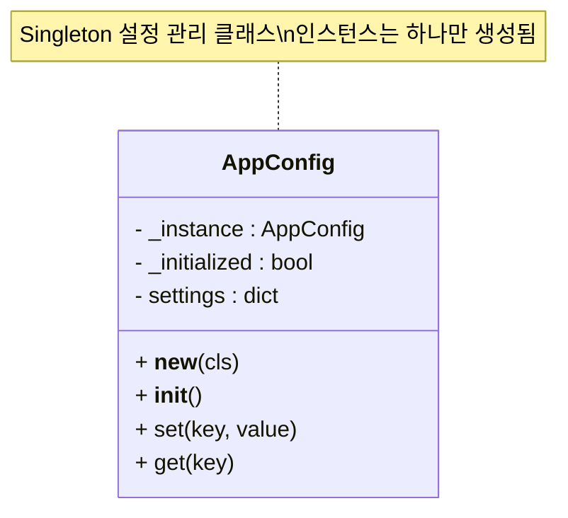

# 🧠 Singleton 패턴이란?
Singleton(싱글톤) 패턴은 클래스의 인스턴스를 하나만 생성하도록 보장하는 디자인 패턴입니다.  
어디서 호출하든 항상 같은 객체를 공유하게 되므로, 설정값, 로그, DB 연결 등 전역 상태를 유지해야 하는 경우에 자주 사용됩니다. 

## ✅ Python에서 Singleton 구현 방식
Python에서는 여러 방식으로 Singleton을 구현할 수 있습니다.  
대표적인 3가지 방법을 소개:

### 1. 클래스 내부에서 인스턴스 제어
```python
class Singleton:
    _instance = None

    def __new__(cls):
        if cls._instance is None:
            cls._instance = super().__new__(cls)
        return cls._instance
```

### 2. 데코레이터 사용
```python
def singleton(cls):
    instances = {}
    def get_instance(*args, **kwargs):
        if cls not in instances:
            instances[cls] = cls(*args, **kwargs)
        return instances[cls]
    return get_instance

@singleton
class Config:
    pass
```

### 3. 모듈 자체를 Singleton처럼 사용
- Python은 모듈이 한 번만 로딩되므로, 모듈 수준 변수를 Singleton처럼 사용할 수 있습니다.

## 🧪 실전 예제: 설정 관리 클래스
```python
class AppConfig:
    _instance = None

    def __new__(cls):
        if cls._instance is None:
            cls._instance = super().__new__(cls)
            cls._instance._initialized = False
        return cls._instance

    def __init__(self):
        if self._initialized:
            return
        self._initialized = True
        self.settings = {}

    def set(self, key, value):
        self.settings[key] = value

    def get(self, key):
        return self.settings.get(key, None)
```

### 🔍 사용 예시
```python
config1 = AppConfig()
config1.set("theme", "dark")

config2 = AppConfig()
print(config2.get("theme"))  # 출력: dark
print(config1 is config2)    # 출력: True (같은 인스턴스)
```


## 🧩 Singleton 패턴: 언제 쓰면 좋을까?

| 사용 사례                      | 이유 및 효과 |
|-------------------------------|--------------|
| 설정 관리 (Config Manager)     | 앱 전체에서 동일한 설정 값을 공유하고 유지 |
| 로그 시스템 (Logger)           | 로그 파일 핸들러를 하나만 유지하여 중복 방지 |
| DB 연결 (Database Connection)  | 커넥션 풀을 하나만 유지하여 리소스 절약 |
| 캐시 관리 (Global Cache)       | 전역 캐시를 하나의 객체로 유지하여 일관성 확보 |
| 상태 추적 (App State Tracker) | 앱의 전역 상태를 하나의 인스턴스로 관리 |
| GUI 컨트롤러 (Main Controller) | 사용자 인터페이스의 중심 제어 객체를 단일화 |


## 클래스 다이아 그램

---
