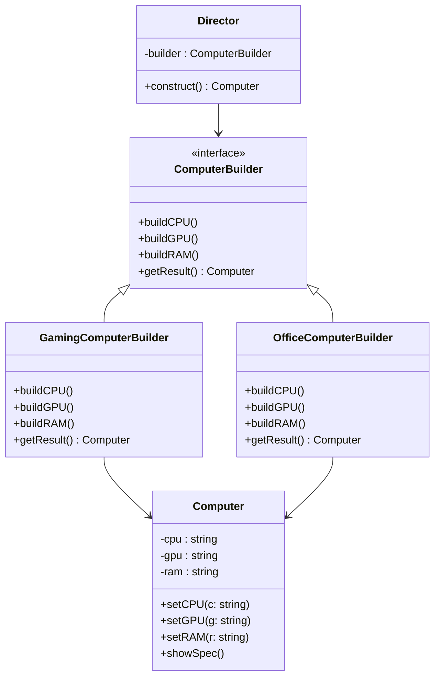
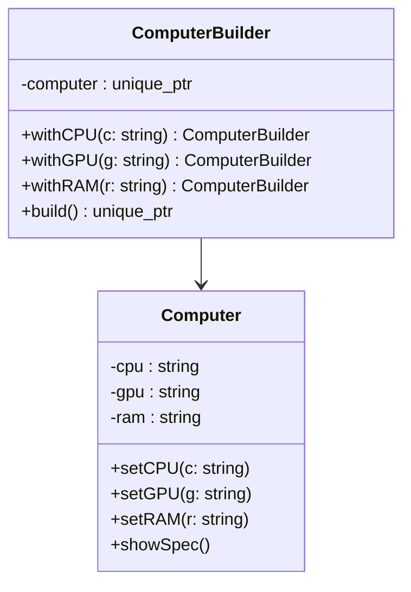

## 📌 Builder 패턴 개념
- 목적: 복잡한 객체를 생성할 때, 생성 과정(단계)을 분리하여 유연성을 높임.
- 장점:
  - 객체 생성 과정을 캡슐화 → 클라이언트는 세부 구현을 몰라도 됨.
  - 동일한 생성 과정으로 서로 다른 표현(객체)을 만들 수 있음.
  - 가독성과 유지보수성 향상.

## 📌 Builder Pattern 다이어그램


## 📌 C++ 샘플 코드
### 1. 스마트 포인터 사용 (권장)
- Computer* 대신 std::unique_ptr<Computer>를 반환하면 자동으로 메모리 관리가 됩니다.
```cpp
class ComputerBuilder {
public:
    virtual ~ComputerBuilder() = default;
    virtual void buildCPU() = 0;
    virtual void buildGPU() = 0;
    virtual void buildRAM() = 0;
    virtual std::unique_ptr<Computer> getResult() = 0;
};

class GamingComputerBuilder : public ComputerBuilder {
    std::unique_ptr<Computer> computer;
public:
    GamingComputerBuilder() : computer(std::make_unique<Computer>()) {}
    void buildCPU() override { computer->setCPU("Intel i9"); }
    void buildGPU() override { computer->setGPU("NVIDIA RTX 4090"); }
    void buildRAM() override { computer->setRAM("32GB DDR5"); }
    std::unique_ptr<Computer> getResult() override { return std::move(computer); }
};
```
```cpp
class Director {
    ComputerBuilder* builder;
public:
    Director(ComputerBuilder* b) : builder(b) {}
    std::unique_ptr<Computer> construct() {
        builder->buildCPU();
        builder->buildGPU();
        builder->buildRAM();
        return builder->getResult();
    }
};
```

- 이제 main에서:
```cpp
int main() {
    GamingComputerBuilder gamingBuilder;
    Director director(&gamingBuilder);
    auto gamingPC = director.construct();
    gamingPC->showSpec(); // 자동 메모리 관리

    OfficeComputerBuilder officeBuilder;
    Director director2(&officeBuilder);
    auto officePC = director2.construct();
    officePC->showSpec(); // 자동 메모리 관리

    return 0; // unique_ptr이 스코프 종료 시 자동 해제
}
```

## 2. 수동 해제 (비권장)
- 만약 스마트 포인터를 쓰지 않는다면, main에서 delete를 직접 호출해야 합니다.
```cpp
Computer* gamingPC = director.construct();
gamingPC->showSpec();
delete gamingPC; // 직접 해제
```
- 하지만 이 방식은 실수로 delete를 빼먹기 쉽고, 예외 발생 시 안전하지 않으므로 스마트 포인터 방식이 훨씬 권장됩니다.

## ✅ 요약
- 원래 코드에서는 new로 생성한 Computer 객체가 해제되지 않아 메모리 누수 발생.
- 해결책은 스마트 포인터(std::unique_ptr)로 반환하여 자동 관리하거나, 수동으로 delete 호출.
- 현대 C++에서는 스마트 포인터 방식을 강력히 권장합니다.

---

## 📌 Fluent DSL + 스마트 포인터 기반 Builder 패턴
```cpp
#include <iostream>
#include <memory>
#include <string>

// Product: 복잡한 객체
class Computer {
    std::string cpu;
    std::string gpu;
    std::string ram;
public:
    void setCPU(const std::string& c) { cpu = c; }
    void setGPU(const std::string& g) { gpu = g; }
    void setRAM(const std::string& r) { ram = r; }

    void showSpec() const {
        std::cout << "CPU: " << cpu << "\n"
                  << "GPU: " << gpu << "\n"
                  << "RAM: " << ram << "\n";
    }
};
```
```cpp
// Fluent Builder
class ComputerBuilder {
    std::unique_ptr<Computer> computer;
public:
    ComputerBuilder() : computer(std::make_unique<Computer>()) {}

    ComputerBuilder& withCPU(const std::string& cpu) {
        computer->setCPU(cpu);
        return *this;
    }

    ComputerBuilder& withGPU(const std::string& gpu) {
        computer->setGPU(gpu);
        return *this;
    }

    ComputerBuilder& withRAM(const std::string& ram) {
        computer->setRAM(ram);
        return *this;
    }

    // 최종 결과 반환 (unique_ptr → 자동 메모리 관리)
    std::unique_ptr<Computer> build() {
        return std::move(computer);
    }
};
```
```cpp
// main 함수
int main() {
    // Gaming PC 생성
    auto gamingPC = ComputerBuilder()
                        .withCPU("Intel i9")
                        .withGPU("NVIDIA RTX 4090")
                        .withRAM("32GB DDR5")
                        .build();
    gamingPC->showSpec();

    // Office PC 생성
    auto officePC = ComputerBuilder()
                        .withCPU("Intel i5")
                        .withGPU("Integrated Graphics")
                        .withRAM("16GB DDR4")
                        .build();
    officePC->showSpec();

    return 0; // unique_ptr이 스코프 종료 시 자동 해제
}
```


## 📊 실행 결과 (예상)
```
CPU: Intel i9
GPU: NVIDIA RTX 4090
RAM: 32GB DDR5
CPU: Intel i5
GPU: Integrated Graphics
RAM: 16GB DDR4
```


📌  다이어그램



## ✅ 요약
- 스마트 포인터 기반: std::unique_ptr로 메모리 자동 관리 → delete 불필요.
- Fluent DSL 스타일: withCPU().withGPU().withRAM().build() 체인식 호출로 직관적 객체 생성.
- Mermaid 다이어그램: 구조를 시각적으로 표현해 이해도 향상.
---


  
