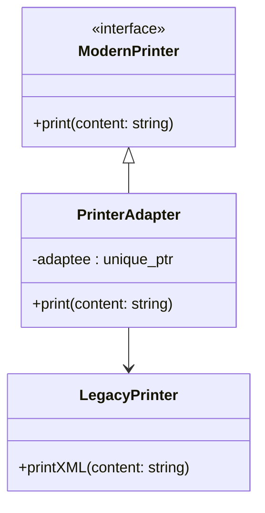
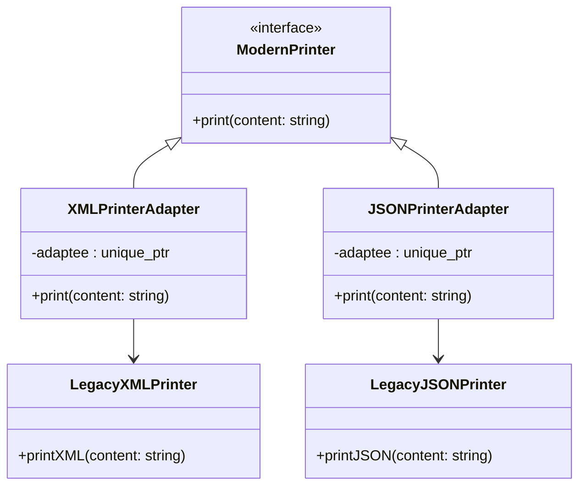
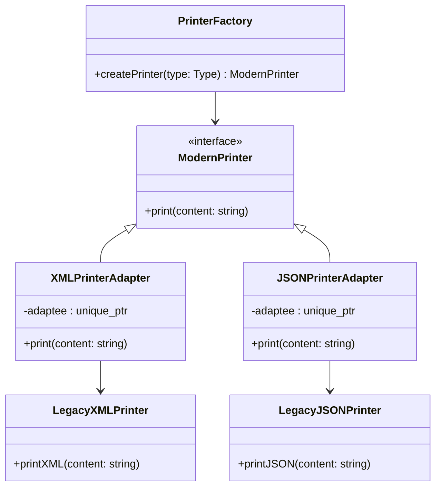

## 📌 스마트 포인터 기반 + 은닉화 적용 코드
```cpp
#include <iostream>
#include <memory>
#include <string>

// Legacy Printer (옛날 인터페이스)
class LegacyPrinter {
public:
    void printXML(const std::string& content) {
        std::cout << "<xml>" << content << "</xml>\n";
    }
};
```
```cpp
// Modern Printer (새 인터페이스)
class ModernPrinter {
public:
    virtual void print(const std::string& content) = 0;
    virtual ~ModernPrinter() = default;
};
```
```cpp
// Adapter (스마트 포인터 은닉화)
class PrinterAdapter : public ModernPrinter {
    std::unique_ptr<LegacyPrinter> adaptee; // 스마트 포인터로 관리

public:
    // 내부에서 LegacyPrinter를 생성 → 클라이언트는 신경 쓸 필요 없음
    PrinterAdapter() : adaptee(std::make_unique<LegacyPrinter>()) {}

    void print(const std::string& content) override {
        adaptee->printXML(content);
    }
};
```
```cpp
int main() {
    // 클라이언트는 LegacyPrinter를 직접 다루지 않고 ModernPrinter 인터페이스만 사용
    PrinterAdapter adapter;
    adapter.print("Hello, Adapter Pattern with Smart Pointer!");

    return 0; // unique_ptr이 자동으로 메모리 해제
}
```


## 📊 개선된 점
- 스마트 포인터 사용: std::unique_ptr<LegacyPrinter> → 메모리 자동 관리.
- 은닉화: 클라이언트는 LegacyPrinter를 직접 생성하거나 관리하지 않고, PrinterAdapter 내부에서 캡슐화.
- 인터페이스 통일: 클라이언트는 ModernPrinter 인터페이스만 알면 됨.

📌 다이어그램



## ✅ 요약
- Adapter 패턴을 스마트 포인터 기반으로 개선 → 메모리 안전성 확보.
- 은닉화 기법을 통해 클라이언트는 LegacyPrinter 존재를 알 필요 없음.
- Mermaid 다이어그램으로 구조를 시각화 → ModernPrinter 인터페이스와 LegacyPrinter 구현을 Adapter가 연결.

---
## 📌 코드 예제 (스마트 포인터 + 은닉화)

- 이번에는 여러 LegacyPrinter 타입(XML, JSON 등)을 하나의 ModernPrinter 인터페이스로 통합하는 버전을 보여드리겠습니다.  
- 핵심은 Adapter 패턴을 확장해서, 다양한 LegacyPrinter 구현을 ModernPrinter 인터페이스로 감싸고 클라이언트는 ModernPrinter만 사용하도록 만드는 것입니다.

```cpp
#include <iostream>
#include <memory>
#include <string>

// Legacy Printers (옛날 인터페이스)
class LegacyXMLPrinter {
public:
    void printXML(const std::string& content) {
        std::cout << "<xml>" << content << "</xml>\n";
    }
};
```
```cpp
class LegacyJSONPrinter {
public:
    void printJSON(const std::string& content) {
        std::cout << "{ \"data\": \"" << content << "\" }\n";
    }
};
```
```cpp
// Modern Printer (새 인터페이스)
class ModernPrinter {
public:
    virtual void print(const std::string& content) = 0;
    virtual ~ModernPrinter() = default;
};
```
```cpp
// Adapter for XML
class XMLPrinterAdapter : public ModernPrinter {
    std::unique_ptr<LegacyXMLPrinter> adaptee;
public:
    XMLPrinterAdapter() : adaptee(std::make_unique<LegacyXMLPrinter>()) {}
    void print(const std::string& content) override {
        adaptee->printXML(content);
    }
};
```
```cpp
// Adapter for JSON
class JSONPrinterAdapter : public ModernPrinter {
    std::unique_ptr<LegacyJSONPrinter> adaptee;
public:
    JSONPrinterAdapter() : adaptee(std::make_unique<LegacyJSONPrinter>()) {}
    void print(const std::string& content) override {
        adaptee->printJSON(content);
    }
};
```
```cpp
// main
int main() {
    // ModernPrinter 인터페이스만 사용
    std::unique_ptr<ModernPrinter> xmlPrinter = std::make_unique<XMLPrinterAdapter>();
    std::unique_ptr<ModernPrinter> jsonPrinter = std::make_unique<JSONPrinterAdapter>();

    xmlPrinter->print("Hello XML Adapter!");
    jsonPrinter->print("Hello JSON Adapter!");

    return 0; // 스마트 포인터가 자동 해제
}
```


## 📊 실행 결과
```
<xml>Hello XML Adapter!</xml>
{ "data": "Hello JSON Adapter!" }
```


## 📌 다이어그램


## ✅ 요약
- 여러 LegacyPrinter(XML, JSON 등)를 각각 Adapter로 감싸서 ModernPrinter 인터페이스로 통합.
- 클라이언트는 ModernPrinter만 사용 → 내부 구현(XML/JSON)은 은닉화.
- 스마트 포인터(std::unique_ptr)로 메모리 관리 자동화.
- ModernPrinter 인터페이스 중심으로 Adapter들이 LegacyPrinter를 연결.

---

## 📌 코드 예제 (Factory + Adapter + 스마트 포인터)

- 런타임에 프린터 타입(XML, JSON 등)을 선택할 수 있는 Factory 패턴 결합 버전을 보여드리겠습니다.
- 핵심은 클라이언트가 문자열이나 enum으로 원하는 타입을 지정하면 Factory가 적절한 Adapter를 생성해주고, 클라이언트는 ModernPrinter 인터페이스만 사용한다는 점입니다.
```cpp
#include <iostream>
#include <memory>
#include <string>

// Legacy Printers
class LegacyXMLPrinter {
public:
    void printXML(const std::string& content) {
        std::cout << "<xml>" << content << "</xml>\n";
    }
};
```
```cpp
class LegacyJSONPrinter {
public:
    void printJSON(const std::string& content) {
        std::cout << "{ \"data\": \"" << content << "\" }\n";
    }
};
```
```cpp
// Modern Printer 인터페이스
class ModernPrinter {
public:
    virtual void print(const std::string& content) = 0;
    virtual ~ModernPrinter() = default;
};
```
```cpp
// XML Adapter
class XMLPrinterAdapter : public ModernPrinter {
    std::unique_ptr<LegacyXMLPrinter> adaptee;
public:
    XMLPrinterAdapter() : adaptee(std::make_unique<LegacyXMLPrinter>()) {}
    void print(const std::string& content) override {
        adaptee->printXML(content);
    }
};
```
```cpp
// JSON Adapter
class JSONPrinterAdapter : public ModernPrinter {
    std::unique_ptr<LegacyJSONPrinter> adaptee;
public:
    JSONPrinterAdapter() : adaptee(std::make_unique<LegacyJSONPrinter>()) {}
    void print(const std::string& content) override {
        adaptee->printJSON(content);
    }
};
```
```cpp
// Factory
class PrinterFactory {
public:
    enum class Type { XML, JSON };

    static std::unique_ptr<ModernPrinter> createPrinter(Type type) {
        switch (type) {
            case Type::XML: return std::make_unique<XMLPrinterAdapter>();
            case Type::JSON: return std::make_unique<JSONPrinterAdapter>();
            default: return nullptr;
        }
    }
};
```
```cpp
// main
int main() {
    // 런타임에 타입 선택
    PrinterFactory::Type choice = PrinterFactory::Type::XML;
    auto printer = PrinterFactory::createPrinter(choice);
    printer->print("Hello Factory + Adapter!");

    choice = PrinterFactory::Type::JSON;
    auto printer2 = PrinterFactory::createPrinter(choice);
    printer2->print("Hello JSON Factory Adapter!");

    return 0; // 스마트 포인터 자동 해제
}
```

## 📊 실행 결과
```
<xml>Hello Factory + Adapter!</xml>
{ "data": "Hello JSON Factory Adapter!" }
```


## 📌 다이어그램



## ✅ 요약
- Factory 패턴을 결합해 런타임에 프린터 타입(XML, JSON)을 선택 가능.
- 클라이언트는 ModernPrinter 인터페이스만 사용 → 내부 구현은 은닉화.
- std::unique_ptr로 메모리 자동 관리.
- Mermaid 다이어그램으로 구조를 시각화 → Factory가 Adapter를 생성해 ModernPrinter 인터페이스로 제공.


  
