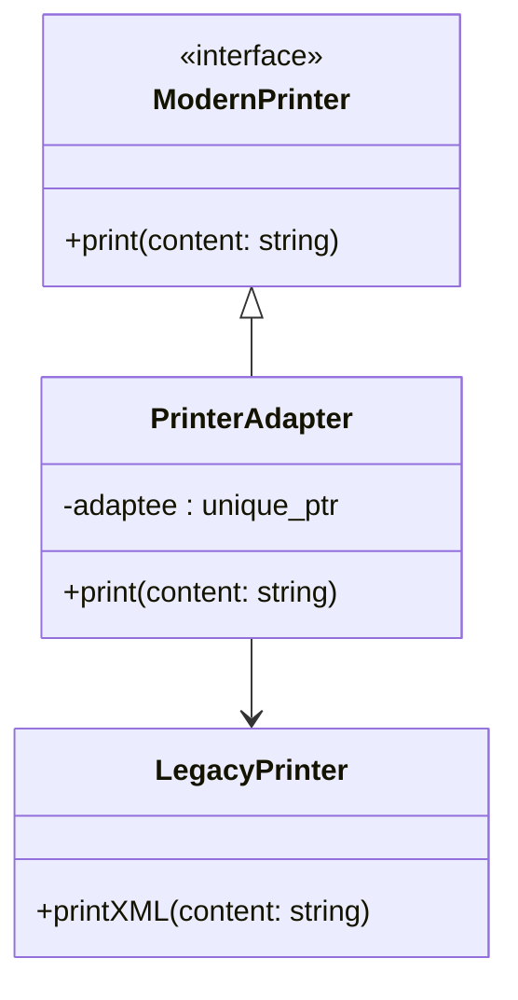

## 📌 스마트 포인터 기반 + 은닉화 적용 코드
```cpp
#include <iostream>
#include <memory>
#include <string>

// Legacy Printer (옛날 인터페이스)
class LegacyPrinter {
public:
    void printXML(const std::string& content) {
        std::cout << "<xml>" << content << "</xml>\n";
    }
};
```
```cpp
// Modern Printer (새 인터페이스)
class ModernPrinter {
public:
    virtual void print(const std::string& content) = 0;
    virtual ~ModernPrinter() = default;
};
```
```cpp
// Adapter (스마트 포인터 은닉화)
class PrinterAdapter : public ModernPrinter {
    std::unique_ptr<LegacyPrinter> adaptee; // 스마트 포인터로 관리

public:
    // 내부에서 LegacyPrinter를 생성 → 클라이언트는 신경 쓸 필요 없음
    PrinterAdapter() : adaptee(std::make_unique<LegacyPrinter>()) {}

    void print(const std::string& content) override {
        adaptee->printXML(content);
    }
};
```
```cpp
int main() {
    // 클라이언트는 LegacyPrinter를 직접 다루지 않고 ModernPrinter 인터페이스만 사용
    PrinterAdapter adapter;
    adapter.print("Hello, Adapter Pattern with Smart Pointer!");

    return 0; // unique_ptr이 자동으로 메모리 해제
}
```


## 📊 개선된 점
- 스마트 포인터 사용: std::unique_ptr<LegacyPrinter> → 메모리 자동 관리.
- 은닉화: 클라이언트는 LegacyPrinter를 직접 생성하거나 관리하지 않고, PrinterAdapter 내부에서 캡슐화.
- 인터페이스 통일: 클라이언트는 ModernPrinter 인터페이스만 알면 됨.

📌 다이어그램



## ✅ 요약
- Adapter 패턴을 스마트 포인터 기반으로 개선 → 메모리 안전성 확보.
- 은닉화 기법을 통해 클라이언트는 LegacyPrinter 존재를 알 필요 없음.
- Mermaid 다이어그램으로 구조를 시각화 → ModernPrinter 인터페이스와 LegacyPrinter 구현을 Adapter가 연결.

---
  
