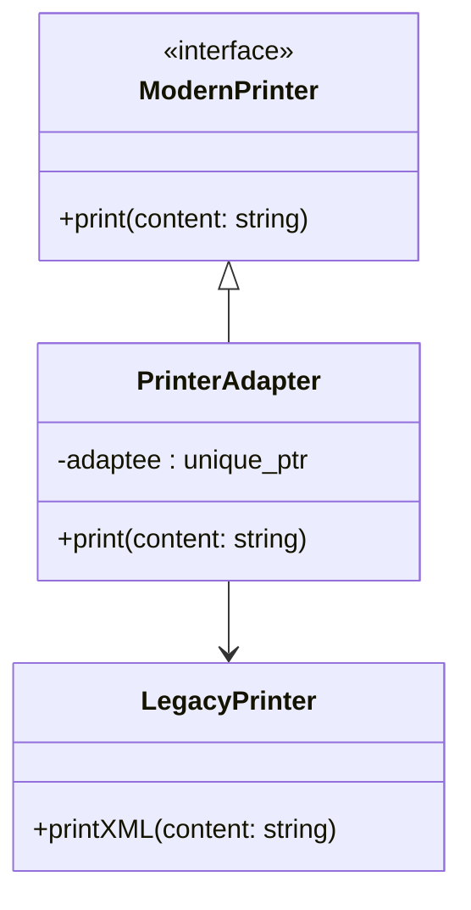
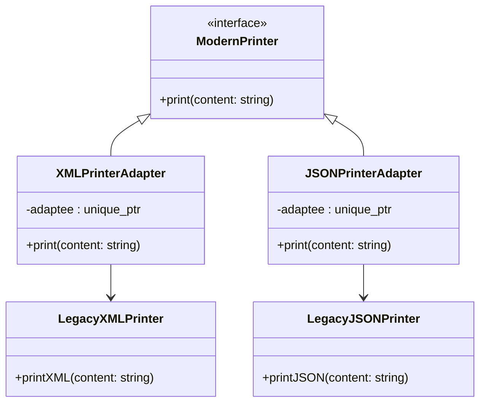
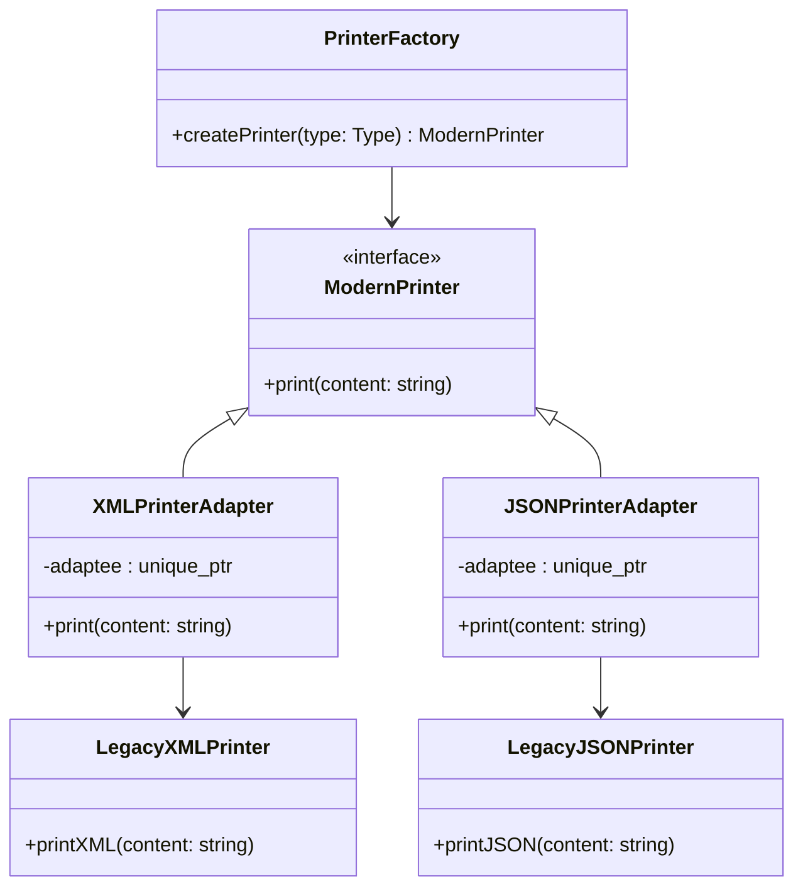
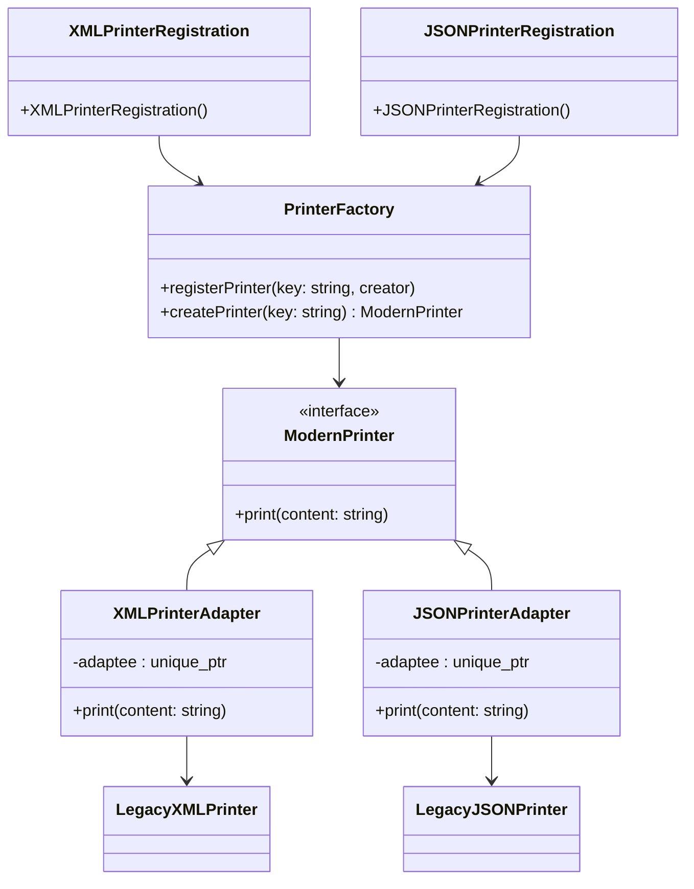

## 📌 스마트 포인터 기반 + 은닉화 적용 코드
```cpp
#include <iostream>
#include <memory>
#include <string>

// Legacy Printer (옛날 인터페이스)
class LegacyPrinter {
public:
    void printXML(const std::string& content) {
        std::cout << "<xml>" << content << "</xml>\n";
    }
};
```
```cpp
// Modern Printer (새 인터페이스)
class ModernPrinter {
public:
    virtual void print(const std::string& content) = 0;
    virtual ~ModernPrinter() = default;
};
```
```cpp
// Adapter (스마트 포인터 은닉화)
class PrinterAdapter : public ModernPrinter {
    std::unique_ptr<LegacyPrinter> adaptee; // 스마트 포인터로 관리

public:
    // 내부에서 LegacyPrinter를 생성 → 클라이언트는 신경 쓸 필요 없음
    PrinterAdapter() : adaptee(std::make_unique<LegacyPrinter>()) {}

    void print(const std::string& content) override {
        adaptee->printXML(content);
    }
};
```
```cpp
int main() {
    // 클라이언트는 LegacyPrinter를 직접 다루지 않고 ModernPrinter 인터페이스만 사용
    PrinterAdapter adapter;
    adapter.print("Hello, Adapter Pattern with Smart Pointer!");

    return 0; // unique_ptr이 자동으로 메모리 해제
}
```


## 📊 개선된 점
- 스마트 포인터 사용: std::unique_ptr<LegacyPrinter> → 메모리 자동 관리.
- 은닉화: 클라이언트는 LegacyPrinter를 직접 생성하거나 관리하지 않고, PrinterAdapter 내부에서 캡슐화.
- 인터페이스 통일: 클라이언트는 ModernPrinter 인터페이스만 알면 됨.

📌 다이어그램



## ✅ 요약
- Adapter 패턴을 스마트 포인터 기반으로 개선 → 메모리 안전성 확보.
- 은닉화 기법을 통해 클라이언트는 LegacyPrinter 존재를 알 필요 없음.
- Mermaid 다이어그램으로 구조를 시각화 → ModernPrinter 인터페이스와 LegacyPrinter 구현을 Adapter가 연결.

---
## 📌 코드 예제 (스마트 포인터 + 은닉화)

- 이번에는 여러 LegacyPrinter 타입(XML, JSON 등)을 하나의 ModernPrinter 인터페이스로 통합하는 버전을 보여드리겠습니다.  
- 핵심은 Adapter 패턴을 확장해서, 다양한 LegacyPrinter 구현을 ModernPrinter 인터페이스로 감싸고 클라이언트는 ModernPrinter만 사용하도록 만드는 것입니다.

```cpp
#include <iostream>
#include <memory>
#include <string>

// Legacy Printers (옛날 인터페이스)
class LegacyXMLPrinter {
public:
    void printXML(const std::string& content) {
        std::cout << "<xml>" << content << "</xml>\n";
    }
};
```
```cpp
class LegacyJSONPrinter {
public:
    void printJSON(const std::string& content) {
        std::cout << "{ \"data\": \"" << content << "\" }\n";
    }
};
```
```cpp
// Modern Printer (새 인터페이스)
class ModernPrinter {
public:
    virtual void print(const std::string& content) = 0;
    virtual ~ModernPrinter() = default;
};
```
```cpp
// Adapter for XML
class XMLPrinterAdapter : public ModernPrinter {
    std::unique_ptr<LegacyXMLPrinter> adaptee;
public:
    XMLPrinterAdapter() : adaptee(std::make_unique<LegacyXMLPrinter>()) {}
    void print(const std::string& content) override {
        adaptee->printXML(content);
    }
};
```
```cpp
// Adapter for JSON
class JSONPrinterAdapter : public ModernPrinter {
    std::unique_ptr<LegacyJSONPrinter> adaptee;
public:
    JSONPrinterAdapter() : adaptee(std::make_unique<LegacyJSONPrinter>()) {}
    void print(const std::string& content) override {
        adaptee->printJSON(content);
    }
};
```
```cpp
// main
int main() {
    // ModernPrinter 인터페이스만 사용
    std::unique_ptr<ModernPrinter> xmlPrinter = std::make_unique<XMLPrinterAdapter>();
    std::unique_ptr<ModernPrinter> jsonPrinter = std::make_unique<JSONPrinterAdapter>();

    xmlPrinter->print("Hello XML Adapter!");
    jsonPrinter->print("Hello JSON Adapter!");

    return 0; // 스마트 포인터가 자동 해제
}
```


## 📊 실행 결과
```
<xml>Hello XML Adapter!</xml>
{ "data": "Hello JSON Adapter!" }
```


## 📌 다이어그램


## ✅ 요약
- 여러 LegacyPrinter(XML, JSON 등)를 각각 Adapter로 감싸서 ModernPrinter 인터페이스로 통합.
- 클라이언트는 ModernPrinter만 사용 → 내부 구현(XML/JSON)은 은닉화.
- 스마트 포인터(std::unique_ptr)로 메모리 관리 자동화.
- ModernPrinter 인터페이스 중심으로 Adapter들이 LegacyPrinter를 연결.

---

## 📌 코드 예제 (Factory + Adapter + 스마트 포인터)

- 런타임에 프린터 타입(XML, JSON 등)을 선택할 수 있는 Factory 패턴 결합 버전을 보여드리겠습니다.
- 핵심은 클라이언트가 문자열이나 enum으로 원하는 타입을 지정하면 Factory가 적절한 Adapter를 생성해주고, 클라이언트는 ModernPrinter 인터페이스만 사용한다는 점입니다.
```cpp
#include <iostream>
#include <memory>
#include <string>

// Legacy Printers
class LegacyXMLPrinter {
public:
    void printXML(const std::string& content) {
        std::cout << "<xml>" << content << "</xml>\n";
    }
};
```
```cpp
class LegacyJSONPrinter {
public:
    void printJSON(const std::string& content) {
        std::cout << "{ \"data\": \"" << content << "\" }\n";
    }
};
```
```cpp
// Modern Printer 인터페이스
class ModernPrinter {
public:
    virtual void print(const std::string& content) = 0;
    virtual ~ModernPrinter() = default;
};
```
```cpp
// XML Adapter
class XMLPrinterAdapter : public ModernPrinter {
    std::unique_ptr<LegacyXMLPrinter> adaptee;
public:
    XMLPrinterAdapter() : adaptee(std::make_unique<LegacyXMLPrinter>()) {}
    void print(const std::string& content) override {
        adaptee->printXML(content);
    }
};
```
```cpp
// JSON Adapter
class JSONPrinterAdapter : public ModernPrinter {
    std::unique_ptr<LegacyJSONPrinter> adaptee;
public:
    JSONPrinterAdapter() : adaptee(std::make_unique<LegacyJSONPrinter>()) {}
    void print(const std::string& content) override {
        adaptee->printJSON(content);
    }
};
```
```cpp
// Factory
class PrinterFactory {
public:
    enum class Type { XML, JSON };

    static std::unique_ptr<ModernPrinter> createPrinter(Type type) {
        switch (type) {
            case Type::XML: return std::make_unique<XMLPrinterAdapter>();
            case Type::JSON: return std::make_unique<JSONPrinterAdapter>();
            default: return nullptr;
        }
    }
};
```
```cpp
// main
int main() {
    // 런타임에 타입 선택
    PrinterFactory::Type choice = PrinterFactory::Type::XML;
    auto printer = PrinterFactory::createPrinter(choice);
    printer->print("Hello Factory + Adapter!");

    choice = PrinterFactory::Type::JSON;
    auto printer2 = PrinterFactory::createPrinter(choice);
    printer2->print("Hello JSON Factory Adapter!");

    return 0; // 스마트 포인터 자동 해제
}
```

## 📊 실행 결과
```
<xml>Hello Factory + Adapter!</xml>
{ "data": "Hello JSON Factory Adapter!" }
```


## 📌 다이어그램



## ✅ 요약
- Factory 패턴을 결합해 런타임에 프린터 타입(XML, JSON)을 선택 가능.
- 클라이언트는 ModernPrinter 인터페이스만 사용 → 내부 구현은 은닉화.
- std::unique_ptr로 메모리 자동 관리.
- Mermaid 다이어그램으로 구조를 시각화 → Factory가 Adapter를 생성해 ModernPrinter 인터페이스로 제공.

---
## 📌 코드 예제 (자동 등록 플러그인 구조)
```cpp
#include <iostream>
#include <memory>
#include <string>
#include <unordered_map>
#include <functional>

// Modern Printer 인터페이스
class ModernPrinter {
public:
    virtual void print(const std::string& content) = 0;
    virtual ~ModernPrinter() = default;
};
```
```cpp
// Registry 기반 Factory
class PrinterFactory {
    using Creator = std::function<std::unique_ptr<ModernPrinter>()>;
    static std::unordered_map<std::string, Creator>& registry() {
        static std::unordered_map<std::string, Creator> instance;
        return instance;
    }

public:
    static void registerPrinter(const std::string& key, Creator creator) {
        registry()[key] = creator;
    }

    static std::unique_ptr<ModernPrinter> createPrinter(const std::string& key) {
        auto it = registry().find(key);
        if (it != registry().end()) {
            return it->second();
        }
        return nullptr;
    }
};
```
```cpp
// ---------------- 플러그인 모듈: XML ----------------
class LegacyXMLPrinter {
public:
    void printXML(const std::string& content) {
        std::cout << "<xml>" << content << "</xml>\n";
    }
};
```
```cpp
class XMLPrinterAdapter : public ModernPrinter {
    std::unique_ptr<LegacyXMLPrinter> adaptee;
public:
    XMLPrinterAdapter() : adaptee(std::make_unique<LegacyXMLPrinter>()) {}
    void print(const std::string& content) override {
        adaptee->printXML(content);
    }
};
```
```cpp
// 자동 등록 헬퍼
struct XMLPrinterRegistration {
    XMLPrinterRegistration() {
        PrinterFactory::registerPrinter("XML", [](){ return std::make_unique<XMLPrinterAdapter>(); });
    }
};
```
```cpp
// 정적 객체 → 프로그램 시작 시 자동 등록
static XMLPrinterRegistration xmlReg;
```
```cpp
// ---------------- 플러그인 모듈: JSON ----------------
class LegacyJSONPrinter {
public:
    void printJSON(const std::string& content) {
        std::cout << "{ \"data\": \"" << content << "\" }\n";
    }
};
```
```cpp
class JSONPrinterAdapter : public ModernPrinter {
    std::unique_ptr<LegacyJSONPrinter> adaptee;
public:
    JSONPrinterAdapter() : adaptee(std::make_unique<LegacyJSONPrinter>()) {}
    void print(const std::string& content) override {
        adaptee->printJSON(content);
    }
};
```
```cpp
struct JSONPrinterRegistration {
    JSONPrinterRegistration() {
        PrinterFactory::registerPrinter("JSON", [](){ return std::make_unique<JSONPrinterAdapter>(); });
    }
};
```
```cpp
static JSONPrinterRegistration jsonReg;
```
```cpp
// ---------------- main ----------------
int main() {
    // main에서는 단순히 createPrinter만 호출
    auto printer1 = PrinterFactory::createPrinter("XML");
    auto printer2 = PrinterFactory::createPrinter("JSON");

    if (printer1) printer1->print("Hello XML Plugin!");
    if (printer2) printer2->print("Hello JSON Plugin!");

    return 0;
}
```

## 📊 실행 결과 (예상)
```
<xml>Hello XML Plugin!</xml>
{ "data": "Hello JSON Plugin!" }
```


## 📌 크래스 다이어그램


## ✅ 요약
- 각 플러그인 모듈(XML, JSON)은 정적 Registration 객체를 통해 Factory에 자동 등록.
- 메인 코드에서는 createPrinter("XML")처럼 호출만 하면 됨.
- 새로운 플러그인 추가 시 Factory 수정 불필요 → 확장성 극대화.
- 스마트 포인터(std::unique_ptr)로 메모리 자동 관리.
  
---
## Dynamic plugin system for runtime-loaded printers
- DLL/so를 런타임에 로드해, 로딩 시점에 자동으로 Factory에 등록되는 **진짜 플러그인 시스템** 을 구성합니다. 
- 핵심은 공용 Registry를 메인 프로세스가 갖고, 각 플러그인이 로딩되면 노출된 엔트리 포인트를 통해 자신의 Adapter 생성기를 등록하는 구조입니다.

## Architecture overview
- Core app:
    - ModernPrinter 인터페이스, PrinterFactory(Registry) 보유.
    - 플랫폼별 로더로 DLL/so를 로드, 각 플러그인의 **registerPlugin()** 를 호출.
- Plugin (DLL/so):
    - 자신만의 LegacyPrinter + Adapter 구현.
    - extern "C"로 내보낸 registerPlugin(PrinterFactory&) 함수를 통해 Registry에 생성기를 등록.

## Core application (shared registry + loader)
```cpp
// core_app.hpp
#pragma once
#include <memory>
#include <string>
#include <unordered_map>
#include <functional>

class ModernPrinter {
public:
    virtual void print(const std::string& content) = 0;
    virtual ~ModernPrinter() = default;
};


class PrinterFactory {
    using Creator = std::function<std::unique_ptr<ModernPrinter>()>;
    std::unordered_map<std::string, Creator> registry;
public:
    // Registry API
    void registerPrinter(const std::string& key, Creator creator) {
        registry[key] = std::move(creator);
    }
    std::unique_ptr<ModernPrinter> createPrinter(const std::string& key) const {
        auto it = registry.find(key);
        if (it != registry.end()) return (it->second)();
        return nullptr;
    }
};

// 플러그인 엔트리 포인트 시그니처 (각 DLL/so가 구현)
using RegisterPluginFn = void(*)(PrinterFactory&);
```
```cpp
// plugin_loader.hpp
#pragma once
#include "core_app.hpp"
#include <string>
#include <vector>

#if defined(_WIN32)
  #include <windows.h>
#else
  #include <dlfcn.h>
#endif

struct LoadedPlugin {
#if defined(_WIN32)
    HMODULE handle;
#else
    void* handle;
#endif
    std::string path;
};

class PluginLoader {
public:
    // 간단한 로더: 파일 경로들을 받아 로드하고 registerPlugin 호출
    static std::vector<LoadedPlugin> loadPlugins(PrinterFactory& factory,
                                                 const std::vector<std::string>& pluginPaths) {
        std::vector<LoadedPlugin> loaded;
        for (const auto& path : pluginPaths) {
#if defined(_WIN32)
            HMODULE h = LoadLibraryA(path.c_str());
            if (!h) { continue; }
            auto fn = reinterpret_cast<RegisterPluginFn>(
                GetProcAddress(h, "registerPlugin"));
            if (!fn) { FreeLibrary(h); continue; }
            fn(factory); // 플러그인 등록
            loaded.push_back({h, path});
#else
            void* h = dlopen(path.c_str(), RTLD_NOW);
            if (!h) { continue; }
            auto fn = reinterpret_cast<RegisterPluginFn>(
                dlsym(h, "registerPlugin"));
            if (!fn) { dlclose(h); continue; }
            fn(factory); // 플러그인 등록
            loaded.push_back({h, path});
#endif
        }
        return loaded;
    }

    static void unloadPlugins(std::vector<LoadedPlugin>& plugins) {
        for (auto& p : plugins) {
#if defined(_WIN32)
            if (p.handle) FreeLibrary(p.handle);
#else
            if (p.handle) dlclose(p.handle);
#endif
        }
        plugins.clear();
    }
};
```
```cpp
// main.cpp (Core 앱)
#include "core_app.hpp"
#include "plugin_loader.hpp"
#include <iostream>

int main() {
    PrinterFactory factory;

    // 실제 환경에서는 설정 파일/디렉터리 스캔으로 경로 수집
#if defined(_WIN32)
    std::vector<std::string> plugins = { "xml_printer_plugin.dll", "json_printer_plugin.dll" };
#else
    std::vector<std::string> plugins = { "./libxml_printer_plugin.so", "./libjson_printer_plugin.so" };
#endif

    auto loaded = PluginLoader::loadPlugins(factory, plugins);

    // 런타임에 등록된 키로 프린터 생성
    if (auto xml = factory.createPrinter("XML")) {
        xml->print("Hello from dynamic XML plugin!");
    }
    if (auto json = factory.createPrinter("JSON")) {
        json->print("Hello from dynamic JSON plugin!");
    }

    PluginLoader::unloadPlugins(loaded);
    return 0;
}
```
```cpp
XML plugin (DLL/so)
// xml_plugin.cpp (빌드: Windows DLL / Linux SO)
#include "core_app.hpp"
#include <memory>
#include <iostream>

// Legacy + Adapter
class LegacyXMLPrinter {
public:
    void printXML(const std::string& content) {
        std::cout << "<xml>" << content << "</xml>\n";
    }
};
class XMLPrinterAdapter : public ModernPrinter {
    std::unique_ptr<LegacyXMLPrinter> adaptee = std::make_unique<LegacyXMLPrinter>();
public:
    void print(const std::string& content) override {
        adaptee->printXML(content);
    }
};

// 플러그인 엔트리 포인트
extern "C"
#if defined(_WIN32)
__declspec(dllexport)
#endif
void registerPlugin(PrinterFactory& factory) {
    factory.registerPrinter("XML", []() {
        return std::make_unique<XMLPrinterAdapter>();
    });
}
```
```cpp
JSON plugin (DLL/so)
// json_plugin.cpp
#include "core_app.hpp"
#include <memory>
#include <iostream>

class LegacyJSONPrinter {
public:
    void printJSON(const std::string& content) {
        std::cout << "{ \"data\": \"" << content << "\" }\n";
    }
};
class JSONPrinterAdapter : public ModernPrinter {
    std::unique_ptr<LegacyJSONPrinter> adaptee = std::make_unique<LegacyJSONPrinter>();
public:
    void print(const std::string& content) override {
        adaptee->printJSON(content);
    }
};

extern "C"
#if defined(_WIN32)
__declspec(dllexport)
#endif
void registerPlugin(PrinterFactory& factory) {
    factory.registerPrinter("JSON", []() {
        return std::make_unique<JSONPrinterAdapter>();
    });
}
```

## Mermaid diagram
```mermaid
flowchart LR
    subgraph CoreApp[Core application]
      Factory[PrinterFactory (Registry)]
      Loader[PluginLoader (dlopen/LoadLibrary)]
      Main[main.cpp]
    end

    subgraph XMLPlugin[XML plugin (DLL/so)]
      XMLAdapter[XMLPrinterAdapter : ModernPrinter]
      LegacyXML[LegacyXMLPrinter]
      RegisterXML[extern "C" registerPlugin()]
    end

    subgraph JSONPlugin[JSON plugin (DLL/so)]
      JSONAdapter[JSONPrinterAdapter : ModernPrinter]
      LegacyJSON[LegacyJSONPrinter]
      RegisterJSON[extern "C" registerPlugin()]
    end

    Main --> Loader
    Loader --> RegisterXML
    Loader --> RegisterJSON
    RegisterXML --> Factory
    RegisterJSON --> Factory
    XMLAdapter --> LegacyXML
    JSONAdapter --> LegacyJSON
    Main --> Factory
```

## Notes and tips
- 빌드/링크: 플러그인들이 core_app.hpp를 포함하므로 헤더를 공유하고, 각 플러그인을 별도 DLL/so로 빌드.
- 심볼 노출: extern "C"로 C 방식 심볼명을 사용하면 이름 맹글링을 피하고 dlsym/GetProcAddress로 쉽게 찾을 수 있습니다.
- 메모리 안전: Adapter 내부는 std::unique_ptr로 Legacy 인스턴스를 관리해 누수 없이 안전합니다.
- 확장성: 새로운 플러그인 추가 시 main/Factory 수정 없이 DLL/so만 추가하면 됩니다.
- 디렉터리 스캔으로 플러그인 목록을 자동 탐색하는 것도 좋습니다.

---


  
