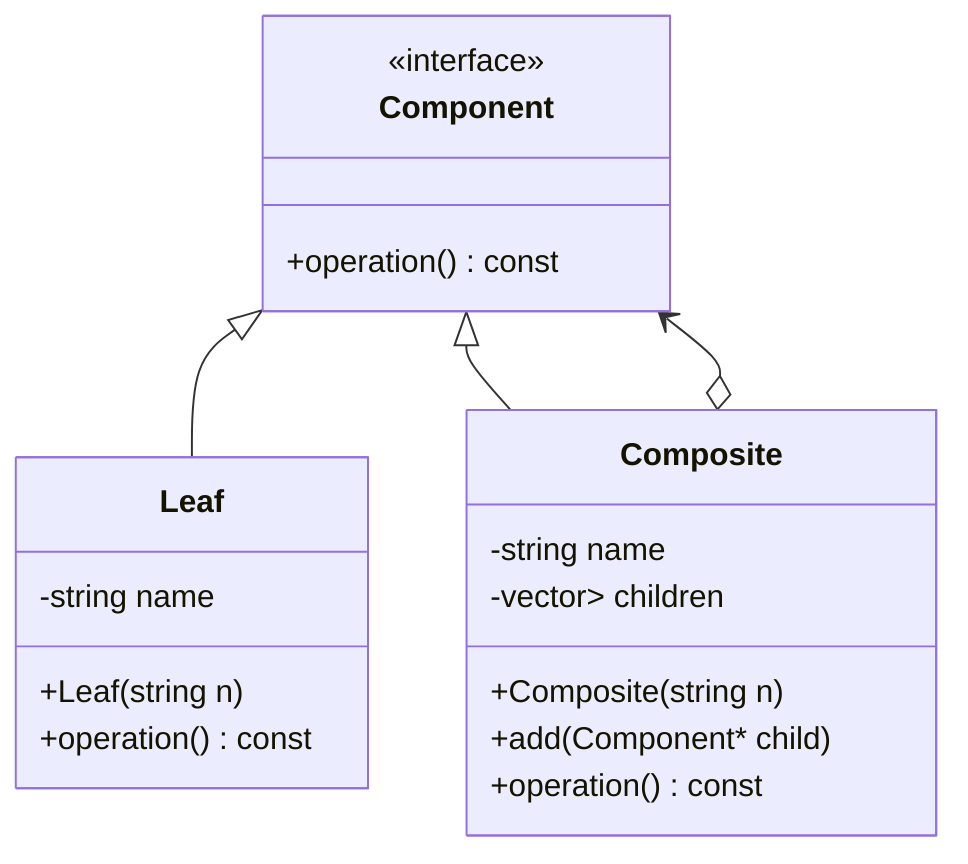

# Composite 패턴
**Leaf와 Composite를 동일한 인터페이스로 다루는 구조** 를 구현

## 🧠 Composite 패턴 개요
Composite 패턴은 트리 구조의 객체 계층을 만들고, **Leaf(단일 객체)** 와  
**Composite(자식들을 포함하는 객체)** 를 동일한 인터페이스로 처리할 수 있게 해줍니다.

## 🔹 스마트 포인터 은닉화 버전
- Composite::add 메서드가 std::unique_ptr<Component> 대신 raw pointer나 std::shared_ptr<Component>을 받아  
  내부에서 스마트 포인터로 감싸도록 만들면 됩니다.  
- 이렇게 하면 클라이언트는 스마트 포인터를 몰라도 되고, 단순히 객체를 생성해서 넘기면 됩니다.
  
```cpp
#include <iostream>
#include <vector>
#include <memory>
#include <string>

class Component {
public:
    virtual void operation() const = 0;
    virtual ~Component() = default;
};

class Leaf : public Component {
    std::string name;
public:
    Leaf(const std::string& n) : name(n) {}
    void operation() const override {
        std::cout << "Leaf: " << name << "\n";
    }
};

class Composite : public Component {
    std::string name;
    std::vector<std::unique_ptr<Component>> children;
public:
    Composite(const std::string& n) : name(n) {}

    // 스마트 포인터 은닉화: raw pointer를 받아 내부에서 unique_ptr로 관리
    void add(Component* child) {
        children.emplace_back(child);
    }

    void operation() const override {
        std::cout << "Composite: " << name << "\n";
        for (const auto& child : children) {
            child->operation();
        }
    }
};
```
```cpp
int main() {
    Composite root("Root");

    Composite* compositeA = new Composite("Composite A");
    compositeA->add(new Leaf("Leaf 1"));
    compositeA->add(new Leaf("Leaf 2"));

    root.add(compositeA);
    root.add(new Leaf("Leaf 3"));

    root.operation();
}
```

## ✨ 특징
- 클라이언트는 new Leaf(...) 또는 new Composite(...)만 호출하면 됩니다.
- Composite 내부에서 unique_ptr로 관리하므로 메모리 누수 위험이 없습니다.
- 스마트 포인터는 클래스 내부에서만 사용되고, 외부에는 노출되지 않습니다.

## 🔹 클래스 다이어그램

- 👉 이렇게 하면 클라이언트는 스마트 포인터를 몰라도 되고, Composite 내부에서 안전하게 메모리를 관리할 수 있습니다.

---

## 스마트 포인터 index 접근

- std::vector<std::unique_ptr<Component>> children; 에서 인덱스로 접근하면 std::unique_ptr<Component>& 타입이 반환됩니다.
- 즉, 벡터 요소는 unique_ptr 그 자체이므로, 그 안에 들어 있는 실제 객체(Component*)를 쓰려면 -> 또는 .get()을 사용해야 합니다.

### 🔹 접근 방식 정리
```cpp
children[i]              // unique_ptr<Component>&
children[i].get()        // Component* (raw pointer)
children[i]->operation() // 바로 Component의 멤버 호출 가능
```
- children[i] → unique_ptr<Component>&
- children[i].get() → Component*
- children[i]->operation() → Component의 가상 함수 호출 (가장 흔히 쓰는 방식)

### 🔹 예시 코드
```cpp
for (size_t i = 0; i < children.size(); ++i) {
    // 방법 1: 바로 unique_ptr을 통해 호출
    children[i]->operation();
    // 방법 2: raw pointer로 꺼내서 사용
    Component* ptr = children[i].get();
    ptr->operation();
}
```
## ✅ 결론:
- 인덱스로 접근하면 unique_ptr이 나오고, 그 안의 객체를 쓰려면 -> 연산자를 쓰는 게 가장 자연스럽습니다. 
- `.get()` 은 굳이 raw pointer가 필요할 때만 사용.

---


