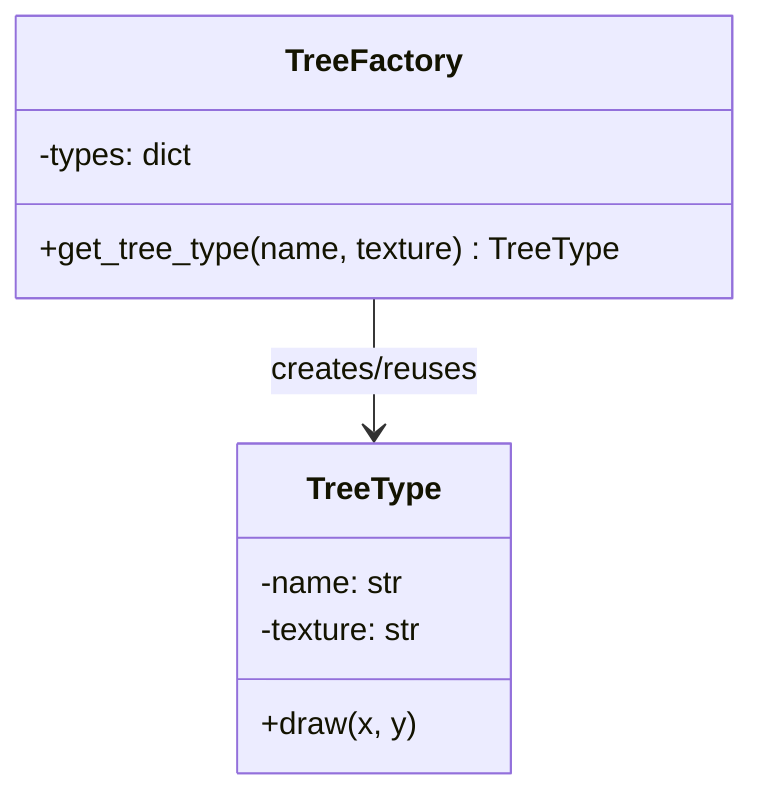

# 🧠 Flyweight 패턴이란?
- 목적: 동일한 데이터를 가진 객체들을 공유하여 메모리 사용을 최소화
- 핵심 개념:
- Intrinsic state: 공유 가능한 내부 상태
- Extrinsic state: 개별 객체마다 다른 외부 상태


## 🗺️ Flyweight 패턴 클래스 다이어그램



🧩 C# 버전
```cpp
using System;
using System.Collections.Generic;

class TreeType {
    public string Name { get; }
    public string Texture { get; }

    public TreeType(string name, string texture) {
        Name = name;
        Texture = texture;
    }

    public void Draw(int x, int y) {
        Console.WriteLine($"Drawing {Name} with texture {Texture} at ({x}, {y})");
    }
}

class TreeFactory {
    private Dictionary<string, TreeType> types = new();

    public TreeType GetTreeType(string name, string texture) {
        string key = name + texture;
        if (!types.ContainsKey(key)) {
            types[key] = new TreeType(name, texture);
        }
        return types[key];
    }
}

class Program {
    static void Main() {
        var factory = new TreeFactory();
        var tree1 = factory.GetTreeType("Oak", "Green");
        var tree2 = factory.GetTreeType("Oak", "Green");

        tree1.Draw(10, 20);
        tree2.Draw(30, 40);
    }
}

```
---
