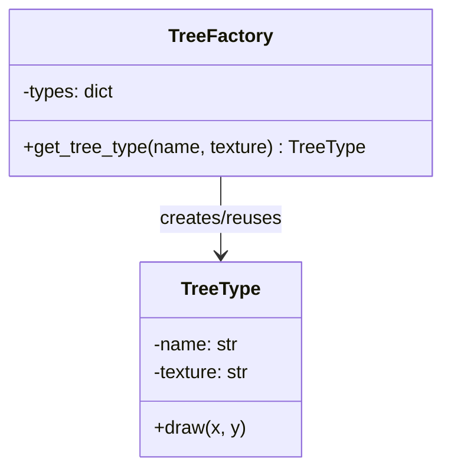
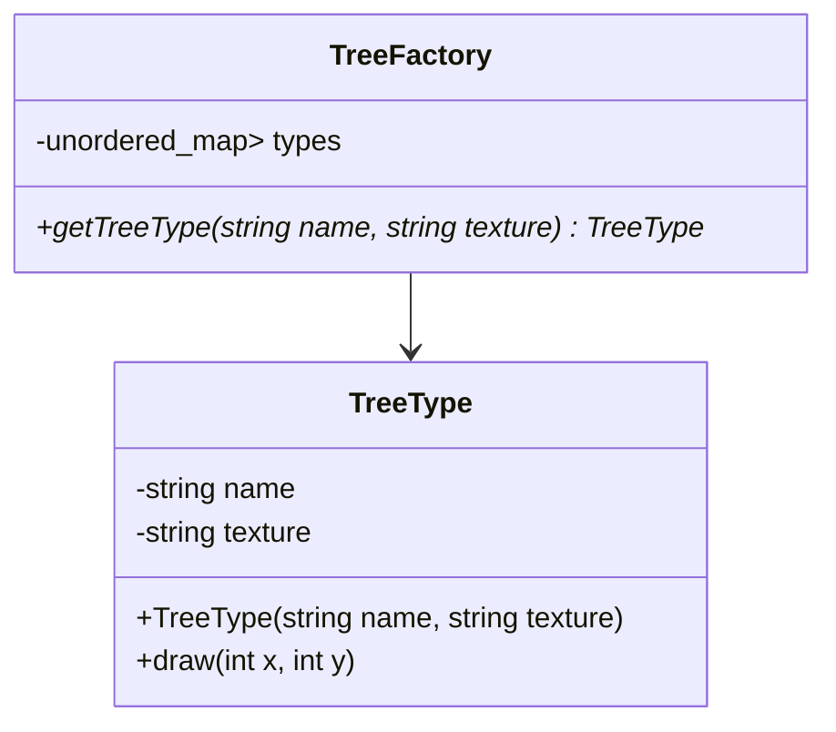

# 🧠 Flyweight 패턴이란?
- 목적: 동일한 데이터를 가진 객체들을 공유하여 메모리 사용을 최소화
- 핵심 개념:
- Intrinsic state: 공유 가능한 내부 상태
- Extrinsic state: 개별 객체마다 다른 외부 상태


## 🗺️ Flyweight 패턴 클래스 다이어그램



## 💻 C++ 버전
```cpp
#include <iostream>
#include <memory>
#include <unordered_map>

class TreeType {
public:
    TreeType(std::string name, std::string texture)
        : name(name), texture(texture) {}

    void draw(int x, int y) {
        std::cout << "Drawing " << name << " with texture " << texture
                  << " at (" << x << ", " << y << ")\n";
    }

private:
    std::string name;
    std::string texture;
};
```
```cpp
class TreeFactory {
public:
    std::shared_ptr<TreeType> getTreeType(const std::string& name, const std::string& texture) {
        std::string key = name + texture;
        if (types.find(key) == types.end()) {
            types[key] = std::make_shared<TreeType>(name, texture);
        }
        return types[key];
    }

private:
    std::unordered_map<std::string, std::shared_ptr<TreeType>> types;
};
```
```cpp
int main() {
    TreeFactory factory;
    auto tree1 = factory.getTreeType("Oak", "Green");
    auto tree2 = factory.getTreeType("Oak", "Green");

    tree1->draw(10, 20);
    tree2->draw(30, 40);
}

```
---

## 수정된 코드 (스마트 포인터 은닉화)
```cpp
#include <iostream>
#include <memory>
#include <unordered_map>

class TreeType {
public:
    TreeType(std::string name, std::string texture)
        : name(std::move(name)), texture(std::move(texture)) {}

    void draw(int x, int y) {
        std::cout << "Drawing " << name << " with texture " << texture
                  << " at (" << x << ", " << y << ")\n";
    }

private:
    std::string name;
    std::string texture;
};
```
```cpp
class TreeFactory {
public:
    TreeType* getTreeType(const std::string& name, const std::string& texture) {
        std::string key = name + texture;
        if (types.find(key) == types.end()) {
            types[key] = std::make_shared<TreeType>(name, texture);
        }
        // 내부에서는 shared_ptr 관리, 외부에는 raw pointer만 제공
        return types[key].get();
    }

private:
    std::unordered_map<std::string, std::shared_ptr<TreeType>> types;
};
```
```cpp
int main() {
    TreeFactory factory;
    TreeType* tree1 = factory.getTreeType("Oak", "Green");
    TreeType* tree2 = factory.getTreeType("Oak", "Green");

    tree1->draw(10, 20);
    tree2->draw(30, 40);
}
```


## 🔹 특징
- TreeFactory 내부에서 shared_ptr로 객체를 관리 → 메모리 안전성 유지.
- 외부에는 TreeType*만 반환 → 클라이언트는 스마트 포인터를 몰라도 됨.
- 클라이언트가 delete를 호출할 필요 없음 → 팩토리 소멸 시 자동 정리.

## 🔹 클래스 다이어그램

- 👉 이렇게 하면 클라이언트 코드가 스마트 포인터를 직접 다루지 않고도 안전하게 객체를 사용할 수 있습니다.


