# Abstract Factory Pattern

## 🧠 추상 팩토리 패턴이란?
서로 연관된 객체들을 제품군으로 묶어, 클라이언트가 구체적인 클래스에 의존하지 않고
일관된 방식으로 객체들을 생성할 수 있도록 하는 패턴입니다.

## 클래스 다이어 그램


---

## 기존 코드
## 🧱 C++ 예제
```cpp
// Abstract Products
class Button {
public:
    virtual void click() = 0;
    virtual ~Button() {}
};
```
```cpp
class Checkbox {
public:
    virtual void check() = 0;
    virtual ~Checkbox() {}
};
```
```cpp
// Concrete Products
class WindowsButton : public Button {
public:
    void click() override { std::cout << "Windows 버튼 클릭!\n"; }
};
```
```cpp
class MacButton : public Button {
public:
    void click() override { std::cout << "Mac 버튼 클릭!\n"; }
};
```
```cpp
class WindowsCheckbox : public Checkbox {
public:
    void check() override { std::cout << "Windows 체크박스 체크!\n"; }
};
```
```cpp
class MacCheckbox : public Checkbox {
public:
    void check() override { std::cout << "Mac 체크박스 체크!\n"; }
};
```
```cpp
// Abstract Factory
class GUIFactory {
public:
    virtual Button* createButton() = 0;
    virtual Checkbox* createCheckbox() = 0;
    virtual ~GUIFactory() {}
};
```
```cpp
// Concrete Factories
class WindowsFactory : public GUIFactory {
public:
    Button* createButton() override { return new WindowsButton(); }
    Checkbox* createCheckbox() override { return new WindowsCheckbox(); }
};
```
```cpp
class MacFactory : public GUIFactory {
public:
    Button* createButton() override { return new MacButton(); }
    Checkbox* createCheckbox() override { return new MacCheckbox(); }
};
```
```cpp
// Client
int main() {
    GUIFactory* factory = new WindowsFactory();
    Button* btn = factory->createButton();
    Checkbox* chk = factory->createCheckbox();

    btn->click();
    chk->check();

    delete btn;
    delete chk;
    delete factory;
    return 0;
}
```
- 지금 구현은 new/delete를 직접 쓰고 있어서 클라이언트가 메모리 관리까지 책임져야 합니다.
- 이를 스마트 포인터 기반으로 바꾸고, 동시에 스마트 포인터를 은닉화하면 클라이언트는 단순히 객체를 받아서 쓰기만 하고, 메모리 관리 책임은 팩토리 내부에 숨길 수 있습니다.

## 🔹 스마트 포인터 + 은닉화 버전
```cpp
#include <iostream>
#include <memory>

// Abstract Products
class Button {
public:
    virtual void click() = 0;
    virtual ~Button() {}
};
```
```cpp
class Checkbox {
public:
    virtual void check() = 0;
    virtual ~Checkbox() {}
};
```
```cpp
// Concrete Products
class WindowsButton : public Button {
public:
    void click() override { std::cout << "Windows 버튼 클릭!\n"; }
};
```
```cpp
class MacButton : public Button {
public:
    void click() override { std::cout << "Mac 버튼 클릭!\n"; }
};
```
```cpp
class WindowsCheckbox : public Checkbox {
public:
    void check() override { std::cout << "Windows 체크박스 체크!\n"; }
};
```
```cpp
class MacCheckbox : public Checkbox {
public:
    void check() override { std::cout << "Mac 체크박스 체크!\n"; }
};
```
```cpp
// Abstract Factory
class GUIFactory {
public:
    virtual Button* createButton() = 0;
    virtual Checkbox* createCheckbox() = 0;
    virtual ~GUIFactory() {}
};
```
```cpp
// Concrete Factories
class WindowsFactory : public GUIFactory {
    // 내부에서 unique_ptr 관리
    std::vector<std::unique_ptr<Button>> buttons;
    std::vector<std::unique_ptr<Checkbox>> checkboxes;
public:
    Button* createButton() override {
        buttons.push_back(std::make_unique<WindowsButton>());
        return buttons.back().get(); // raw pointer만 반환
    }
    Checkbox* createCheckbox() override {
        checkboxes.push_back(std::make_unique<WindowsCheckbox>());
        return checkboxes.back().get();
    }
};
```
```cpp
class MacFactory : public GUIFactory {
    std::vector<std::unique_ptr<Button>> buttons;
    std::vector<std::unique_ptr<Checkbox>> checkboxes;
public:
    Button* createButton() override {
        buttons.push_back(std::make_unique<MacButton>());
        return buttons.back().get();
    }
    Checkbox* createCheckbox() override {
        checkboxes.push_back(std::make_unique<MacCheckbox>());
        return checkboxes.back().get();
    }
};
```
```cpp
// Client
int main() {
    std::unique_ptr<GUIFactory> factory = std::make_unique<WindowsFactory>();

    Button* btn = factory->createButton();   // raw pointer만 사용
    Checkbox* chk = factory->createCheckbox();

    btn->click();
    chk->check();

    // delete 필요 없음! factory가 소멸될 때 내부 unique_ptr이 알아서 정리
    return 0;
}
```

## 🔹 특징
- 클라이언트는 Button*, Checkbox*만 받아서 사용 → 스마트 포인터를 몰라도 됨.
- 팩토리 내부에서 unique_ptr로 객체를 관리 → 메모리 누수 방지.
- 팩토리 소멸 시점에 모든 객체 자동 정리 → delete 불필요.
- 👉 이렇게 하면 클라이언트는 스마트 포인터를 전혀 몰라도 되고, 팩토리 내부에서 안전하게 메모리를 관리할 수 있습니다.

---


