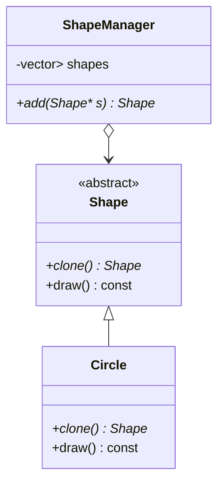

# Prototype Pattern

## 🧠 프로토타입 패턴이란?
- 객체를 직접 생성하지 않고, **기존 객체를 복제(clone)** 해서 새로운 객체를 만드는 생성 패턴입니다.
- 복잡한 초기화 과정을 피하고, 런타임에 객체를 유연하게 생성할 수 있게 해줍니다.

## 구현 코드
```cpp
#include <iostream>
#include <memory>

class Shape {
public:
    virtual std::unique_ptr<Shape> clone() const = 0;
    virtual void draw() const = 0;
    virtual ~Shape() {}
};
```
```cpp
class Circle : public Shape {
public:
    std::unique_ptr<Shape> clone() const override {
        return std::make_unique<Circle>(*this);
    }
    void draw() const override {
        std::cout << "Drawing Circle\n";
    }
};
```
```cpp
int main() {
    std::unique_ptr<Shape> original = std::make_unique<Circle>();
    std::unique_ptr<Shape> copy = original->clone();

    original->draw();
    copy->draw();
}
```

---

## 🔹 Prototype 패턴 (스마트 포인터 은닉화 버전)
```cpp
#include <iostream>
#include <memory>
#include <vector>

class Shape {
public:
    virtual Shape* clone() const = 0;   // raw pointer 반환
    virtual void draw() const = 0;
    virtual ~Shape() {}
};
```
```cpp
class Circle : public Shape {
public:
    Shape* clone() const override {
        return new Circle(*this);   // 내부에서 new, 외부는 raw pointer
    }
    void draw() const override {
        std::cout << "Drawing Circle\n";
    }
};
```
```cpp
// Shape 관리 컨테이너 (스마트 포인터 은닉화)
class ShapeManager {
    std::vector<std::unique_ptr<Shape>> shapes;
public:
    Shape* add(Shape* s) {
        shapes.emplace_back(s);   // unique_ptr로 관리
        return s;
    }
};
```
```cpp
int main() {
    ShapeManager manager;

    Shape* original = manager.add(new Circle());
    Shape* copy = manager.add(original->clone());

    original->draw();
    copy->draw();

    // delete 불필요: manager가 unique_ptr로 관리
    return 0;
}
```
## 🔹 특징
- clone()은 raw pointer를 반환 → 클라이언트는 스마트 포인터를 몰라도 됨.
- ShapeManager 내부에서 unique_ptr로 관리 → 메모리 안전성 확보.
- 클라이언트는 단순히 Shape*만 받아서 사용 → 코드가 간결해짐.
- ShapeManager가 소멸될 때 모든 객체 자동 해제.

## 🔹 Mermaid 다이어그램

- 👉 이렇게 하면 Prototype 패턴을 유지하면서도 클라이언트는 스마트 포인터를 직접 다루지 않고,  
  내부에서만 안전하게 관리할 수 있습니다.

---

## 🔹 전체 코드 (Manager가 생성 책임을 가짐)
```cpp
#include <iostream>
#include <memory>
#include <vector>

// Prototype 인터페이스
class Shape {
public:
    virtual Shape* clone() const = 0;   // raw pointer 반환
    virtual void draw() const = 0;
    virtual ~Shape() {}
};
```
```cpp
// Concrete Prototype
class Circle : public Shape {
public:
    Shape* clone() const override {
        return new Circle(*this);   // 복제된 객체를 raw pointer로 반환
    }
    void draw() const override {
        std::cout << "Drawing Circle\n";
    }
};
```
```cpp
// Shape 관리 클래스 (생성 책임 포함)
class ShapeManager {
    std::vector<std::unique_ptr<Shape>> shapes;
public:
    // 새로운 객체 생성 (팩토리 역할)
    template<typename T, typename... Args>
    Shape* create(Args&&... args) {
        auto s = std::make_unique<T>(std::forward<Args>(args)...);
        Shape* raw = s.get();
        shapes.push_back(std::move(s));
        return raw;
    }

    // 기존 객체 복제
    Shape* cloneShape(const Shape* original) {
        auto s = std::unique_ptr<Shape>(original->clone());
        Shape* raw = s.get();
        shapes.push_back(std::move(s));
        return raw;
    }

    void drawAll() const {
        for (const auto& s : shapes) {
            s->draw();
        }
    }
};
```
```cpp
int main() {
    ShapeManager manager;

    // Manager가 직접 생성
    Shape* original = manager.create<Circle>();

    // Manager가 복제까지 책임
    Shape* copy = manager.cloneShape(original);

    original->draw();
    copy->draw();

    std::cout << "---- Manager drawAll() ----\n";
    manager.drawAll();

    // delete 필요 없음: manager가 unique_ptr로 관리
    return 0;
}
```

## 🔹 특징
- 클라이언트는 절대 new를 호출하지 않음 → Manager가 생성 책임을 가짐.
- create<T>()로 객체를 만들고, cloneShape()로 복제 → 모두 Manager 내부에서 unique_ptr 관리.
- 클라이언트는 Shape*만 받아서 사용 → 스마트 포인터 은닉화.
- Manager 소멸 시 모든 객체 자동 해제 → 메모리 누수 방지.

- 👉 이렇게 하면 Prototype 패턴을 유지하면서도, 객체 생성과 메모리 관리 책임을 전부 Manager가 맡아  
  클라이언트 코드가 훨씬 안전하고 단순해집니다.

---


