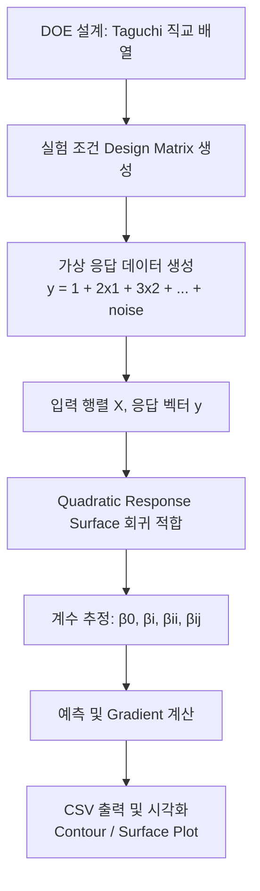
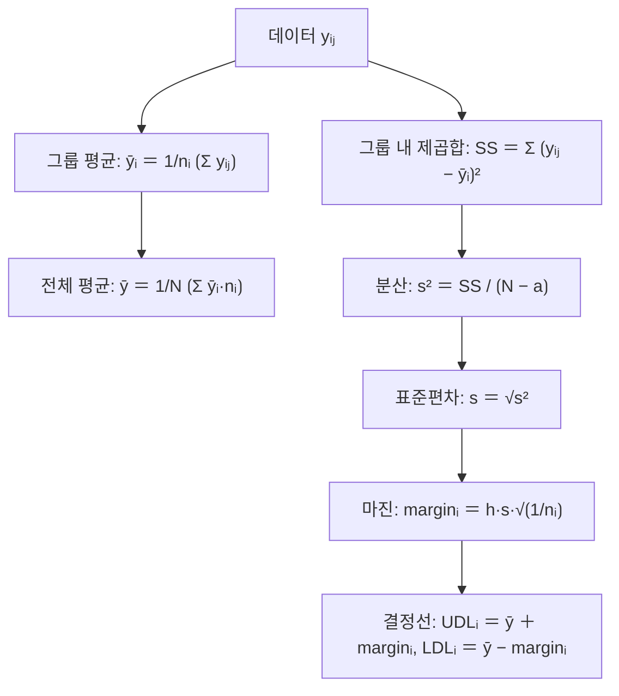
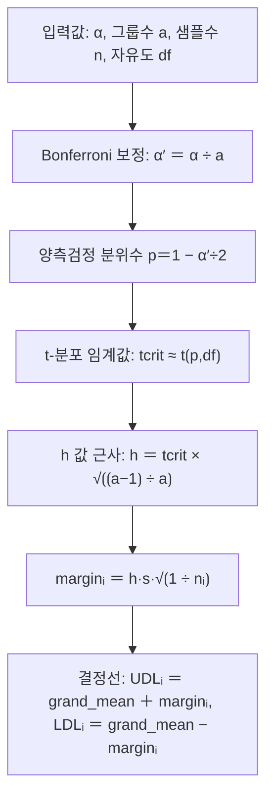

# DOE / Response Surface / ANOM 정리 (doe.md)

DOE(Design of Experiments, 실험계획법), Response Surface Methodology(응답면법), 그리고 **ANOM(Analysis of Means, 평균분석)** 을  
구현한 C++ 유틸리티의 흐름을 정리. 핵심 의도와 원리, 수식을 좀 더 체계적으로 설명.

## DOE (실험계획법)와 Taguchi 직교 배열
### 🎯 의도
- 여러 요인(factor)이 결과(response)에 어떤 영향을 주는지 최소한의 실험 횟수로 파악하기.
- Taguchi 직교 배열은 균형 잡힌 설계 행렬을 제공해서, 요인들의 효과를 독립적으로 추정할 수 있게 해줍니다.
### 📐 원리
- 예: L9(3^4) 배열은 4개의 요인, 각 요인 3수준, 총 9개의 실험으로 구성.
- 직교 배열의 **직교성** 은 각 수준 조합이 균형 있게 나타나도록 보장합니다.
  
### 🧮 수식
- 설계 행렬 X: 각 행은 실험 조건, 각 열은 요인 값.
- 예: X 크기 = $9\times 4$.

## 2. Quadratic Response Surface (2차 응답면)
### 🎯 의도
- 실험 데이터를 기반으로 근사 모델을 만들고, 최적 조건을 탐색하거나 요인 간 상호작용을 이해하기.
- 2차 다항식은 곡선/곡면을 표현할 수 있어, 단순 선형보다 더 현실적인 모델링 가능.
### 📐 원리
- 모델:

$$
𝑦 = 𝛽₀ + ∑ᵢ 𝛽ᵢ 𝑥ᵢ + ∑ᵢ 𝛽ᵢᵢ 𝑥ᵢ² + ∑ᵢ<ⱼ 𝛽ᵢⱼ 𝑥ᵢ 𝑥ⱼ
$$

- 계수 추정: 최소제곱법

$$
\hat {\beta }=\arg \min _{\beta }\| Z\beta -y\| _2
$$

- 여기서 Z는 확장된 설계 행렬 (절편, 1차항, 제곱항, 교호항 포함).

### 🧮 Gradient (기울기)
- 각 변수에 대한 편미분:

$$  
\frac{\partial y}{\partial x_i}=\beta _i+2\beta _{ii}x_i+\sum _{j\neq i}\beta _{ij}x_j
$$

- 최적화나 민감도 분석에 활용.
  
## 3. ANOM (Analysis of Means)
### 🎯 의도
- 여러 그룹 평균이 전체 평균과 유의하게 다른지를 시각적으로 확인.
- ANOVA와 유사하지만, 그래프 기반으로 직관적으로 해석.
### 📐 원리
- 각 그룹 평균 $\bar {y}_i$ 와 전체 평균 $\bar {y}$ 비교.
- 결정선(UDL/LDL)을 그려서, 그룹 평균이 선 밖에 있으면 유의하게 다르다고 판단.
### 🧮 수식
- 전체 평균:

$$
\bar {y}=\frac{1}{N}\sum _{i=1}^a\sum _{j=1}^{n_i}y_{ij}
$$

- 그룹 내 분산:

$$
s^2=\frac{\sum _{i=1}^a\sum _{j=1}^{n_i}(y_{ij}-\bar {y}_i)^2}{N-a}
$$

- 마진:

$$
\mathrm{margin_{\mathnormal{i}}}=h\cdot s\cdot \sqrt{\frac{1}{n_i}}
$$

- 결정선:

$$
UDL_i=\bar {y}+\mathrm{margin_{\mathnormal{i}}},\quad LDL_i=\bar {y}-\mathrm{margin_{\mathnormal{i}}}
$$

- 여기서 h는 Bonferroni 보정 기반으로 근사한 값: $h\approx t_{\mathrm{crit}}\cdot \sqrt{\frac{a-1}{a}}$

## 4. 전체 흐름 요약
- DOE 설계: 직교 배열로 실험 조건 생성.
- 가상 데이터 생성: 특정 수식 기반으로 응답값 y 만들기.
- Response Surface 회귀: 2차 다항식으로 근사 모델 적합.
- ANOM 분석: 그룹 평균과 전체 평균 비교, 결정선으로 유의성 확인.
- CSV 출력: 결과를 시각화 도구로 확인 가능.


## 5. 흐름도
- 앞서 설명드린 DOE 설계 → 데이터 생성 → 회귀분석 → 결과 활용 흐름.


- 이 다이어그램은 다음을 보여줍니다:
  - A → B: DOE(Taguchi OA)로 설계 행렬을 만든다.
  - B → C: 설계 조건에 따라 가상 응답값을 계산한다.
  - C → D: 입력 행렬 X와 응답 벡터 y를 준비한다.
  - D → E: Quadratic Response Surface 모델을 적합한다.
  - E → F: 계수를 추정한다.
  - F → G: 예측과 Gradient를 계산한다.
  - G → H: 결과를 CSV로 저장하고 시각화한다.

---


## 1. `doe_full_test` 전체 흐름

- `doe_full_test.cpp` 에서는 두 가지 큰 테스트를 수행합니다.
  - 1. **Taguchi 직교 배열 + 2차 응답면(Quadratic Response Surface) 회귀 테스트**
  - 2. **ANOM (Analysis of Means) 전체 파이프라인 테스트**
- 두 테스트 모두 **가상 데이터를 생성** 해서 전체 로직이 잘 돌아가는지 검증합니다.


### 1.1 Taguchi + Quadratic Response Surface 테스트

함수: `test_taguchi_and_response_surface()`

#### 1.1.1 L9 직교 배열 사용

- 사용한 배열: **L9(3^4)**  
  - 9개의 실험(run)  
  - 4개의 요인(factor)  
  - 각 요인은 3수준(levels) (예: -1, 0, 1)

- 코드에서는:
  - `const OrthogonalArray& oa = OA_L9_3_4();`
  - `FactorLevels` 구조체를 이용해서 각 요인의 실제 수준값을 설정합니다.

  ```cpp
  std::vector<FactorLevels> factors(4);
  for (auto& f : factors) {
      f.levels = {-1.0, 0.0, 1.0};
  }
  ```

- `build_design_from_orthogonal_array(oa, factors)` 를 호출하면
  - 직교 배열의 level index (0,1,2) 를 실제 값(-1,0,1)으로 변환한
  - `std::vector<std::vector<double>> design` 이 생성됩니다.

- 결과적으로, 9 x 4 크기의 설계 행렬이 만들어집니다.  
  - 각 행이 하나의 실험 조건 (x1,x2,x3,x4) 에 해당합니다.


#### 1.1.2 가상 응답 데이터 생성

우리가 응답값 `y`를 만들 때 사용하는 **진짜** 모델은 다음과 같습니다.

- 요인은 실제로 **x1, x2만 사용** 하고 x3, x4는 더미(dummy)로 둡니다.
- 모델:

  ```text
  y = 1
      + 2 * x1
      + 3 * x2
      + 1 * x1^2
      - 0.5 * x2^2
      + 0.2 * x1 * x2
      + noise
  ```

여기서:

- `x1`, `x2` 는 -1, 0, 1 수준을 가지는 실험 인자
- `noise` 는 평균 0, 표준편차 0.1 정도의 정규분포 잡음입니다.

DOE 설계에서는 **요인(factor)** 을 4개로 잡았지만, 실제로 응답 모델을 만들 때는 x1, x2 두 개만 사용.  
이게 가능한 이유와 의미를 정리.

### 1. 왜 4개 중 2개만 썼을까?
- DOE 직교 배열(L9(3^4))은 4개의 요인, 각 3수준을 균형 있게 배치한 설계입니다.
- 하지만 우리가 만든 **진짜** 응답 모델은:

$$
y=1+2x_1+3x_2+x_1^2-0.5x_2^2+0.2x_1x_2+\varepsilon
$$

- 여기서 **x3, x4는 더미(dummy)** 로 두었음.
- 즉, 설계 행렬은 4개 요인을 포함하지만, 실제 데이터 생성은 2개 요인만 반영 → 나머지 두 요인은 응답에 영향이 없는 변수로 취급됩니다.

### 2. 괜찮은 이유
- DOE에서는 종종 **더미 요인(dummy factor)** 를 넣습니다.
  - 직교 배열의 구조를 맞추기 위해서, 또는 모델 검증용으로.
- x3, x4가 응답에 영향을 주지 않으면, 회귀분석 시 해당 계수들이 0 근처로 추정됩니다.
- 이렇게 하면 모델이 **불필요한 요인은 자동으로 무시** 하는지 확인할 수 있고, 모델의 안정성을 검증하는 데 도움이 됩니다.

### 3. 주의할 점
- 만약 실제로는 x3, x4도 영향을 주는데 모델에 포함하지 않으면 → 모형이 잘못 지정(misspecification) 되어 추정이 왜곡될 수 있습니다.
- 하지만 여기서는 테스트 목적으로 일부 요인만 쓰는 것이므로 문제 없습니다.
- DOE 설계는 전체 요인을 고려하지만, 분석 단계에서는 실제로 중요한 요인만 모델에 포함하는 게 일반적입니다.

### 4. 요약
- DOE 설계: 4개 요인으로 균형 잡힌 실험 조건 생성.
- 응답 모델: 실제로는 2개 요인만 사용, 나머지는 더미.
- 괜찮은 이유: 모델 검증과 단순화 목적.
- 실제 분석에서는 반드시 중요한 요인을 모두 포함해야 함.
- 👉 정리하면: **요인은 4개로 설계했지만, 응답에 영향을 주는 건 2개만** 이라는 설정은 의도된 것이고, 테스트/검증 목적에서는 전혀 문제 없어요.

- 코드에서는:

```cpp
std::mt19937 rng(12345);
std::normal_distribution<double> noise(0.0, 0.1);

const int n = design.size();  // 9
const int k = 2;              // 실제 모델에 쓰는 요인 수 (x1, x2만)

Eigen::MatrixXd X(n, k);
Eigen::VectorXd y(n);

for (int r = 0; r < n; ++r) {
    double x1 = design[r][0]; // F1
    double x2 = design[r][1]; // F2
    double eps = noise(rng);

    double yy = 1.0
              + 2.0 * x1
              + 3.0 * x2
              + 1.0 * x1 * x1
              - 0.5 * x2 * x2
              + 0.2 * x1 * x2
              + eps;

    X(r, 0) = x1;
    X(r, 1) = x2;
    y(r)    = yy;
}
```
- 이렇게 해서 **입력 행렬 X (9 x 2)** 와 **응답 벡터 y (9)** 를 얻습니다.


### 1. 난수 생성기와 잡음 분포 설정
```cpp
std::mt19937 rng(12345);
std::normal_distribution<double> noise(0.0, 0.1);
```
- rng(12345) → 시드가 12345인 Mersenne Twister 난수 발생기.
- noise(0.0, 0.1) → 평균 0, 표준편차 0.1인 정규분포.
  - 실험 데이터에 **잡음(오차)** 를 추가하기 위해 사용.

### 2. 행렬 크기 정의
```cpp
const int n = design.size();  // 9 (실험 횟수)
const int k = 2;              // 실제 모델에 쓰는 요인 수 (x1, x2만)

Eigen::MatrixXd X(n, k);
Eigen::VectorXd y(n);
```
- design은 DOE 직교 배열에서 만든 설계 행렬 (9개의 실험 조건).
- X → 입력 변수 행렬 (9행 × 2열).
- y → 응답 벡터 (길이 9).

### 3. 루프: 각 실험 조건에 대해 응답값 계산
```cpp
for (int r = 0; r < n; ++r) {
    double x1 = design[r][0]; // 첫 번째 요인
    double x2 = design[r][1]; // 두 번째 요인
    double eps = noise(rng);  // 잡음

    double yy = 1.0
              + 2.0 * x1
              + 3.0 * x2
              + 1.0 * x1 * x1
              - 0.5 * x2 * x2
              + 0.2 * x1 * x2
              + eps;

    X(r, 0) = x1;
    X(r, 1) = x2;
    y(r)    = yy;
}
```

- 여기서 yy는 **진짜 모델** 을 따라 계산된 응답값:
  
$$
y=1+2x_1+3x_2+1x_1^2-0.5x_2^2+0.2x_1x_2+\varepsilon
$$

- eps 는 잡음 → 현실적인 데이터처럼 보이게 함.
- X 행렬에는 입력값 (x1, x2) 저장.
- y 벡터에는 계산된 응답값 저장.

### 4. 전체 목적
- DOE 설계 행렬에서 나온 조건을 기반으로
- **가상의 실험 데이터 (X, y)** 를 생성
- 이후 QuadraticResponseSurface 같은 회귀 모델에 넣어서 계수 추정을 테스트할 수 있게 준비하는 단계.
- 👉 한마디로 요약하면:
  - **직교 배열 설계 조건을 바탕으로, 잡음이 섞인 2차 다항식 응답 데이터를 만들어서 회귀분석용 입력(X)과 출력(y)을 채워 넣는 코드** 입니다.


#### 1.1.3 QuadraticResponseSurface 회귀

이제 `QuadraticResponseSurface` 클래스를 사용하여
위 데이터를 이용한 2차 응답면을 적합합니다.

```cpp
QuadraticResponseSurface rs;
bool ok = rs.fit(X, y);
```

`fit` 내부에서 하는 일은 다음과 같습니다.

- 1. X 를 받아서 2차 설계 행렬 Z 를 만듭니다.
   - 절편항 1
   - 1차항: $x1$, $x2$
   - 제곱항: $x1^2$, $x2^2$
   - 교호항: $x1$ * $x2$
   - 즉, 요인 수 k=2라면 계수 개수 p는:

```text
p = 1 (절편)
   + k (1차항)
   + k (제곱항)
   + k*(k-1)/2 (교호항)
 = 1 + 2 + 2 + 1 = 6
```

- 2. 최소제곱 해:
   - y ≈ Z * beta 를 만족하는 beta 를 QR 분해로 구합니다.
 ```text
 beta_hat = argmin ||Z * beta - y||_2
 ```

- 3. 구해진 beta를
   - `beta0` (절편),
   - `beta_linear` (크기 k 벡터),
   - `beta_quadratic` (크기 k 벡터),
   - `beta_cross` (k x k 대칭 행렬)
   로 분해해서 저장합니다.

- 그리고 테스트 코드에서 **진짜 계수** 와 비교해봅니다.

- 진짜 계수:
  ```text
  beta0       = 1.0
  beta_linear = [2.0, 3.0]
  beta_quad   = [1.0, -0.5]
  beta_cross  = [[0, 0.2], [0.2, 0]]
  ```

- 추정 계수는 다음처럼 출력됩니다.
  ```cpp
  std::cout << "estimated beta0      = " << rs.beta0() << "\n";
  std::cout << "estimated beta_linear= " << rs.beta_linear().transpose() << "\n";
  std::cout << "estimated beta_quad  = " << rs.beta_quadratic().transpose() << "\n";
  std::cout << "estimated beta_cross = \n" << rs.beta_cross() << "\n";
  ```
- 잡음이 조금 들어가 있기 때문에 **추정값은 진짜 값 근처의 수치** 가 나오게 됩니다.


#### 1.1.4 예측값과 Gradient 확인

- 예시로 x = (0.3, -0.4) 에 대해:

```cpp
Eigen::VectorXd x(2);
x << 0.3, -0.4;

double y_pred = rs.predict(x);
Eigen::VectorXd g = rs.gradient(x);
```

- `predict` 는 위에서 적합한 2차 다항식을 이용하여 y(x)를 계산합니다.
- `gradient` 는 각 변수에 대한 편미분을 모은 벡터입니다.

- 모델이

```text
y = beta0
    + sum_i beta_i * x_i
    + sum_i beta_ii * x_i^2
    + sum_{i<j} beta_ij * x_i * x_j
```

- 일 때, 기울기는

```text
∂y/∂x_i = beta_i
          + 2 * beta_ii * x_i
          + sum_{j != i} beta_ij * x_j
```
입니다.


#### 1.1.5 응답면 그리드 CSV 출력

- 마지막으로, x1, x2 를 [-1,1] 범위에서 21 x 21 격자로 샘플링하고,  
  - 각 점에서의 응답면 값을 계산해서 `response_surface_grid.csv` 에 저장합니다.

```cpp
std::ofstream rs_csv("response_surface_grid.csv");
rs_csv << "x1,x2,y\n";
int grid = 21;
for (int i = 0; i < grid; ++i) {
    for (int j = 0; j < grid; ++j) {
        double xx1 = -1.0 + 2.0 * i / (grid - 1);
        double xx2 = -1.0 + 2.0 * j / (grid - 1);
        Eigen::VectorXd xv(2);
        xv << xx1, xx2;
        double yy = rs.predict(xv);
        rs_csv << xx1 << "," << xx2 << "," << yy << "\n";
    }
}
```

- 이 CSV 파일을 Python, Excel, gnuplot 등으로 읽으면  
  - 2D contour 또는 3D surface plot을 쉽게 그릴 수 있습니다.

---

### 1.2 ANOM (Analysis of Means) 파이프라인 테스트

- 함수: `test_anom_pipeline()`

#### 1.2.1 가상 그룹 데이터 생성

- 그룹 수 a = 4
- 각 그룹당 샘플 수 n = 8
- 각 그룹은 서로 다른 평균을 가지는 정규분포에서 샘플링:

```text
true_means = [10.0, 10.5, 9.7, 11.0]
sigma      = 0.2
```

- 코드:

```cpp
const int a = 4;
const int n = 8;
const int df = a * (n - 1); // within-group 자유도

double true_means[a] = {10.0, 10.5, 9.7, 11.0};
double sigma = 0.2;

std::mt19937 rng(54321);
std::normal_distribution<double> noise(0.0, sigma);

std::vector<std::vector<double>> groups(a);
for (int i = 0; i < a; ++i) {
    groups[i].resize(n);
    for (int j = 0; j < n; ++j) {
        groups[i][j] = true_means[i] + noise(rng);
    }
}
```

### 코드 설명 단계별
- 1. 그룹 수와 샘플 수 정의
```cpp
const int a = 4;   // 그룹 수 (예: 4개 그룹)
const int n = 8;   // 각 그룹당 샘플 수
const int df = a * (n - 1); // within-group 자유도
```
- 그룹이 4개 있고, 각 그룹에 샘플이 8개씩 존재합니다.
- 자유도(df)는 ANOM/ANOVA에서 그룹 내 분산을 계산할 때 쓰이는 값입니다.

- 2. "진짜 평균값"과 표준편차 설정
```cpp
double true_means[a] = {10.0, 10.5, 9.7, 11.0};
double sigma = 0.2;
```

- 각 그룹의 진짜 평균값을 다르게 설정합니다.
  - 그룹1 평균 = 10.0
  - 그룹2 평균 = 10.5
  - 그룹3 평균 = 9.7
  - 그룹4 평균 = 11.0
- sigma = 0.2 → 각 그룹 데이터는 평균 주변에서 표준편차 0.2인 정규분포로 퍼져 있습니다.
- 즉, 그룹1은 평균 10.0을 중심으로 데이터가 퍼져 있고, 그룹2는 평균 10.5를 중심으로 퍼져 있는 집단이라는 뜻.

- 📊 직관적인 예시
  - 그룹1: 어떤 공정에서 나온 제품의 길이 (평균 10.0cm)
  - 그룹2: 다른 조건에서 나온 제품의 길이 (평균 10.5cm)
  - 그룹3: 또 다른 조건 (평균 9.7cm)
  - 그룹4: 또 다른 조건 (평균 11.0cm)
- 각 그룹은 조건이 다른 실험 집단이라고 생각하면 됩니다.
- ANOM은 이 그룹들의 평균이 전체 평균과 비교했을 때 유의하게 다른지를 보는 방법.

 - ANOM/ANOVA에서 쓰는 **그룹 내 분산(pooled within-group variance)** 은 다음 과정을 거쳐 계산:

- 1. 그룹 평균과 전체 평균
  - 각 그룹 i의 평균:

$$  
\bar {y}_i=\frac{1}{n_i}\sum _{j=1}^{n_i}y_{ij}
$$

- 전체 평균(Grand Mean):

$$
\bar {y}=\frac{1}{N}\sum _{i=1}^a\sum _{j=1}^{n_i}y_{ij}
$$

- 여기서 $N=\sum _in_i$.

2. 분산 계산 방식
ANOM에서 쓰는 분산은 **그룹 내 변동(Within-group variance)** 입니다.
즉, 각 그룹 안에서 데이터가 자기 그룹 평균 $\bar {y}_i$ 주변에 얼마나 퍼져 있는지를 합쳐서 계산합니다.

$$
SS_{\mathrm{within}}=\sum _{i=1}^a\sum _{j=1}^{n_i}(y_{ij}-\bar {y}_i)^2
$$

- 4. 자유도와 분산 추정
  - 자유도: $df=N-a$ (전체 샘플 수에서 그룹 수를 뺀 값)
  - 분산 추정값:

$$
s^2=\frac{SS_{\mathrm{within}}}{N-a}
$$

  - 표준편차:

$$  
s=\sqrt{s^2}
$$

✅ 정리
- 그룹 평균은 각 집단의 중심값을 나타내고,
- 전체 평균은 모든 데이터를 합친 중심값을 나타냅니다.
- 하지만 분산 계산은 전체 평균이 아니라 각 그룹 평균을 기준으로 합니다.
  - 즉, **각 그룹 안에서 데이터가 자기 그룹 평균과 얼마나 차이나는지** 를 모아서 전체 분산을 추정하는 거예요.


ANOM에서 그룹 평균 → 전체 평균 → 그룹 내 제곱합 → 분산 추정 → 표준편차 → 결정선(UDL/LDL) 으로 이어지는 과정



📊 흐름 설명
- 그룹 데이터 → 각 그룹의 평균을 계산.
- 그룹 평균 → 전체 평균(Grand Mean)을 계산.
- 그룹 내 제곱합 → 각 데이터가 자기 그룹 평균에서 얼마나 벗어났는지 합산.
- 분산 추정 → 자유도 N-a로 나눠서 그룹 내 분산을 추정.
- 표준편차 → 분산의 제곱근.
- 마진 → ANOM에서 사용하는 h 값과 표준편차로 계산.
- 결정선 → 전체 평균 ± 마진으로 UDL/LDL을 구함.

## 분산 의미 설명
그룹마다 실제로는 분산이 다를 수 있습니다.  
그런데 코드에서는 sigma = 0.2 하나만 두고 모든 그룹에 동일하게 적용. 
이 차이를 정리.

- 1. 이론적으로는
- 그룹 i의 데이터는 보통

$$
y_{ij}\sim \mathcal{N}(\mu _i,\sigma _i^2)
$$

  - 처럼 각 그룹마다 평균 $\mu _i$ 와 분산 $\sigma _i^2$ 를 가질 수 있습니다.
  - 즉, **그룹별 분산 $\sigma _i^2$** 가 따로 존재하는 게 맞습니다.
- 2. 코드에서는 왜 sigma를 하나만 썼나?
```cpp
double sigma = 0.2;
std::normal_distribution<double> noise(0.0, sigma);
```
- 여기서는 테스트용 가상 데이터를 만들기 때문에 단순화를 한 겁니다.
- 모든 그룹이 **같은 분산(σ² = 0.04)** 을 가진다고 가정해서, 그룹 간 차이는 평균값의 차이만 반영되도록 설계했습니다.
- 이렇게 하면 ANOM 파이프라인을 검증할 때, **평균 차이만으로 그룹이 구분되는지** 를 확인할 수 있습니다.
- 3. 실제 ANOM/ANOVA에서는- 그룹마다 분산이 다를 수 있고, 그 경우 등분산성(equal variance) 가정을 먼저 확인합니다.
  - 등분산성이 성립하면 하나의 공통 분산(σ²)을 추정해서 쓰고,
  - 성립하지 않으면 Welch ANOVA 같은 변형 방법을 사용합니다.
- 4. 요약- 이론: 그룹마다 분산이 다를 수 있음 → σ₁², σ₂², … σₐ².
  - 코드: 단순화를 위해 모든 그룹에 같은 σ = 0.2를 사용.
  - 의도: 평균 차이만 반영해서 ANOM 알고리즘이 잘 동작하는지 확인하기 위함.
  - 실제 분석: 그룹별 분산이 다르면 등분산성 검정 후 적절한 방법을 선택해야 함.
- 👉 정리하면: 실제 데이터라면 그룹마다 σ가 다를 수 있지만, 여기서는 테스트 목적이라 σ를 하나로 고정한 것임.

### 전통적 ANOVA

**전통적 ANOVA(일원분산분석, One-way ANOVA)** 에서 **분산을 하나만 쓰는가?** 를 정리해드리면 이렇게 됩니다:

- 1. 기본 아이디어
  - ANOVA는 여러 그룹 평균이 서로 다른지 검정하는 방법입니다.
  - 각 그룹마다 자체 분산은 있을 수 있지만, 전통적 ANOVA는 **모든 그룹의 분산이 동일하다(equal variance)** 고 가정합니다.
  - 그래서 실제 계산에서는 그룹별 분산을 따로 쓰지 않고, 하나의 공통 분산 추정치를 사용합니다.

- 2. 어떻게 계산하나?
  - 그룹 내 제곱합 (SS_within)
   - 각 그룹 내부에서 데이터가 자기 그룹 평균에서 얼마나 퍼져 있는지 합산합니다.

$$
SS_{within}=\sum _i\sum _j(y_{ij}-\bar {y}_i)^2
$$

- 그룹 내 분산 (MSE, Mean Square Error)
  - 자유도 N-a로 나눠서 하나의 분산 추정치를 얻습니다.

$$
s^2=\frac{SS_{within}}{N-a}
$$

- 그룹 간 제곱합 (SS_between)
  - 그룹 평균들이 전체 평균에서 얼마나 차이나는지 계산합니다.

$$
SS_{between}=\sum _in_i(\bar {y}_i-\bar {y})^2
$$

- F-통계량
  - 그룹 간 평균 차이가 그룹 내 분산에 비해 얼마나 큰지 비교합니다.

$$
F=\frac{MS_{between}}{MS_{within}}
$$

- 3. 결론
  - 전통적 ANOVA는 분산을 **하나만** 씁니다.
  - 각 그룹의 분산을 따로 쓰지 않고, 모든 그룹이 동일한 분산을 가진다고 가정하여 **공통 분산(MSE)** 을 추정해서 사용합니다.

---


## 3. 난수 발생기와 잡음 분포
```cpp
std::mt19937 rng(54321);
std::normal_distribution<double> noise(0.0, sigma);
```
- Mersenne Twister 난수 발생기 (rng)를 시드 54321로 초기화.
- 평균 0, 표준편차 0.2인 정규분포(noise)를 정의.
- 각 샘플에 랜덤 잡음을 추가하기 위해 사용합니다.

## 4. 그룹별 데이터 생성
```cpp
std::vector<std::vector<double>> groups(a);
for (int i = 0; i < a; ++i) {
    groups[i].resize(n);
    for (int j = 0; j < n; ++j) {
        groups[i][j] = true_means[i] + noise(rng);
    }
}
```
- groups는 2차원 벡터, 즉 그룹별 데이터 집합입니다.
- 각 그룹 i에 대해:
- 크기 n으로 벡터를 만들고,
- 각 샘플 j는 true_means[i] + noise(rng)로 생성합니다.
  - 즉, **그룹 평균 + 랜덤 잡음** 형태의 데이터.

## 전체 의도
- 이 코드는 ANOM 파이프라인을 테스트하기 위해,  
  4개 그룹의 평균이 서로 다른 가상 데이터를 만듭니다.
- 앞선 Response Surface 부분은 DOE 설계 → 회귀 모델 적합을 위한 데이터였고,
- 지금은 **그룹 평균 비교(ANOM)** 를 위한 데이터라서 별개의 데이터 생성 과정입니다.

## 👉 요약:
  - 앞선 Response Surface는 요인-응답 관계를 모델링하는 데이터, 지금 코드는 그룹 평균 차이를 검증하는 ANOM용 데이터예요.

#### 1.2.2 ANOM용 h 근사값 계산

- 우리가 사용하는 ANOM 결정선은 다음 꼴입니다.

```text
UDL_i = grand_mean + h * s * sqrt(1/n_i)
LDL_i = grand_mean - h * s * sqrt(1/n_i)
```

- 여기서
  
  - `grand_mean` 은 전체 평균
  - `s` 는 그룹 내 오차에 대한 표준편차 추정 (pooled within-group standard deviation)
  - `n_i` 는 그룹 i 의 샘플 수 (equal n 이면 모두 같은 값)

- `anom_critical_value.h` 에서 `h`를 근사하는 함수는:

```cpp
double h = anom_h_bonferroni_equal_n(alpha, a, n, df);
```

- 이 함수는 다음 가정을 사용합니다.
  - 1. 각 그룹의 크기가 모두 동일 (n_i = n).
  - 2. 전체 유의수준 alpha 에 대해 Bonferroni 보정을 사용하여
     - per-comparison 유의수준을 alpha / a 로 나눔.
  - 3. 각 평균에 대한 t-검정 상한값 t_crit 을 이용하여
     ANOM 그래프에서 사용할 h를 유도합니다.

- 대략적인 수식은 다음과 같습니다.
- per-comparison 유의수준:

  ```text
  alpha' = alpha / a
  p = 1 - alpha' / 2
  t_crit = t_quantile(p, df)   (t-분포 분위수, 여기서는 정규 근사)
  ```

- ANOM 교과서적 결정선과의 비교를 통해
  `h` 를 다음처럼 근사합니다.

  ```text
  h ≈ t_crit * sqrt( (a - 1) / a )
  ```


#### 1.2.3 ANOM 결과 계산 (`compute_anom`)

- `doe_anom.h` 에 있는 함수:

```cpp
AnomResult compute_anom(
    const std::vector<std::vector<double>>& groups,
    double h);
```
- 는 다음 값을 계산합니다.

- 입력
  - `groups[i]` : i번째 그룹의 관측값 벡터
  - `h` : 위에서 계산한 ANOM 임계 상수

- 계산

  - 1) 각 그룹 평균:

     ```text
     mean_i = (1/n_i) * sum_{j} y_{ij}
     ```

  - 2) 전체 평균 (grand mean):

     ```text
     grand_mean = (1/N) * sum_{i} sum_{j} y_{ij}
                = (1/N) * sum_{i} mean_i * n_i
     ```

    - 여기서 N = 전체 샘플 수 = sum_i n_i

  - 3) 그룹 내 오차 제곱합 (within-group SS):

     ```text
     SS_within = sum_{i} sum_{j} (y_{ij} - mean_i)^2
     ```

  - 4) 그룹 내 분산 (pooled variance, MSE):

     ```text
     s^2 = SS_within / (N - a)
     s   = sqrt(s^2)
     ```

  - 5) 각 그룹에 대한 결정선 마진:
     ```text
     margin_i = h * s * sqrt(1 / n_i)
     ```

  - 6) 상한(UDL), 하한(LDL):

     ```text
     UDL_i = grand_mean + margin_i
     LDL_i = grand_mean - margin_i
     ```

- 출력 구조체 `AnomResult`:

  ```cpp
  struct AnomResult
  {
      double grand_mean;
      std::vector<double> group_means;
      std::vector<double> upper_limit;   // UDL
      std::vector<double> lower_limit;   // LDL
      std::vector<std::size_t> group_sizes;
  };
  ```
- 이 값들을 가지고 ANOM Chart를 그릴 수 있습니다.
  - x축: 그룹 index (0,1,2,3 ...)
  - y축: group_mean / UDL / LDL / grand_mean
  - grand_mean 은 수평선, UDL/LDL은 상하 한계선,
    group_mean 은 각 그룹 지점을 나타내는 점/마커.
  

#### 1.2.4 ANOM 결과 CSV 출력

- 테스트 코드에서는 다음과 같이 CSV를 덤프합니다.

```cpp
std::ofstream csv("anom_data.csv");
csv << "group_index,true_mean,group_mean,LDL,UDL,grand_mean\n";
for (int i = 0; i < a; ++i) {
    csv << i
        << "," << true_means[i]
        << "," << res.group_means[i]
        << "," << res.lower_limit[i]
        << "," << res.upper_limit[i]
        << "," << res.grand_mean
        << "\n";
}
```

- 이 CSV를 이용해서 **ANOM Chart** 를 쉽게 그릴 수 있습니다.


---

## 2. 구현된 유틸리티/클래스 이론 정리

### 2.1 `doe_stats.h` – 기본 통계 유틸

#### 2.1.1 평균 (mean)

- 입력: 벡터 x = [x_1, x_2, ..., x_n]
- 정의:

  ```text
  mean(x) = (1/n) * sum_{i=1}^n x_i
  ```

- 코드: `double mean(const std::vector<double>& x)`


#### 2.1.2 표본 분산 (sample variance)

- 정의:

  ```text
  var_sample(x) = (1/(n-1)) * sum_{i=1}^n (x_i - mean(x))^2
  ```

- 코드: `double variance_sample(const std::vector<double>& x)`


#### 2.1.3 그룹 내 분산 (pooled within-group variance)

- 입력: 여러 그룹의 관측값
  - groups[i] = i번째 그룹 벡터
  - a = 그룹 수
  - n_i = i번째 그룹 크기

- 1) 각 그룹 평균 mean_i 계산  
- 2) 그룹 내 제곱합 (SS_within):

   ```text
   SS_within = sum_{i=1}^a sum_{j=1}^{n_i} (y_{ij} - mean_i)^2
   ```

- 3) 자유도: N - a  (N = 전체 샘플 수)
- 4) 분산 추정값:

   ```text
   s^2 = SS_within / (N - a)
   ```

- 코드: `double pooled_within_group_variance(const std::vector<std::vector<double>>& groups)`
- 이 값은 ANOVA에서 말하는 **MSE (Mean Square Error)** 에 해당하며, ANOM에서 결정선을 만들 때 사용되는 s^2 입니다.


---

### 2.2 `doe_orthogonal_array.h` – 정규 직교 배열

- `OrthogonalArray` 구조체는 다음 정보를 가집니다.

```cpp
struct OrthogonalArray
{
    int runs;          // 실험 횟수 (행 수)
    int factors;       // 요인 수 (열 수)
    int levels;        // 각 요인의 수준 수 (단순화 버전)
    std::vector<int> data; // row-major, 값은 0 .. levels-1
};
```

- 예: L9(3^4)
  - runs = 9, factors = 4, levels = 3
  - `data` 는 9 x 4 정수 배열을 일렬로 저장한 것.

- 함수:

- `OA_L4_2_3()` : L4(2^3) 정규 직교 배열
- `OA_L8_2_7()` : L8(2^7) 정규 직교 배열
- `OA_L9_3_4()` : L9(3^4) 정규 직교 배열

- 각 배열의 내용은 Taguchi 교과서에 있는 표를 그대로 코드로 옮긴 것입니다.  
- 이는 "표준 OA"를 **하드코딩** 해서 사용하는 형태입니다.

---

### 2.3 `doe_taguchi.h` – Taguchi 설계와 S/N ratio

#### 2.3.1 FactorLevels와 설계 행렬 생성

- `FactorLevels` 구조체:

```cpp
struct FactorLevels
{
    std::vector<double> levels;
};
```

- 예: 3수준 요인일 경우 levels = [10.0, 20.0, 30.0]

- 함수: `build_design_from_orthogonal_array`

```cpp
std::vector<std::vector<double>>
build_design_from_orthogonal_array(
    const OrthogonalArray& oa,
    const std::vector<FactorLevels>& factors);
```

- 역할:
  - 정수 레벨 index (0,1,2,...)를 실제 물리값으로 변환합니다.

- 예:
- OA에서 (0,1,2) 라는 수준 index를 받아
- FactorLevels.levels = [-1.0, 0.0, 1.0] 이라면
  - index 0 → -1.0
  - index 1 →  0.0
  - index 2 → +1.0

- 즉, OA가 정의하는 조합을 실제 실험 조건 공간으로 매핑합니다.


#### 2.3.2 Taguchi S/N Ratio

- S/N (Signal-to-Noise) 비는 **응답의 변동성과 목표 방향성** 을 함께 고려하기 위한 척도입니다.
- 일반적인 3가지 유형은 다음과 같습니다.

- 1) Larger-is-better (값이 클수록 좋음)
   ```text
   S/N = -10 * log10( (1/n) * sum_{i=1}^n (1 / y_i^2) )
   ```

- 2) Smaller-is-better (값이 작을수록 좋음)
   ```text
   S/N = -10 * log10( (1/n) * sum_{i=1}^n (y_i^2) )
   ```

- 3) Nominal-is-best (목표값이 있고, 그 주변에서 변동이 작을수록 좋음)
   - 보통 평균과 분산을 사용해서 정의합니다.
   - 한 예:

   ```text
   S/N = 10 * log10( (mean^2) / variance )
   ```

   - mean = (1/n) * sum y_i
   - variance = sample variance

- 구현된 함수는 다음과 같습니다.

- `double sn_ratio_larger_is_better(const std::vector<double>& y)`
- `double sn_ratio_smaller_is_better(const std::vector<double>& y)`
- `double sn_ratio_nominal_is_best(const std::vector<double>& y)`
- `double compute_snr(const std::vector<double>& y, SnrType type)`

- 사용자는 각 실험 조건에서 측정한 y 값들을 넣고, 원하는 유형의 S/N을 계산하면 됩니다.

---

### 2.4 `QuadraticResponseSurface` – 2차 응답면 회귀

- 이 클래스는 **다변수 2차 다항식 회귀** 를 수행합니다.

#### 2.4.1 모델 수식

- 요인이 k개인 경우, 입력 벡터 x = [x1, x2, ..., xk] 에 대해 모델은 다음과 같습니다.

```text
y = beta0
    + sum_{i=1}^k beta_i * x_i
    + sum_{i=1}^k beta_ii * x_i^2
    + sum_{1 <= i < j <= k} beta_ij * x_i * x_j
```

- 계수 개수 p는 다음과 같습니다.

```text
p = 1               (절편항)
    + k             (1차항)
    + k             (제곱항)
    + k*(k-1)/2     (교호항)
```


#### 2.4.2 설계 행렬 Z

- 실험이 n번, 요인이 k개라면, 원래의 데이터는 n x k 행렬 X 로 주어집니다.

- X(r, i) = r번째 실험에서의 i번째 요인 값
- 2차 모델에서 회귀를 수행하기 위해, 각 행을 다음과 같이 확장해서 p차원으로 만듭니다.
- Z(r, :) = [1, x1, x2, ..., xk, x1^2, x2^2, ..., xk^2, (x1 x2), (x1 x3), ..., (x_{k-1} x_k)]
- 즉, X를 2차 polynomial feature 로 확장한 것이 Z입니다.


#### 2.4.3 최소제곱 해

- Z: n x p, y: n x 1 일 때, beta 를 최소제곱 의미로 추정합니다.

```text
beta_hat = argmin ||Z * beta - y||_2
```

- 이는 정상 방정식:

```text
Z^T Z beta_hat = Z^T y
```

- 을 풀거나, QR 분해 등으로 안정적으로 해결할 수 있습니다.

- 코드에서는 Eigen의

```cpp
Eigen::ColPivHouseholderQR<Eigen::MatrixXd> qr(Z);
m_beta = qr.solve(y);
```

- 를 사용합니다.

#### 2.4.4 예측과 Gradient

- 예측:

  ```text
  predict(x) = beta0
               + sum_i beta_i * x_i
               + sum_i beta_ii * x_i^2
               + sum_{i<j} beta_ij * x_i * x_j
  ```

- Gradient:

  ```text
  ∂y/∂x_i = beta_i
            + 2 * beta_ii * x_i
            + sum_{j != i} beta_ij * x_j
  ```


#### 2.4.5 구현 인터페이스 요약

- `bool fit(const Eigen::MatrixXd& X, const Eigen::VectorXd& y)`
- `double predict(const Eigen::VectorXd& x) const`
- `Eigen::VectorXd gradient(const Eigen::VectorXd& x) const`
- `int num_factors() const`
- `int num_coeffs() const`
- `const Eigen::VectorXd& coeffs_raw() const`
- `double beta0() const`
- `const Eigen::VectorXd& beta_linear() const`
- `const Eigen::VectorXd& beta_quadratic() const`
- `const Eigen::MatrixXd& beta_cross() const`
- `static Eigen::MatrixXd build_design_matrix(const Eigen::MatrixXd& X)`

---

### 2.5 `doe_anom.h` – ANOM 계산

- ANOM (Analysis of Means)은 각 그룹 평균들이 전체 평균에서 유의하게 다르게 벗어나 있는지를 그래프로 보는 방법입니다.

#### 2.5.1 입력 데이터

- `groups[i]` : i번째 그룹에 속하는 관측값 벡터
- `a` : 그룹 수
- `n_i` : 그룹 i의 샘플 수
- `N = sum_i n_i` : 전체 샘플 수
- `h` : 결정선 상수 (별도 함수로 계산)

#### 2.5.2 계산 단계

- 1) 각 그룹 평균:

   ```text
   mean_i = (1/n_i) * sum_j y_{ij}
   ```

- 2) 전체 평균:

   ```text
   grand_mean = (1/N) * sum_i sum_j y_{ij}
              = (1/N) * sum_i (mean_i * n_i)
   ```

- 3) 그룹 내 제곱합:

   ```text
   SS_within = sum_i sum_j (y_{ij} - mean_i)^2
   ```

- 4) 그룹 내 분산 (MSE):

   ```text
   s^2 = SS_within / (N - a)
   s   = sqrt(s^2)
   ```

- 5) 각 그룹에 대한 마진 (하나의 그룹 평균이 grand_mean에서 얼마나 벗어날 수 있는지):

   ```text
   margin_i = h * s * sqrt(1 / n_i)
   ```

- 6) 상한/하한 결정선:

   ```text
   UDL_i = grand_mean + margin_i
   LDL_i = grand_mean - margin_i
   ```

#### 2.5.3 출력 (`AnomResult`)

```cpp
struct AnomResult
{
    double grand_mean;
    std::vector<double> group_means;
    std::vector<double> upper_limit;   // UDL
    std::vector<double> lower_limit;   // LDL
    std::vector<std::size_t> group_sizes;
};
```

- 이 구조체를 사용해서 ANOM Chart를 그릴 수 있습니다.

---

### 2.6 `anom_critical_value.h` – h 값 근사

- 이 파일은 ANOM에서 사용할 h를 **근사** 하는 함수들을 제공합니다.
- 정확한 Nelson h 상수는 studentized range 분포를 사용해야 하지만,
- 여기서는 보다 간단한 **Bonferroni + t 분포 + 정규 근사**를 사용합니다.


#### 2.6.1 정규분포 분위수 근사

- 1) erf^-1(x) 근사 (`erfinv_approx`)
- 2) 표준 정규분포 분위수 (`normal_quantile_approx`)
  - 수식:

  ```text
  z = sqrt(2) * erfinv(2p - 1)
  ```

- 여기서 p 는 누적분포값입니다.


#### 2.6.2 t-분포 분위수 근사

- `student_t_quantile_approx(p, df)` 는 다음 근사를 사용합니다.
  - 자유도 df가 크면: t ≈ z (정규 근사)
  - df가 작으면:

  ```text
  t ≈ z + (z^3 + z) / (4 df)
  ```

- 여기서 z = 정규분포 분위수.

---
### t-분포
student_t_quantile_approx 함수는 t-분포의 분위수(quantile)를 근사적으로 계산하는 함수입니다.  
즉, 자유도(df)를 가진 Student t-분포에서 누적확률 p에 해당하는 임계값 $t_{p,df}$ 를 구하는 역할을 합니다.

#### 🔎 함수의 정의 (요약)
```cpp
inline double student_t_quantile_approx(double p, double df)
{
    if (df <= 0.0)
        throw std::runtime_error("df <= 0");

    // 기본 정규 분위수
    double z = normal_quantile_approx(p);

    if (df > 30.0) {
        return z; // 자유도가 충분히 크면 정규분포 근사
    }

    // 간단한 1차 보정
    double z3 = z * z * z;
    double t = z + (z3 + z) / (4.0 * df);
    return t;
}
```

#### 📐 동작 원리
- 입력값
  - p: 누적확률 (예: 0.975 → 상위 2.5% 분위수)
  - df: 자유도 (예: 표본 크기와 그룹 수에 따라 결정)
- 정규분포 근사
  - 자유도가 충분히 크면 (df>30) t-분포는 거의 정규분포와 같으므로

$$
t_{p,df}\approx z_p
$$

- 여기서 z_p는 표준정규분포 분위수.
- 자유도가 작은 경우 보정
- 자유도가 작으면 정규분포와 차이가 크므로 1차 보정항을 추가:

$$
t_{p,df}\approx z+\frac{z^3+z}{4df}
$$

- 이 식은 통계학에서 알려진 근사식으로, 간단히 t-분포 분위수를 계산할 수 있게 해줍니다.

#### ✅ 의미
- 정확한 t-분포 분위수는 보통 라이브러리(Boost.Math, R, Python scipy 등)를 써야 합니다.
- 하지만 여기서는 간단한 근사치만 필요하기 때문에, student_t_quantile_approx 함수로 빠르게 계산합니다.
- 이 값은 ANOM에서 h를 계산할 때 쓰이는 **t-임계값(t-critical value)** 로 활용됩니다.

- 👉 정리하면:  
  student_t_quantile_approx는 자유도 df를 가진 t-분포에서 누적확률 p에 해당하는 분위수(임계값)를 근사적으로 계산하는 함수.


**t-분포(Student’s t-distribution)** 는 통계학에서 아주 중요한 확률분포.  
특히 표본 크기가 작을 때 평균을 추정하거나 검정할 때 사용됩니다.

#### 🔎 정의
- t-분포는 정규분포를 기반으로 하지만 자유도(df)에 따라 모양이 달라지는 분포입니다.
- 자유도(df)가 작을수록 꼬리가 두껍고, 표본 평균의 불확실성을 더 크게 반영합니다.
- 자유도가 커지면 점점 표준정규분포와 같아집니다.

#### 📐 수식
- t-분포는 다음과 같이 정의됩니다:

$$
t=\frac{\bar {x}-\mu }{s/\sqrt{n}}
$$

- 여기서:
  - $\bar {x}$: 표본 평균
  - $\mu$ : 모집단 평균
  - $s$: 표본 표준편차
  - $n$: 표본 크기
  - 자유도(df) = n-1
- 즉, 모집단 평균과 표본 평균의 차이를 표본 표준편차로 나눈 값이 t-분포를 따릅니다.

- 📊 특징
  - 꼬리가 두꺼움: 작은 표본에서는 극단값이 나올 가능성을 더 크게 반영.
  - df → ∞: 자유도가 커지면 정규분포와 거의 동일해짐.
  - 검정에 활용: 평균 차이 검정(t-test), 회귀분석의 계수 검정, ANOM/ANOVA에서 임계값 계산 등에 사용.

- ✅ 왜 중요한가?
  - 표본 크기가 작을 때 정규분포를 그대로 쓰면 위험합니다.
  - t-분포는 작은 표본에서 평균 추정의 불확실성을 반영해 더 안전한 검정을 가능하게 합니다.
  - 그래서 t-test, ANOVA, 회귀분석 등 거의 모든 통계적 추론에서 핵심적으로 등장합니다.

- 👉 정리하면:  
  t-분포는 작은 표본에서 평균을 추정하거나 검정할 때 쓰이는, 정규분포보다 꼬리가 두꺼운 확률분포예요. 자유도가 커지면 정규분포와 같아집니다.

```mermaid
flowchart TD
    A[입력값: 누적확률 p, 자유도 df] --> B[df ≤ 0 인지 확인]
    B -->|Yes| C[오류 발생: df는 0보다 커야 함]
    B -->|No| D[표준정규분포 분위수 계산: z ≈ Φ⁻¹⟮p⟯]
    D --> E[df ＞ 30 인지 확인]
    E -->|Yes| F[출력: t ≈ z ⟮정규 근사⟯]
    E -->|No| G[z³ 계산: z³ ＝ z × z × z]
    G --> H[보정식 적용: t ≈ z ＋ ⟮z³ ＋ z⟯ ÷ ⟮4 × df⟯]
    H --> I[출력: 근사 t-분포 분위수]
 ``` 

#### 정규분포와 T-분포 차이 


---

### 2.6.3 h 근사 (equal n, Bonferroni 기반)

- 함수:

```cpp
double anom_h_bonferroni_equal_n(
    double alpha, // 전체 유의수준 (예: 0.05)
    int    a,     // 그룹 수
    int    n,     // 그룹당 샘플 수
    int    df     // 오차 자유도 (보통 a * (n - 1))
);
```

#### 과정:
  - 1) Bonferroni 보정

   ```text
   alpha' = alpha / a
   p = 1 - alpha' / 2
   ```

- 2) t-분포 상한 분위수

   ```text
   t_crit = t_quantile_approx(p, df)
   ```

- 3) ANOM 이론에서 사용하는 결정선과의 등가를 맞추면

   ```text
   h ≈ t_crit * sqrt((a - 1) / a)
   ```
- 이렇게 계산된 h는 `compute_anom(groups, h)`에서 사용하는 h와 호환되도록 설계되었습니다.


--- 
## anom_h_bonferroni_equal_n
anom_h_bonferroni_equal_n 함수는 ANOM(Analysis of Means)에서 결정선(UDL/LDL)을 그릴 때 필요한 상수 h를 근사 계산하는 함수입니다.

### 🔎 함수의 역할
ANOM에서는 각 그룹 평균이 전체 평균(Grand Mean)과 얼마나 다른지를 판단하기 위해 **결정선(Upper Decision Limit, Lower Decision Limit)** 을 그립니다.
- 결정선은 다음과 같이 정의:

- 여기서:
  - \bar {y}: 전체 평균
  - s: 그룹 내 표준편차 (pooled within-group standard deviation)
  - n_i: 그룹 i의 샘플 수
  - h: 결정선의 스케일을 조절하는 상수
- 즉, h 값이 얼마나 엄격하게 평균 차이를 유의하다고 볼지 결정하는 기준이에요.

### 📐 함수 내부 원리
```cpp
inline double anom_h_bonferroni_equal_n(
        double alpha,   // 전체 유의수준 (예: 0.05)
        int    a,       // 그룹 수
        int    n,       // 각 그룹 샘플 수
        int    df       // 자유도 (보통 a*(n-1))
)
```
- Bonferroni 보정
  - 전체 유의수준 \alpha 를 그룹 수 a로 나눠서, 각 그룹 평균 검정에 적용합니다.
- t-분포 임계값 계산
  - 자유도 df를 가진 t-분포에서 상위 분위수 $t_{crit}$ 를 근사합니다.
- h 값 근사
  - ANOM 이론에서 margin을 맞추기 위해 h를 다음처럼 정의합니다:

$$  
h\approx t_{crit}\cdot \sqrt{\frac{a-1}{a}}
$$

- ✅ 의미 요약
  - anom_h_bonferroni_equal_n은 그룹 수가 동일하고 샘플 크기도 같은 상황에서 ANOM 결정선에 필요한 h 값을 계산하는 함수.
  - Bonferroni 보정과 t-분포 근사를 사용해서, 유의수준 α에 맞는 안전한 기준선을 만들어줍니다.
  - 이 h 값 덕분에 ANOM 차트에서 **어떤 그룹 평균이 전체 평균과 유의하게 다른지** 를 시각적으로 판정할 수 있습니다.

- 👉 쉽게 말하면:
  - 이 함수는 ANOM 차트에서 평균 차이가 유의한지 판단하기 위한 **안전한 경계선 높이(h)** 를 계산하는 도구.

#### 흐름도
- anom_h_bonferroni_equal_n 함수가 어떻게 h 값을 계산하는지를 Mermaid 흐름도로 표현  



- 📊 흐름 설명
  - 입력값: 유의수준 α, 그룹 수 a, 샘플 수 n, 자유도 df.
  - Bonferroni 보정: 전체 α를 그룹 수로 나눠서 각 그룹 검정에 적용.
  - 분위수 p 계산: 양측검정이므로 p=1-\alpha '/2.
  - t-분포 임계값: 자유도 df를 가진 t-분포에서 분위수 tcrit을 근사.
  - h 값 근사: h≈tcrit×\surd ((a-1)/a).
  - margin 계산: 각 그룹 평균의 허용 범위.
  - ANOM 결정선: 전체 평균 ± margin으로 UDL/LDL을 그려서 판정.

- 👉 이렇게 보면 anom_h_bonferroni_equal_n은 유의수준 α를 보정하고, t-분포 임계값을 이용해 ANOM 결정선의 높이를 정하는 함수라는 게 한눈에 들어옵니다.


---

## 3. 정리 및 확장 방향

- 지금까지 구현된 코드로 다음을 할 수 있습니다.

- 1. **Taguchi 직교 배열 기반 DOE 설계**
   - 표준 L4, L8, L9 정규 직교 배열 사용
   - 사용자가 지정한 요인 수준값으로 실험 조건 행렬 생성

- 2. **S/N Ratio 계산**
   - larger-is-better, smaller-is-better, nominal-is-best 유형 지원

- 3. **2차 응답면(Quadratic Response Surface) 회귀**
   - Eigen을 사용한 안정적인 최소제곱 해
   - 예측 및 gradient 계산 가능

- 4. **ANOM Chart 데이터 생성**
   - 각 그룹 평균, 전체 평균, 상/하한 결정선(UDL/LDL)
   - Bonferroni + t 근사를 사용한 h 값 계산

- 5. **CSV 출력 기반 시각화**
   - 응답면 그리드: `response_surface_grid.csv`
   - ANOM 차트: `anom_data.csv`

## 향후 확장:
- unequal n (그룹별 샘플 수가 다를 때)용 ANOM 결정선
- 보다 정교한 h 계산 (studentized range 분포, 전용 라이브러리 사용)
- Response Surface에서 변수 중심화/스케일링 자동 처리
- 고차 모델(3차 이상), 다른 surrogate (Kriging 등)로 확장


```cpp
#pragma once
#include <cmath>
#include <stdexcept>

/**
 * ANOM용 h 근사 함수 모음.
 *
 * 여기서 정의하는 h는 아래와 같은 결정선에 사용되는 상수:
 *
 *   UDL_i, LDL_i = grand_mean ± h * s * sqrt(1 / n_i)
 *
 * (우리가 앞에서 만든 compute_anom(groups, h) 의 정의에 맞춘 버전)
 *
 * equal sample size n, 그룹 수 a, 전체 유의수준 α 에 대해
 * Bonferroni 근사를 사용:
 *
 *   각 그룹 평균 vs 전체 평균 비교에서
 *     t_{α' /2, df} * s * sqrt((a-1)/(a n))
 *   를 임계값으로 보고,
 *   margin = h * s * sqrt(1/n) 과 같다고 두면
 *
 *     h ≈ t_{1 - α' / 2, df} * sqrt((a-1)/a)
 *
 *  여기서 α' = α / a (Bonferroni)
 *
 *  t-분포 분위수는 정규분포 근사를 사용 (df가 충분히 크다는 가정)
 */

/**
 * @brief A&S 26.2.23 기반 erf^{-1}(x) 근사 (x in (-1,1))
 *
 *   erfinv(x) ≈ sign(x) * sqrt( sqrt(A^2 - B) - A )
 *   A = 2/(π a) + ln(1 - x^2)/2
 *   B = ln(1 - x^2)/a
 *   a = 0.147
 */

#define M_PI 3.141592

inline double erfinv_approx(double x)
{
    if (x <= -1.0 || x >= 1.0)
        throw std::runtime_error("erfinv_approx: x out of (-1,1)");

    const double a = 0.147;
    const double ln1minusx2 = std::log(1.0 - x * x);
    const double A = 2.0 / (M_PI * a) + 0.5 * ln1minusx2;
    const double B = ln1minusx2 / a;

    double inside_sqrt = A * A - B;
    if (inside_sqrt <= 0.0)
        throw std::runtime_error("erfinv_approx: invalid sqrt");

    double result = std::sqrt(std::sqrt(inside_sqrt) - A);
    return (x < 0.0) ? -result : result;
}

/**
 * @brief 표준 정규분포 분위수 Φ^{-1}(p) 근사 (0 < p < 1)
 */
inline double normal_quantile_approx(double p)
{
    if (p <= 0.0 || p >= 1.0)
        throw std::runtime_error("normal_quantile_approx: p out of (0,1)");

    // Φ^{-1}(p) = sqrt(2) * erfinv(2p - 1)
    double x = 2.0 * p - 1.0; // (-1,1)
    return std::sqrt(2.0) * erfinv_approx(x);
}

/**
 * @brief Student t-분포 분위수 t_{p, df} 근사
 *
 * df가 충분히 크면 t ≈ N(0,1) 근사 사용,
 * df가 작은 경우 1차 보정항 추가:
 *
 *   t ≈ z + (z^3 + z) / (4 df)
 *
 * (정확한 값이 필요하면 Boost.Math, StatsLib 등 외부 라이브러리 사용 권장)
 */
inline double student_t_quantile_approx(double p, double df)
{
    if (df <= 0.0)
        throw std::runtime_error("student_t_quantile_approx: df <= 0");

    // 기본 정규 분위수
    double z = normal_quantile_approx(p);

    if (df > 30.0) {
        return z; // df 충분히 크면 정규 근사
    }

    // 간단한 1차 보정
    double z3 = z * z * z;
    double t = z + (z3 + z) / (4.0 * df);
    return t;
}

/**
 * @brief ANOM용 h 근사 (equal n, Bonferroni 기반)
 *
 * 그룹 수 a, 각 그룹당 샘플 수 n, 전체 유의수준 alpha, 자유도 df (= a(n-1) 가 보통)
 *
 * compute_anom(groups, h)와 함께 사용:
 *   margin_i = h * s * sqrt(1 / n_i)
 *
 * 가정:
 *   - 모든 그룹의 크기가 동일(n_i = n)
 *   - Bonferroni 보정: 각 그룹 평균의 검정에 alpha/a 사용
 *   - t 분포는 정규 근사 사용 (df가 충분히 크다고 가정)
 */
inline double anom_h_bonferroni_equal_n(
        double alpha,   // 전체 유의수준 (예: 0.05)
        int    a,       // 그룹 수
        int    n,       // 각 그룹 샘플 수
        int    df       // 오차 자유도 (보통 a*(n-1))
)
{
    if (alpha <= 0.0 || alpha >= 1.0)
        throw std::runtime_error("anom_h_bonferroni_equal_n: alpha out of (0,1)");
    if (a < 2 || n < 1 || df <= 0)
        throw std::runtime_error("anom_h_bonferroni_equal_n: invalid arguments");

    // Bonferroni: 각 그룹 평균 vs grand mean에 대해
    // per-comparison alpha' = alpha / a
    // 양측검정 → 상위 분위수 p = 1 - alpha' / 2
    double alpha_prime = alpha / static_cast<double>(a);
    double p = 1.0 - alpha_prime / 2.0;

    double tcrit = student_t_quantile_approx(p, static_cast<double>(df));

    // margin = tcrit * s * sqrt((a-1)/(a*n))
    // compute_anom에서는 margin = h * s * sqrt(1/n) 이므로
    //
    //   h * s * sqrt(1/n) ≈ tcrit * s * sqrt((a-1)/(a*n))
    //
    // → h ≈ tcrit * sqrt((a-1)/a)
    double h = tcrit * std::sqrt((static_cast<double>(a) - 1.0)
                                 / static_cast<double>(a));
    return h;
}
```
```cpp
#pragma once
#include <vector>
#include <stdexcept>
#include <cmath>
#include "doe_stats.h"
#include <fstream>

namespace doe {

    struct AnomResult
    {
        double grand_mean = 0.0;
        std::vector<double> group_means;
        std::vector<double> upper_limit;
        std::vector<double> lower_limit;
        std::vector<std::size_t> group_sizes;
    };

    inline AnomResult compute_anom(
            const std::vector<std::vector<double>>& groups,
            double h)
    {
        if (groups.empty())
            throw std::runtime_error("compute_anom: no groups");

        const std::size_t a = groups.size();

        double total_sum = 0.0;
        std::size_t total_n = 0;
        std::vector<double> group_means(a);
        std::vector<std::size_t> group_sizes(a);

        for (std::size_t i = 0; i < a; ++i) {
            const auto& g = groups[i];
            if (g.empty())
                throw std::runtime_error("compute_anom: empty group");

            double m = mean(g);
            group_means[i] = m;
            group_sizes[i] = g.size();

            total_sum += m * static_cast<double>(g.size());
            total_n += g.size();
        }

        if (total_n == 0)
            throw std::runtime_error("compute_anom: total sample size is zero");

        double grand_mean = total_sum / static_cast<double>(total_n);


        double s2 = pooled_within_group_variance(groups);
        double s = std::sqrt(s2);

        std::vector<double> upper(a);
        std::vector<double> lower(a);

        for (std::size_t i = 0; i < a; ++i) {
            double n_i = static_cast<double>(group_sizes[i]);
            if (n_i <= 0.0)
                throw std::runtime_error("compute_anom: group size <= 0");

            double margin = h * s * std::sqrt(1.0 / n_i);
            upper[i] = grand_mean + margin;
            lower[i] = grand_mean - margin;
        }

        AnomResult result;
        result.grand_mean = grand_mean;
        result.group_means = std::move(group_means);
        result.upper_limit = std::move(upper);
        result.lower_limit = std::move(lower);
        result.group_sizes = std::move(group_sizes);
        return result;
    }
#include "anom_critical_value.h"
    void dump_anom_csv(const std::vector<std::vector<double>>& groups)
    {
        int a  = (int)groups.size();
        int n  = (int)groups[0].size();      // equal n 가정
        int df = a * (n - 1);
        double alpha = 0.05;

        double h = anom_h_bonferroni_equal_n(alpha, a, n, df);
        AnomResult res = compute_anom(groups, h);

        std::ofstream os("anom_data.csv");
        os << "group_index,group_mean,LDL,UDL,grand_mean\n";
        for (int i = 0; i < a; ++i) {
            os << i
               << "," << res.group_means[i]
               << "," << res.lower_limit[i]
               << "," << res.upper_limit[i]
               << "," << res.grand_mean
               << "\n";
        }
    }
} // namespace doe
```

```cpp
#pragma once
#include <vector>
#include <stdexcept>

namespace doe {

    struct OrthogonalArray
    {
        int runs;          // 행 수
        int factors;       // 열 수
        int levels;        // 각 요인 수준 수 (단순 케이스)
        std::vector<int> data; // row-major: idx = row * factors + col, 값은 0..levels-1

        int at(int row, int col) const
        {
            if (row < 0 || row >= runs || col < 0 || col >= factors)
                throw std::out_of_range("OrthogonalArray::at");
            return data[static_cast<std::size_t>(row) * factors + col];
        }
    };

// L4(2^3) : 4 runs, 3 factors, 2 levels
    inline const OrthogonalArray& OA_L4_2_3()
    {
        static const OrthogonalArray oa = []{
            OrthogonalArray o;
            o.runs = 4;
            o.factors = 3;
            o.levels = 2;
            o.data = {
                    // F1 F2 F3
                    0, 0, 0,
                    0, 1, 1,
                    1, 0, 1,
                    1, 1, 0
            };
            return o;
        }();
        return oa;
    }

// L8(2^7) : 8 runs, 7 factors, 2 levels
    inline const OrthogonalArray& OA_L8_2_7()
    {
        static const OrthogonalArray oa = []{
            OrthogonalArray o;
            o.runs = 8;
            o.factors = 7;
            o.levels = 2;
            o.data = {
                    // 표준 L8 OA 예시 (열 순서는 약간 다를 수 있음)
                    // F1 F2 F3 F4 F5 F6 F7
                    0,0,0,0,0,0,0,
                    0,0,0,1,1,1,1,
                    0,1,1,0,0,1,1,
                    0,1,1,1,1,0,0,
                    1,0,1,0,1,0,1,
                    1,0,1,1,0,1,0,
                    1,1,0,0,1,1,0,
                    1,1,0,1,0,0,1
            };
            return o;
        }();
        return oa;
    }

// L9(3^4) : 9 runs, 4 factors, 3 levels
    inline const OrthogonalArray& OA_L9_3_4()
    {
        static const OrthogonalArray oa = []{
            OrthogonalArray o;
            o.runs = 9;
            o.factors = 4;
            o.levels = 3;
            o.data = {
                    // 한 예시 (많이 쓰이는 형태)
                    // F1 F2 F3 F4
                    0,0,0,0,
                    0,1,1,1,
                    0,2,2,2,
                    1,0,1,2,
                    1,1,2,0,
                    1,2,0,1,
                    2,0,2,1,
                    2,1,0,2,
                    2,2,1,0
            };
            return o;
        }();
        return oa;
    }
} // namespace doe
```
```cpp
#pragma once
#include <vector>
#include <cmath>
#include <stdexcept>

namespace doe {

    inline double mean(const std::vector<double>& x)
    {
        if (x.empty())
            throw std::runtime_error("mean: empty vector");
        double s = 0.0;
        for (double v : x) s += v;
        return s / static_cast<double>(x.size());
    }

    inline double variance_sample(const std::vector<double>& x)
    {
        const std::size_t n = x.size();
        if (n < 2)
            throw std::runtime_error("variance_sample: need at least 2 samples");

        double m = mean(x);
        double s2 = 0.0;
        for (double v : x) {
            double d = v - m;
            s2 += d * d;
        }
        return s2 / static_cast<double>(n - 1);
    }


    inline double pooled_within_group_variance(
            const std::vector<std::vector<double>>& groups)
    {
        std::size_t total_n = 0;
        double sum_sq = 0.0;

        for (const auto& g : groups) {
            if (g.size() < 2)
                throw std::runtime_error("pooled_within_group_variance: group size < 2");
            double m = mean(g);
            for (double v : g) {
                double d = v - m;
                sum_sq += d * d;
            }
            total_n += g.size();
        }

        std::size_t a = groups.size(); // number of groups
        if (total_n <= a)
            throw std::runtime_error("pooled_within_group_variance: total_n <= a");

        return sum_sq / static_cast<double>(total_n - a);
    }

} // namespace doe
```
```cpp
#pragma once
#include <vector>
#include <stdexcept>
#include <cmath>
#include "doe_orthogonal_array.h"
#include "doe_stats.h"
#include "doe_taguchi.h"

namespace doe {
    enum class SnrType
    {
        LargerIsBetter,
        SmallerIsBetter,
        NominalIsBest
    };

    struct FactorLevels {
        std::vector<double> levels;
    };

    inline std::vector<std::vector<double>>
    build_design_from_orthogonal_array(
            const OrthogonalArray &oa,
            const std::vector<FactorLevels> &factors) {
        if (static_cast<int>(factors.size()) != oa.factors)
            throw std::runtime_error("build_design_from_orthogonal_array: factor count mismatch");


        for (int f = 0; f < oa.factors; ++f) {
            if (static_cast<int>(factors[static_cast<std::size_t>(f)].levels.size()) != oa.levels) {
                throw std::runtime_error("build_design_from_orthogonal_array: level count mismatch");
            }
        }

        std::vector<std::vector<double>> design;
        design.resize(static_cast<std::size_t>(oa.runs));

        for (int r = 0; r < oa.runs; ++r) {
            auto &row = design[static_cast<std::size_t>(r)];
            row.resize(static_cast<std::size_t>(oa.factors));
            for (int f = 0; f < oa.factors; ++f) {
                int level_index = oa.at(r, f); // 0..levels-1
                row[static_cast<std::size_t>(f)] =
                        factors[static_cast<std::size_t>(f)].levels[static_cast<std::size_t>(level_index)];
            }
        }
        return design;
    }

    inline double sn_ratio_larger_is_better(const std::vector<double>& y)
    {
        if (y.empty())
            throw std::runtime_error("sn_ratio_larger_is_better: empty");
        double s = 0.0;
        for (double v : y) {
            if (v == 0.0)
                continue;
            s += 1.0 / (v * v);
        }
        double m = s / static_cast<double>(y.size());
        return -10.0 * std::log10(m);
    }

    inline double sn_ratio_smaller_is_better(const std::vector<double>& y)
    {
        if (y.empty())
            throw std::runtime_error("sn_ratio_smaller_is_better: empty");
        double s = 0.0;
        for (double v : y) {
            s += v * v;
        }
        double m = s / static_cast<double>(y.size());
        return -10.0 * std::log10(m);
    }

    inline double sn_ratio_nominal_is_best(const std::vector<double>& y)
    {
        if (y.size() < 2)
            throw std::runtime_error("sn_ratio_nominal_is_best: need at least 2 samples");

        double m = mean(y);
        double s2 = variance_sample(y); // sample variance
        if (s2 == 0.0)
            return 0.0; // 모든 값 같으면 SNR = 0 dB 로 처리 (또는 +∞로 볼 수도 있음)
        double ratio = (m * m) / s2;
        return 10.0 * std::log10(ratio);
    }

    inline double compute_snr(const std::vector<double>& y, SnrType type)
    {
        switch (type) {
            case SnrType::LargerIsBetter:
                return sn_ratio_larger_is_better(y);
            case SnrType::SmallerIsBetter:
                return sn_ratio_smaller_is_better(y);
            case SnrType::NominalIsBest:
                return sn_ratio_nominal_is_best(y);
            default:
                throw std::runtime_error("compute_snr: unknown SnrType");
        }
    }
}
```      
```cpp
#pragma once

#include <Eigen/Dense>
#include <stdexcept>

/**
 * QuadraticResponseSurface
 *
 * k차원 요인 x = (x1,...,xk)에 대해 2차 응답면을 적합하는 클래스.
 *
 * 모델:
 *   y = β0
 *     + Σ_i β_i x_i
 *     + Σ_i β_ii x_i^2
 *     + Σ_{i<j} β_ij x_i x_j
 *
 * 사용 절차:
 *   1) n x k 행렬 X (각 행: 실험 조건 벡터), 길이 n 벡터 y (응답) 준비
 *   2) fit(X, y) 호출 → 내부에서 2차 설계행렬로 확장 후 최소제곱 회귀
 *   3) predict(x), gradient(x) 로 예측값 / 기울기 계산
 *
 * 주의:
 *   - 수치 안정성을 위해 x는 보통 -1~1 코딩(중심화, 스케일링)해서 쓰는 것이 좋습니다.
 */

class QuadraticResponseSurface
{
public:
    QuadraticResponseSurface() = default;

    /**
     * @brief 설계 데이터로부터 2차 응답면 적합
     * @param X  n x k 행렬 (각 행 = 요인 벡터)
     * @param y  길이 n 벡터 (응답)
     * @return   성공 시 true, 실패 시 false
     */
    bool fit(const Eigen::MatrixXd& X, const Eigen::VectorXd& y)
    {
        const auto n = static_cast<int>(X.rows());
        const auto k = static_cast<int>(X.cols());

        if (n <= 0 || k <= 0)
            throw std::runtime_error("QuadraticResponseSurface::fit: empty data");

        if (y.size() != n)
            throw std::runtime_error("QuadraticResponseSurface::fit: size mismatch between X and y");

        const int p = num_terms(k); // 회귀 계수 개수
        if (n < p) {
            // 데이터 수가 계수 수보다 적으면 최소제곱이 불안정해질 수 있음
            // 여기서는 경고만 하고 일단 진행 (QR가 pseudo-solution을 줌)
            // 필요하면 throw로 바꿔도 됨.
        }

        m_k = k;

        // 1) 2차 설계 행렬 Z (n x p) 생성
        Eigen::MatrixXd Z = build_design_matrix(X);

        // 2) 최소제곱 해 β = argmin ||Z β - y||_2
        //    안정성을 위해 QR 분해 사용
        Eigen::ColPivHouseholderQR<Eigen::MatrixXd> qr(Z);
        if (qr.rank() < p) {
            // 심하게 rank-deficient 한 경우
            // 여기서는 일단 해를 계산하되, 사용자가 주의할 수 있도록 false 반환
            m_beta = qr.solve(y);
            unpack_coeffs();
            return false;
        }

        m_beta = qr.solve(y);
        unpack_coeffs();
        return true;
    }

    /**
     * @brief 하나의 요인 벡터 x (길이 k)에 대한 예측 값
     */
    double predict(const Eigen::VectorXd& x) const
    {
        if (x.size() != m_k)
            throw std::runtime_error("QuadraticResponseSurface::predict: dimension mismatch");
        if (m_beta.size() == 0)
            throw std::runtime_error("QuadraticResponseSurface::predict: not fitted");

        double y = m_beta0;
        // 1차항
        for (int i = 0; i < m_k; ++i) {
            y += m_beta_lin(i) * x(i);
        }
        // 제곱항
        for (int i = 0; i < m_k; ++i) {
            y += m_beta_quad(i) * x(i) * x(i);
        }
        // 교호항 i<j
        for (int i = 0; i < m_k; ++i) {
            for (int j = i + 1; j < m_k; ++j) {
                y += m_beta_cross(i, j) * x(i) * x(j);
            }
        }
        return y;
    }

    /**
     * @brief 응답면의 기울기 ∇y(x) (길이 k 벡터)
     *
     * ∂y/∂x_i = β_i + 2 β_ii x_i + Σ_{j≠i} β_ij x_j
     */
    Eigen::VectorXd gradient(const Eigen::VectorXd& x) const
    {
        if (x.size() != m_k)
            throw std::runtime_error("QuadraticResponseSurface::gradient: dimension mismatch");
        if (m_beta.size() == 0)
            throw std::runtime_error("QuadraticResponseSurface::gradient: not fitted");

        Eigen::VectorXd g(m_k);
        g.setZero();

        for (int i = 0; i < m_k; ++i) {
            double gi = m_beta_lin(i) + 2.0 * m_beta_quad(i) * x(i);
            // j < i
            for (int j = 0; j < i; ++j) {
                gi += m_beta_cross(j, i) * x(j);
            }
            // j > i
            for (int j = i + 1; j < m_k; ++j) {
                gi += m_beta_cross(i, j) * x(j);
            }
            g(i) = gi;
        }
        return g;
    }

    int num_factors() const { return m_k; }
    int num_coeffs() const { return static_cast<int>(m_beta.size()); }

    const Eigen::VectorXd& coeffs_raw() const { return m_beta; }
    double beta0() const { return m_beta0; }
    const Eigen::VectorXd& beta_linear() const { return m_beta_lin; }
    const Eigen::VectorXd& beta_quadratic() const { return m_beta_quad; }
    const Eigen::MatrixXd& beta_cross() const { return m_beta_cross; }

    /**
     * @brief 요인 행렬 X (n x k) 에서 2차 설계 행렬 Z (n x p)를 생성
     *        (정적 유틸만 따로 써도 됨)
     */
    static Eigen::MatrixXd build_design_matrix(const Eigen::MatrixXd& X)
    {
        const int n = static_cast<int>(X.rows());
        const int k = static_cast<int>(X.cols());
        const int p = num_terms(k);

        Eigen::MatrixXd Z(n, p);

        for (int r = 0; r < n; ++r) {
            int col = 0;
            // 1) 절편
            Z(r, col++) = 1.0;

            // 2) 1차항
            for (int i = 0; i < k; ++i) {
                Z(r, col++) = X(r, i);
            }

            // 3) 제곱항
            for (int i = 0; i < k; ++i) {
                double xi = X(r, i);
                Z(r, col++) = xi * xi;
            }

            // 4) 교호항 i<j
            for (int i = 0; i < k; ++i) {
                for (int j = i + 1; j < k; ++j) {
                    Z(r, col++) = X(r, i) * X(r, j);
                }
            }
        }

        return Z;
    }

private:
    int m_k = 0;                    // 요인 수
    Eigen::VectorXd m_beta;         // 전체 계수 (길이 p)
    double m_beta0 = 0.0;           // 절편
    Eigen::VectorXd m_beta_lin;     // 1차항 계수 (길이 k)
    Eigen::VectorXd m_beta_quad;    // 제곱항 계수 (길이 k)
    Eigen::MatrixXd m_beta_cross;   // 교호항 계수 (k x k, 대칭, diag=0)

    static int num_terms(int k)
    {
        // 절편(1) + 1차 k + 제곱 k + 교호항 k(k-1)/2
        return 1 + k + k + (k * (k - 1)) / 2;
    }

    void unpack_coeffs()
    {
        const int k = m_k;
        const int p = num_terms(k);
        if (m_beta.size() != p)
            throw std::runtime_error("QuadraticResponseSurface::unpack_coeffs: size mismatch");

        m_beta0 = m_beta(0);

        m_beta_lin.resize(k);
        m_beta_quad.resize(k);
        m_beta_cross.setZero(k, k);

        int idx = 1;

        // 1차
        for (int i = 0; i < k; ++i) {
            m_beta_lin(i) = m_beta(idx++);
        }

        // 제곱
        for (int i = 0; i < k; ++i) {
            m_beta_quad(i) = m_beta(idx++);
        }

        // 교호항 i<j
        for (int i = 0; i < k; ++i) {
            for (int j = i + 1; j < k; ++j) {
                double b = m_beta(idx++);
                m_beta_cross(i, j) = b;
                m_beta_cross(j, i) = b; // 대칭
            }
        }
    }
};
```
```cpp
#include "doe_orthogonal_array.h"
#include "doe_taguchi.h"
#include "doe_anom.h"
#include <iostream>
#include <vector>

using namespace doe;


#include "response_surface_quadratic.h"
#include <iostream>

void test_quadratic_response()
{
    // 예: 2개 요인 (x1,x2), 모델: y = 1 + 2 x1 + 3 x2 + x1^2 - 0.5 x2^2 + 0.2 x1 x2
    Eigen::MatrixXd X(5, 2);
    Eigen::VectorXd y(5);

    X << -1.0, -1.0,
            -1.0,  1.0,
            1.0, -1.0,
            1.0,  1.0,
            0.0,  0.0;

    for (int i = 0; i < X.rows(); ++i) {
        double x1 = X(i, 0);
        double x2 = X(i, 1);
        y(i) = 1.0
               + 2.0 * x1
               + 3.0 * x2
               + 1.0 * x1 * x1
               - 0.5 * x2 * x2
               + 0.2 * x1 * x2;
    }

    QuadraticResponseSurface rs;
    bool ok = rs.fit(X, y);

    std::cout << "fit ok: " << ok << "\n";
    std::cout << "beta0      = " << rs.beta0() << "\n";
    std::cout << "beta_linear= " << rs.beta_linear().transpose() << "\n";
    std::cout << "beta_quad  = " << rs.beta_quadratic().transpose() << "\n";
    std::cout << "beta_cross = \n" << rs.beta_cross() << "\n";

    Eigen::VectorXd x(2);
    x << 0.3, -0.4;
    double yp = rs.predict(x);
    Eigen::VectorXd g = rs.gradient(x);

    std::cout << "predict at (0.3,-0.4) = " << yp << "\n";
    std::cout << "gradient               = " << g.transpose() << "\n";
}
```
```cpp
#include "doe_anom.h"            // compute_anom(groups, h)
#include "anom_critical_value.h" // anom_h_bonferroni_equal_n

void test_anom_with_h()
{
    using namespace doe;

    std::vector<std::vector<double>> groups = {
            {10.1,  9.9, 10.2, 10.0, 10.3},
            {11.5, 11.3, 11.6, 11.4, 11.7},
            { 9.7,  9.6,  9.8,  9.7,  9.9},
            {10.8, 10.9, 10.7, 10.6, 10.8}
    };

    int a  = static_cast<int>(groups.size());
    int n  = static_cast<int>(groups[0].size());
    int df = a * (n - 1); // equal n 가정

    double alpha = 0.05;
    double h = anom_h_bonferroni_equal_n(alpha, a, n, df);

    AnomResult res = compute_anom(groups, h);

    std::cout << "ANOM grand mean = " << res.grand_mean << "\n";
    std::cout << "h (approx)      = " << h << "\n";

    for (std::size_t i = 0; i < res.group_means.size(); ++i) {
        std::cout << "Group " << i
                  << ": mean=" << res.group_means[i]
                  << ", LDL=" << res.lower_limit[i]
                  << ", UDL=" << res.upper_limit[i]
                  << "\n";
    }
}
```
```cpp
int main()
{
    const OrthogonalArray& oa = OA_L9_3_4();

    std::vector<doe::FactorLevels> factors(4);
    factors[0].levels = {10.0, 20.0, 30.0};
    factors[1].levels = {1.0,  2.0,  3.0};
    factors[2].levels = {100.0, 200.0, 300.0};
    factors[3].levels = {5.0,   10.0,  15.0};

    auto design = build_design_from_orthogonal_array(oa, factors);

    std::cout << "L9 design:\n";
    for (std::size_t r = 0; r < design.size(); ++r) {
        std::cout << r << ": ";
        for (double v : design[r]) {
            std::cout << v << " ";
        }
        std::cout << "\n";
    }

    // 2) S/N Ratio 예시 (Larger-is-better)
    std::vector<double> responses = {50.0, 55.0, 52.0}; // 특정 조건에서 3회 측정
    double sn = compute_snr(responses, SnrType::LargerIsBetter);
    std::cout << "\nS/N (Larger-is-better) = " << sn << " dB\n";

    // 3) ANOM 예시
    std::vector<std::vector<double>> groups = {
            {10.1,  9.9, 10.2}, // 그룹1
            {11.5, 11.3, 11.6}, // 그룹2
            { 9.7,  9.6,  9.8}  // 그룹3
    };

    double h = 2.5;
    AnomResult res = compute_anom(groups, h);

    std::cout << "\nANOM:\n";
    std::cout << "Grand mean = " << res.grand_mean << "\n";
    for (std::size_t i = 0; i < res.group_means.size(); ++i) {
        std::cout << "Group " << i
                  << ": mean=" << res.group_means[i]
                  << ", LDL=" << res.lower_limit[i]
                  << ", UDL=" << res.upper_limit[i]
                  << "\n";
    }


    test_quadratic_response();


    test_anom_with_h();

    return 0;
}
```
```cpp
#include <iostream>
#include <fstream>
#include <random>

#include "doe_stats.h"
#include "doe_orthogonal_array.h"
#include "doe_taguchi.h"
#include "doe_anom.h"
#include "anom_critical_value.h"
#include "response_surface_quadratic.h"

// 편의를 위해
using namespace doe;

// -----------------------------
// 1) Taguchi + Response Surface 테스트
// -----------------------------
//
// - L9(3^4) 직교 배열 사용
// - 인자 x1, x2만 "실제" 모델에 사용하고, x3, x4는 dummy로 놔둠
// - 실제 모델:
//     y = 1 + 2 x1 + 3 x2 + x1^2 - 0.5 x2^2 + 0.2 x1 x2 + noise
//   (여기서 x1,x2는 -1,0,1 수준으로 코딩)
// - 이 데이터를 가지고 QuadraticResponseSurface로 회귀하고,
//   진짜 계수와 추정 계수를 비교

void test_taguchi_and_response_surface()
{
    std::cout << "==== Taguchi + Quadratic Response Surface test ====\n";

    // 1-1. L9 OA (3수준, 4요인)
    const OrthogonalArray& oa = OA_L9_3_4();


    std::vector<FactorLevels> factors(4);
    for (auto& f : factors) {
        f.levels = {-1.0, 0.0, 1.0};
    }


    auto design = build_design_from_orthogonal_array(oa, factors);


    std::mt19937 rng(12345);
    std::normal_distribution<double> noise(0.0, 0.1);

    const int n = static_cast<int>(design.size());  // 9
    const int k = 2;                                // 실제로 모델에 쓸 요인 수 (x1,x2만)

    Eigen::MatrixXd X(n, k);
    Eigen::VectorXd y(n);

    for (int r = 0; r < n; ++r) {
        double x1 = design[r][0]; // F1
        double x2 = design[r][1]; // F2
        double eps = noise(rng);

        double yy = 1.0
                    + 2.0 * x1
                    + 3.0 * x2
                    + 1.0 * x1 * x1
                    - 0.5 * x2 * x2
                    + 0.2 * x1 * x2
                    + eps;

        X(r, 0) = x1;
        X(r, 1) = x2;
        y(r)    = yy;
    }

    // 1-5. Quadratic Response Surface 적합
    QuadraticResponseSurface rs;
    bool ok = rs.fit(X, y);

    std::cout << "fit ok: " << ok << "\n";
    std::cout << "true beta0      = 1.0\n";
    std::cout << "true beta_linear= [2.0, 3.0]\n";
    std::cout << "true beta_quad  = [1.0, -0.5]\n";
    std::cout << "true beta_cross = [ [0, 0.2], [0.2, 0] ]\n\n";

    std::cout << "estimated beta0      = " << rs.beta0() << "\n";
    std::cout << "estimated beta_linear= " << rs.beta_linear().transpose() << "\n";
    std::cout << "estimated beta_quad  = " << rs.beta_quadratic().transpose() << "\n";
    std::cout << "estimated beta_cross = \n" << rs.beta_cross() << "\n\n";

    // 1-6. 예측/gradient 확인
    Eigen::VectorXd x(2);
    x << 0.3, -0.4;

    double y_pred = rs.predict(x);
    Eigen::VectorXd g = rs.gradient(x);

    // 참값도 같이 계산해 보자
    double y_true = 1.0
                    + 2.0 * x(0)
                    + 3.0 * x(1)
                    + 1.0 * x(0) * x(0)
                    - 0.5 * x(1) * x(1)
                    + 0.2 * x(0) * x(1);

    std::cout << "test point x = [0.3, -0.4]\n";
    std::cout << "true  y(x) = " << y_true << "\n";
    std::cout << "fit   y(x) = " << y_pred << "\n";
    std::cout << "gradient   = " << g.transpose() << "\n\n";


    std::ofstream rs_csv("response_surface_grid.csv");
    rs_csv << "x1,x2,y\n";
    int grid = 21;
    for (int i = 0; i < grid; ++i) {
        for (int j = 0; j < grid; ++j) {
            double xx1 = -1.0 + 2.0 * i / (grid - 1);
            double xx2 = -1.0 + 2.0 * j / (grid - 1);
            Eigen::VectorXd xv(2);
            xv << xx1, xx2;
            double yy = rs.predict(xv);
            rs_csv << xx1 << "," << xx2 << "," << yy << "\n";
        }
    }
    std::cout << "Response surface grid -> response_surface_grid.csv\n";
}

// -----------------------------
// 2) ANOM 전체 파이프라인 테스트
// -----------------------------
//
// - 그룹 개수 a=4, 각 그룹당 샘플 n=8
// - 각 그룹은 서로 다른 평균을 가지는 정규분포에서 샘플링
// - 전체 유의수준 alpha=0.05
// - anom_h_bonferroni_equal_n() 으로 h 근사
// - compute_anom()으로 grand mean, group means, UDL/LDL 계산
// - 결과는 콘솔 출력 + CSV 파일(anom_data.csv) 덤프
//
// CSV는 x축=group_index, y축=group_mean, UDL, LDL, grand_mean 으로 ANOM chart 그리기 용도.

void test_anom_pipeline()
{
    std::cout << "==== ANOM pipeline test ====\n";


    const int a = 4;
    const int n = 8;
    const int df = a * (n - 1); // within-group 자유도


    double true_means[a] = {10.0, 10.5,  9.7, 11.0};
    double sigma = 0.2;

    std::mt19937 rng(54321);
    std::normal_distribution<double> noise(0.0, sigma);

    std::vector<std::vector<double>> groups(a);
    for (int i = 0; i < a; ++i) {
        groups[i].resize(n);
        for (int j = 0; j < n; ++j) {
            groups[i][j] = true_means[i] + noise(rng);
        }
    }

    // 2-2. h 근사값 계산 (Bonferroni + t 근사)
    double alpha = 0.05;
    double h = anom_h_bonferroni_equal_n(alpha, a, n, df);

    std::cout << "alpha = " << alpha << ", a = " << a << ", n = " << n << ", df = " << df << "\n";
    std::cout << "approx h = " << h << "\n\n";

    // 2-3. ANOM 결과 계산
    AnomResult res = compute_anom(groups, h);

    std::cout << "grand mean = " << res.grand_mean << "\n\n";
    std::cout << "Group  true_mean   sample_mean   LDL         UDL\n";
    for (int i = 0; i < a; ++i) {
        std::cout << "  "
                  << i
                  << "      " << true_means[i]
                  << "        " << res.group_means[i]
                  << "        " << res.lower_limit[i]
                  << "   " << res.upper_limit[i]
                  << "\n";
    }
    std::cout << "\n";

    // 2-4. CSV로 덤프 (ANOM Chart 그리기용)
    std::ofstream csv("anom_data.csv");
    csv << "group_index,true_mean,group_mean,LDL,UDL,grand_mean\n";
    for (int i = 0; i < a; ++i) {
        csv << i
            << "," << true_means[i]
            << "," << res.group_means[i]
            << "," << res.lower_limit[i]
            << "," << res.upper_limit[i]
            << "," << res.grand_mean
            << "\n";
    }
    std::cout << "ANOM data -> anom_data.csv\n";
}
```
```cpp
// -----------------------------
// main: 전체 테스트 수행
// -----------------------------

int main()
{
    try {
        test_taguchi_and_response_surface();
        std::cout << "\n-------------------------------------------\n\n";
        test_anom_pipeline();
    }
    catch (const std::exception& ex) {
        std::cerr << "Exception: " << ex.what() << "\n";
        return 1;
    }

    return 0;
}
```
