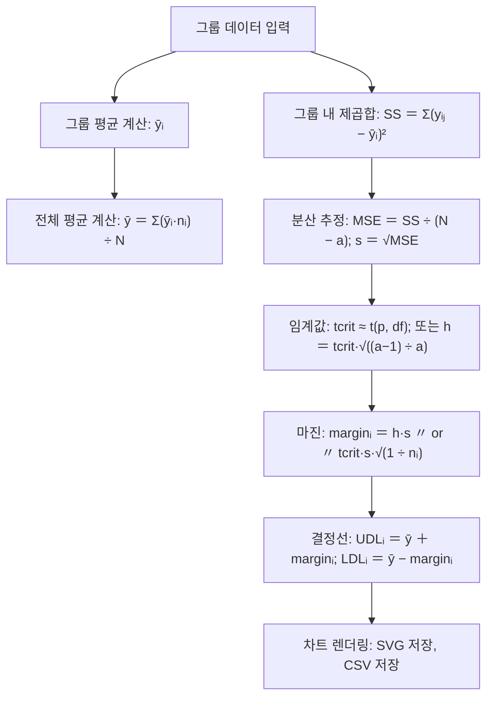

## Anom pipeline class in C++
- 아래 클래스는 데이터를 그룹별로 넣기만 하면 내부에서:
  - 그룹화 및 평균 계산
  - 그룹 내 분산(pooled within-group variance) 추정
  - ANOM 결정선(UDL/LDL) 계산
  - 결과 질의 및 저장
  - 간단한 차트 산출(SVG 및 CSV)
- 까지 처리합니다. 그룹별 샘플 수가 균등/비균등인 경우를 모두 지원합니다.

## Features
- 입력: 그룹 이름과 값 벡터
- 처리: 평균, 분산(MSE), grand mean, UDL/LDL
- 옵션: 유의수준, h-계산 방식(equal-n/unequal-n), Bonferroni 보정
- 출력: 결과 질의, CSV 저장, SVG ANOM Chart 렌더링(간단 스타일)

### 흐름도



## 🔎 그룹 A, B, C의 의미
- 그룹 = 요인 수준 조합
  - 예를 들어, 요인 1이 “온도”, 요인 2가 “압력”이라고 하면,
  - 그룹 A: 온도=저, 압력=저
  - 그룹 B: 온도=저, 압력=고
  - 그룹 C: 온도=고, 압력=저
- 이런 식으로 각 그룹은 특정 조건 조합을 나타냅니다.
- 실험 결과 데이터는 각 그룹 조건에서 반복 측정한 값들입니다.
  - 그래서 그룹별 평균은 **그 조건에서의 성능/품질 지표** 를 의미합니다.

## 📊 ANOM에서 그룹 구별 방식
- 그룹 A, B, C는 실험 설계에서 정해진 요인 조합으로 구별됩니다.
  - ANOM은 각 그룹 평균을 전체 평균과 비교해서,
  - 어떤 조건 조합이 평균보다 유의하게 높은지(UDL 초과)
  - 어떤 조건 조합이 평균보다 유의하게 낮은지(LDL 미만)
- 를 판정합니다.
- 따라서 그룹 이름(A, B, C)은 단순히 **라벨(label)** 이고, 실제 구별은 조건 조합에 의해 이루어집니다.

## ✅ 정리
- 다구치 실험에서는 요인 × 수준 조합이 그룹을 정의합니다.
- 그룹 A, B, C는 각각 다른 조건 조합을 의미하며,
- ANOM 분석에서는 이 그룹 평균을 전체 평균과 비교해 조건 효과를 판정합니다.

## 결과의 의미
A, B, C 그룹으로 들어가는 데이터는 다구치 실험에서 설정한 인자(요인)와 수준(조건)의 조합에 따라 얻어진 
**하나의 동일한 지표(response)** 라고 이해하면 됩니다.

## 🔎 정리해보면
- 인자(factor): 실험에서 조절하는 변수 (예: 온도, 압력, 시간 등)
- 수준(level): 각 인자의 설정값 (예: 온도=50℃, 압력=100bar)
- 그룹(Group A, B, C): 특정 인자 수준 조합을 의미
- 반응(response): 그 조건에서 측정된 결과값 (예: 강도, 수율, 효율 등)
- 즉,
- 그룹 A, B, C는 조건이 다른 실험 조합이고,
- 각 그룹에서 얻은 데이터는 같은 종류의 지표를 측정한 값입니다.
- 그래서 ANOM이나 Response Surface 분석에서는 그룹별 평균을 비교하거나 조건에 따른 반응 곡면을 적합하는 것이 가능합니다.

## ✅ 예시
- 인자1: 온도 (50, 60)
- 인자2: 압력 (100, 120)

| 그룹 | 조건(온도, 압력) | 측정 지표(예: 강도) |
|------|-----------------|---------------------|
| A    | (50, 100)       | 12.3, 12.1, 12.5   |
| B    | (60, 100)       | 13.0, 13.2, 13.1   |
| C    | (50, 120)       | 11.8, 11.9, 12.0   |

→ 여기서 강도라는 동일한 지표를 조건별로 측정한 것이고, 그룹은 단지 조건 조합을 구분하는 라벨입니다.
- 👉 결론: A, B, C 그룹 데이터는 모두 같은 종류의 값(동일 지표)이고, 단지 실험 조건이 달라서 그룹으로 구분된 것.

---

## 소스 코드
```cpp
#pragma once
#include <vector>
#include <string>
#include <stdexcept>
#include <cmath>
#include <limits>
#include <algorithm>
#include <sstream>
#include <fstream>

namespace stat_util {

// -----------------------------------------------------------------------------
// Standard normal quantile (Moro/Wichura 계열 근사)
// -----------------------------------------------------------------------------
// p in (0,1) 에 대해 z = Phi^{-1}(p)를 근사
inline double normal_quantile_approx(double p) {
    if (p <= 0.0 || p >= 1.0)
        throw std::runtime_error("normal_quantile_approx: p must be in (0,1)");

    // Coefficients for approximation
    static const double a1 = -3.969683028665376e+01;
    static const double a2 =  2.209460984245205e+02;
    static const double a3 = -2.759285104469687e+02;
    static const double a4 =  1.383577518672690e+02;
    static const double a5 = -3.066479806614716e+01;
    static const double a6 =  2.506628277459239e+00;

    static const double b1 = -5.447609879822406e+01;
    static const double b2 =  1.615858368580409e+02;
    static const double b3 = -1.556989798598866e+02;
    static const double b4 =  6.680131188771972e+01;
    static const double b5 = -1.328068155288572e+01;

    static const double c1 = -7.784894002430293e-03;
    static const double c2 = -3.223964580411365e-01;
    static const double c3 = -2.400758277161838e+00;
    static const double c4 = -2.549732539343734e+00;
    static const double c5 =  4.374664141464968e+00;
    static const double c6 =  2.938163982698783e+00;

    static const double d1 =  7.784695709041462e-03;
    static const double d2 =  3.224671290700398e-01;
    static const double d3 =  2.445134137142996e+00;
    static const double d4 =  3.754408661907416e+00;

    double q, r;
    if (p < 0.02425) {
        // lower region
        q = std::sqrt(-2.0 * std::log(p));
        return (((((c1*q + c2)*q + c3)*q + c4)*q + c5)*q + c6) /
               ((((d1*q + d2)*q + d3)*q + d4)*q + 1.0);
    } else if (p > 1.0 - 0.02425) {
        // upper region
        q = std::sqrt(-2.0 * std::log(1.0 - p));
        return -(((((c1*q + c2)*q + c3)*q + c4)*q + c5)*q + c6) /
                 ((((d1*q + d2)*q + d3)*q + d4)*q + 1.0);
    } else {
        // central region
        q = p - 0.5;
        r = q * q;
        return (((((a1*r + a2)*r + a3)*r + a4)*r + a5)*r + a6) * q /
               (((((b1*r + b2)*r + b3)*r + b4)*r + b5)*r + 1.0);
    }
}

// -----------------------------------------------------------------------------
// Student t quantile approx
// p in (0,1), df > 0, t_p(df) 근사
// -----------------------------------------------------------------------------
inline double student_t_quantile_approx(double p, double df) {
    if (df <= 0.0)
        throw std::runtime_error("student_t_quantile_approx: df must be > 0");
    double z = normal_quantile_approx(p);
    if (df > 30.0)
        return z;
    double z3 = z * z * z;
    return z + (z3 + z) / (4.0 * df); // 간단한 작은 df 보정
}

// -----------------------------------------------------------------------------
// Bonferroni 기반 ANOM h (equal-n case)
// a: 그룹 수, n: 그룹당 샘플 수, df: within-group 자유도
// -----------------------------------------------------------------------------
inline double anom_h_bonferroni_equal_n(double alpha, int a, int n, int df) {
    if (alpha <= 0.0 || alpha >= 1.0)
        throw std::runtime_error("anom_h_bonferroni_equal_n: alpha in (0,1)");
    if (a <= 1 || n <= 0 || df <= 0)
        throw std::runtime_error("anom_h_bonferroni_equal_n: invalid a/n/df");

    double alpha_per_group = alpha / static_cast<double>(a);
    double p = 1.0 - alpha_per_group / 2.0; // two-sided
    double tcrit = student_t_quantile_approx(p, static_cast<double>(df));

    // 클래식 ANOM 문헌에서 나오는 sqrt((a-1)/a) 스케일
    return tcrit * std::sqrt(static_cast<double>(a - 1) / a);
}

// -----------------------------------------------------------------------------
// Bonferroni 기반 t_crit (unequal-n case) – 그룹별 margin은 sqrt(1/n_i)로 처리
// -----------------------------------------------------------------------------
inline double anom_tcrit_bonferroni(double alpha, int a, int df) {
    if (alpha <= 0.0 || alpha >= 1.0)
        throw std::runtime_error("anom_tcrit_bonferroni: alpha in (0,1)");
    if (a <= 1 || df <= 0)
        throw std::runtime_error("anom_tcrit_bonferroni: invalid a/df");
    double alpha_per_group = alpha / static_cast<double>(a);
    double p = 1.0 - alpha_per_group / 2.0;
    return student_t_quantile_approx(p, static_cast<double>(df));
}

} // namespace stat_util

// ============================================================================
// ANOM 메인 구조체들
// ============================================================================

struct AnomOptions {
    double alpha = 0.05;          // 전체 유의수준
    bool assume_equal_n = true;   // true → 모든 그룹 n이 같으면 equal-n ANOM 공식 사용
    bool bonferroni = true;       // true → 그룹수에 대한 Bonferroni 보정

    // SVG 옵션
    double svg_width = 900.0;
    double svg_height = 500.0;
    double svg_margin = 60.0;
};

struct AnomGroupResult {
    std::string name;
    int n = 0;
    double mean = std::numeric_limits<double>::quiet_NaN();
    double margin = std::numeric_limits<double>::quiet_NaN();
    double UDL = std::numeric_limits<double>::quiet_NaN();
    double LDL = std::numeric_limits<double>::quiet_NaN();
    bool significant_high = false;
    bool significant_low = false;
};

class Anom {
public:
    explicit Anom(AnomOptions opt = {}) : opt_(opt) {}

    // 그룹 추가 (vector 버전)
    void add_group(const std::string& name, const std::vector<double>& values) {
        if (values.empty()) throw std::runtime_error("Anom::add_group: group has no values: " + name);
        groups_.push_back({name, values});
        computed_ = false;
    }

    // 그룹 추가 (initializer_list 버전)
    void add_group(const std::string& name, std::initializer_list<double> values) {
        if (values.size() == 0) throw std::runtime_error("Anom::add_group: group has no values: " + name);
        groups_.push_back({name, std::vector<double>(values)});
        computed_ = false;
    }

    // 전체 초기화
    void clear() {
        groups_.clear();
        results_.clear();
        computed_ = false;
        grand_mean_ = mse_ = s_within_ = std::numeric_limits<double>::quiet_NaN();
    }

    // -------------------------------------------------------------------------
    // 핵심: ANOM 계산
    // -------------------------------------------------------------------------
    void fit() {
        if (groups_.empty())
            throw std::runtime_error("Anom::fit: no groups to fit");

        int a = static_cast<int>(groups_.size());
        std::vector<double> means(a);
        std::vector<int> ns(a);

        int N = 0;
        for (int i = 0; i < a; ++i) {
            const auto& v = groups_[i].values;
            ns[i] = static_cast<int>(v.size());
            N += ns[i];
            double s = 0.0;
            for (double x : v) s += x;
            means[i] = s / ns[i];
        }

        // Grand mean (weighted)
        double grand_sum = 0.0;
        for (int i = 0; i < a; ++i) grand_sum += means[i] * ns[i];
        grand_mean_ = grand_sum / static_cast<double>(N);

        // Pooled within-group variance (MSE)
        int df_within = 0;
        double ss_within = 0.0;
        for (int i = 0; i < a; ++i) {
            const auto& v = groups_[i].values;
            double mi = means[i];
            for (double x : v) {
                double d = x - mi;
                ss_within += d * d;
            }
            df_within += (ns[i] - 1);
        }
        if (df_within <= 0)
            throw std::runtime_error("Anom::fit: insufficient degrees of freedom");
        mse_ = ss_within / static_cast<double>(df_within);
        s_within_ = std::sqrt(mse_);

        // Margin 계산 준비
        results_.clear();
        results_.reserve(a);

        bool equal_n = opt_.assume_equal_n && all_equal(ns);
        double h = std::numeric_limits<double>::quiet_NaN();
        double tcrit = std::numeric_limits<double>::quiet_NaN();

        if (opt_.bonferroni) {
            if (equal_n) {
                // equal-n ANOM: h 사용
                h = stat_util::anom_h_bonferroni_equal_n(opt_.alpha, a, ns[0], df_within);
            } else {
                // unequal-n: tcrit 사용
                tcrit = stat_util::anom_tcrit_bonferroni(opt_.alpha, a, df_within);
            }
        } else {
            // Bonferroni 없이: 두쪽 검정용 tcrit
            double p = 1.0 - opt_.alpha / 2.0;
            tcrit = stat_util::student_t_quantile_approx(p, static_cast<double>(df_within));
        }

        for (int i = 0; i < a; ++i) {
            AnomGroupResult r;
            r.name = groups_[i].name;
            r.n = ns[i];
            r.mean = means[i];

            double margin_i = 0.0;
            if (equal_n && !std::isnan(h)) {
                // equal-n ANOM: margin_i = h * s * sqrt(1/n_i)
                margin_i = h * s_within_ * std::sqrt(1.0 / ns[i]);
            } else {
                // 일반 t 기반 margin: tcrit * s * sqrt(1/n_i)
                margin_i = tcrit * s_within_ * std::sqrt(1.0 / ns[i]);
            }

            r.margin = margin_i;
            r.UDL = grand_mean_ + margin_i;
            r.LDL = grand_mean_ - margin_i;
            r.significant_high = (r.mean > r.UDL);
            r.significant_low  = (r.mean < r.LDL);

            results_.push_back(r);
        }

        computed_ = true;
    }

    // Grand mean
    double grand_mean() const { ensure_computed(); return grand_mean_; }

    // s_within (pooled within-group std)
    double s_within() const { ensure_computed(); return s_within_; }

    // 모든 그룹 결과
    const std::vector<AnomGroupResult>& results() const { ensure_computed(); return results_; }

    // CSV 저장
    void save_csv(const std::string& path) const {
        ensure_computed();
        std::ofstream ofs(path);
        if (!ofs) throw std::runtime_error("Anom::save_csv: cannot open file: " + path);
        ofs << "group,n,mean,margin,UDL,LDL,significant_high,significant_low\n";
        for (const auto& r : results_) {
            ofs << r.name << ","
                << r.n << ","
                << r.mean << ","
                << r.margin << ","
                << r.UDL << ","
                << r.LDL << ","
                << (r.significant_high ? 1 : 0) << ","
                << (r.significant_low  ? 1 : 0) << "\n";
        }
    }

    // SVG로 ANOM chart 렌더링
    std::string render_svg() const {
        ensure_computed();
        const double W = opt_.svg_width;
        const double H = opt_.svg_height;
        const double M = opt_.svg_margin;
        const double plotW = W - 2 * M;
        const double plotH = H - 2 * M;

        // y-range 결정
        double ymin = grand_mean_, ymax = grand_mean_;
        for (const auto& r : results_) {
            ymin = std::min({ymin, r.mean, r.LDL});
            ymax = std::max({ymax, r.mean, r.UDL});
        }
        double span = (ymax - ymin);
        if (span <= 0.0) span = 1.0;
        double pad = 0.05 * span;
        ymin -= pad; ymax += pad;

        auto y_to_px = [&](double y) {
            double t = (y - ymin) / (ymax - ymin);
            return H - M - t * plotH;
        };

        int a = static_cast<int>(results_.size());
        auto x_for_i = [&](int i) {
            double t = (a == 1 ? 0.5 : static_cast<double>(i) / (a - 1));
            return M + t * plotW;
        };

        std::ostringstream ss;
        ss << "<svg xmlns=\"http://www.w3.org/2000/svg\" width=\"" << W
           << "\" height=\"" << H << "\">\n";

        // 배경 및 축
        ss << "<rect x=\"0\" y=\"0\" width=\"" << W << "\" height=\"" << H
           << "\" fill=\"#ffffff\"/>\n";
        ss << "<line x1=\"" << M << "\" y1=\"" << H - M << "\" x2=\"" << W - M
           << "\" y2=\"" << H - M << "\" stroke=\"#000\"/>\n"; // X축
        ss << "<line x1=\"" << M << "\" y1=\"" << M << "\" x2=\"" << M
           << "\" y2=\"" << H - M << "\" stroke=\"#000\"/>\n"; // Y축

        // grand mean
        ss << "<line x1=\"" << M << "\" y1=\"" << y_to_px(grand_mean_) << "\" x2=\"" << W - M
           << "\" y2=\"" << y_to_px(grand_mean_) << "\" stroke=\"#1f77b4\" stroke-dasharray=\"6,4\"/>\n";

        // 전체 min LDL / max UDL 강조 라인
        double minLDL = std::numeric_limits<double>::infinity();
        double maxUDL = -std::numeric_limits<double>::infinity();
        for (const auto& r : results_) {
            minLDL = std::min(minLDL, r.LDL);
            maxUDL = std::max(maxUDL, r.UDL);
        }
        ss << "<line x1=\"" << M << "\" y1=\"" << y_to_px(maxUDL) << "\" x2=\"" << W - M
           << "\" y2=\"" << y_to_px(maxUDL) << "\" stroke=\"#d62728\" stroke-width=\"1.5\"/>\n";
        ss << "<line x1=\"" << M << "\" y1=\"" << y_to_px(minLDL) << "\" x2=\"" << W - M
           << "\" y2=\"" << y_to_px(minLDL) << "\" stroke=\"#2ca02c\" stroke-width=\"1.5\"/>\n";

        // 그룹 포인트 & 그룹별 UDL/LDL tick
        for (int i = 0; i < a; ++i) {
            const auto& r = results_[i];
            double x = x_for_i(i);
            double y = y_to_px(r.mean);
            std::string color = (r.significant_high ? "#d62728"
                              : (r.significant_low ? "#2ca02c" : "#555555"));
            double radius = 5.0;

            // mean 포인트
            ss << "<circle cx=\"" << x << "\" cy=\"" << y << "\" r=\"" << radius
               << "\" fill=\"" << color << "\"/>\n";

            // 그룹별 UDL/LDL tick
            double yUDL = y_to_px(r.UDL);
            double yLDL = y_to_px(r.LDL);
            ss << "<line x1=\"" << x - 12 << "\" y1=\"" << yUDL << "\" x2=\"" << x + 12
               << "\" y2=\"" << yUDL << "\" stroke=\"#d62728\"/>\n";
            ss << "<line x1=\"" << x - 12 << "\" y1=\"" << yLDL << "\" x2=\"" << x + 12
               << "\" y2=\"" << yLDL << "\" stroke=\"#2ca02c\"/>\n";

            // 그룹 라벨
            ss << "<text x=\"" << x << "\" y=\"" << (H - M + 18)
               << "\" font-size=\"12\" text-anchor=\"middle\" fill=\"#000\">" << r.name << "</text>\n";
        }

        // y축 눈금 (최대, grand, 최소)
        ss << "<text x=\"" << (M - 8) << "\" y=\"" << y_to_px(ymax)
           << "\" font-size=\"11\" text-anchor=\"end\">" << round2(ymax) << "</text>\n";
        ss << "<text x=\"" << (M - 8) << "\" y=\"" << y_to_px(grand_mean_)
           << "\" font-size=\"11\" text-anchor=\"end\">" << round2(grand_mean_) << "</text>\n";
        ss << "<text x=\"" << (M - 8) << "\" y=\"" << y_to_px(ymin)
           << "\" font-size=\"11\" text-anchor=\"end\">" << round2(ymin) << "</text>\n";

        ss << "</svg>\n";
        return ss.str();
    }

private:
    struct Group {
        std::string name;
        std::vector<double> values;
    };

    static bool all_equal(const std::vector<int>& ns) {
        for (size_t i = 1; i < ns.size(); ++i)
            if (ns[i] != ns[0]) return false;
        return true;
    }

    static double round2(double x) {
        return std::round(x * 100.0) / 100.0;
    }

    void ensure_computed() const {
        if (!computed_)
            throw std::runtime_error("Anom: fit() has not been called");
    }

    AnomOptions opt_;
    std::vector<Group> groups_;
    bool computed_ = false;

    // 결과
    double grand_mean_ = std::numeric_limits<double>::quiet_NaN();
    double mse_        = std::numeric_limits<double>::quiet_NaN();
    double s_within_   = std::numeric_limits<double>::quiet_NaN();
    std::vector<AnomGroupResult> results_;
};

```

---
## 테스트 코드
```cpp

int main() {
    AnomOptions opt;
    opt.alpha = 0.05;
    opt.assume_equal_n = false; // allow unequal-n margins
    opt.bonferroni = true;

    Anom anom(opt);
    anom.add_group("A", {9.9, 10.1, 10.0, 9.8});
    anom.add_group("B", {10.5, 10.6, 10.4, 10.7, 10.3});
    anom.add_group("C", {9.7, 9.6, 9.9});
    anom.fit();

    std::cout << "Grand mean: " << anom.grand_mean() << "\n";
    std::cout << "s_within:   " << anom.s_within() << "\n";

    for (const auto& r : anom.results()) {
        std::cout << r.name << " n=" << r.n
                  << " mean=" << r.mean
                  << " margin=" << r.margin
                  << " UDL=" << r.UDL
                  << " LDL=" << r.LDL
                  << " high=" << r.significant_high
                  << " low="  << r.significant_low << "\n";
    }

    // Save CSV
    anom.save_csv("anom_results.csv");

    // Save SVG chart
    std::string svg = anom.render_svg();
    std::ofstream("anom_chart.svg") << svg;

    return 0;
}
```
### 출력 결과
```
Grand mean: 10.125
s_within:   0.147824
A n=4 mean=9.95 margin=0.210028 UDL=10.335 LDL=9.91497 high=0 low=0
B n=5 mean=10.5 margin=0.187854 UDL=10.3129 LDL=9.93715 high=1 low=0
C n=3 mean=9.73333 margin=0.242519 UDL=10.3675 LDL=9.88248 high=0 low=1
```

## 테스트 코드
```cpp
#include "Anom_Utils.h"
#include <iostream>

void test_equal_n_simple() {
    std::cout << "=== test_equal_n_simple (4 groups, equal n) ===\n";

    AnomOptions opt;
    opt.alpha = 0.05;
    opt.assume_equal_n = true;  // equal-n ANOM 공식 사용
    opt.bonferroni = true;

    Anom anom(opt);

    // 그룹 4개, 각 8개 샘플 (equal-n)
    anom.add_group("G1", { 10.0, 10.2,  9.9, 10.1, 10.0, 10.1,  9.8, 10.0 });
    anom.add_group("G2", { 10.5, 10.6, 10.4, 10.7, 10.5, 10.4, 10.6, 10.5 }); // HIGH
    anom.add_group("G3", {  9.7,  9.8,  9.6,  9.7,  9.7,  9.8,  9.6,  9.7 }); // LOW
    anom.add_group("G4", { 10.1, 10.2, 10.0, 10.1, 10.2, 10.0, 10.1, 10.1 });

    anom.fit();

    std::cout << "Grand mean = " << anom.grand_mean() << "\n";
    std::cout << "s_within   = " << anom.s_within() << "\n";

    for (const auto& r : anom.results()) {
        std::cout << r.name
                  << " n=" << r.n
                  << " mean=" << r.mean
                  << " margin=" << r.margin
                  << " UDL=" << r.UDL
                  << " LDL=" << r.LDL
                  << " high=" << r.significant_high
                  << " low="  << r.significant_low
                  << "\n";
    }

    anom.save_csv("anom_equal_n.csv");
    std::string svg = anom.render_svg();
    std::ofstream("anom_equal_n.svg") << svg;
}

void test_unequal_n() {
    std::cout << "\n=== test_unequal_n (3 groups, different n) ===\n";

    AnomOptions opt;
    opt.alpha = 0.05;
    opt.assume_equal_n = true;  // true여도 n이 다르면 내부에서 unequal-n 처리
    opt.bonferroni = true;

    Anom anom(opt);

    // 그룹별 sample size 다르게
    anom.add_group("A", { 9.9, 10.1, 10.0,  9.8 });                  // n=4
    anom.add_group("B", {10.5, 10.6, 10.4, 10.7, 10.3, 10.6 });      // n=6
    anom.add_group("C", { 9.7,  9.6,  9.9 });                        // n=3

    anom.fit();

    std::cout << "Grand mean = " << anom.grand_mean() << "\n";
    std::cout << "s_within   = " << anom.s_within() << "\n";

    for (const auto& r : anom.results()) {
        std::cout << r.name
                  << " n=" << r.n
                  << " mean=" << r.mean
                  << " margin=" << r.margin
                  << " UDL=" << r.UDL
                  << " LDL=" << r.LDL
                  << " high=" << r.significant_high
                  << " low="  << r.significant_low
                  << "\n";
    }

    anom.save_csv("anom_unequal_n.csv");
    std::string svg = anom.render_svg();
    std::ofstream("anom_unequal_n.svg") << svg;
}

void test_no_bonferroni() {
    std::cout << "\n=== test_no_bonferroni (equal n, no Bonferroni) ===\n";

    AnomOptions opt;
    opt.alpha = 0.05;
    opt.assume_equal_n = true;
    opt.bonferroni = false;   // Bonferroni 보정 없이 tcrit 한 번만 사용

    Anom anom(opt);

    anom.add_group("G1", {10.0, 10.1,  9.9, 10.0});
    anom.add_group("G2", {10.4, 10.5, 10.6, 10.5});
    anom.add_group("G3", { 9.7,  9.8,  9.6,  9.7});
    anom.add_group("G4", {10.2, 10.3, 10.1, 10.2});

    anom.fit();

    std::cout << "Grand mean = " << anom.grand_mean() << "\n";
    std::cout << "s_within   = " << anom.s_within() << "\n";

    for (const auto& r : anom.results()) {
        std::cout << r.name
                  << " n=" << r.n
                  << " mean=" << r.mean
                  << " margin=" << r.margin
                  << " UDL=" << r.UDL
                  << " LDL=" << r.LDL
                  << " high=" << r.significant_high
                  << " low="  << r.significant_low
                  << "\n";
    }

    anom.save_csv("anom_no_bonferroni.csv");
    std::string svg = anom.render_svg();
    std::ofstream("anom_no_bonferroni.svg") << svg;
}

int main() {
    try {
        test_equal_n_simple();
        test_unequal_n();
        test_no_bonferroni();
    }
    catch (const std::exception& ex) {
        std::cerr << "Exception: " << ex.what() << "\n";
        return 1;
    }
    return 0;
}
```
### 출력 결과
```
=== test_equal_n_simple (4 groups, equal n) ===
Grand mean = 10.0844
s_within   = 0.0970548
G1 n=8 mean=10.0125 margin=0.079021 UDL=10.1634 LDL=10.0054 high=0 low=0
G2 n=8 mean=10.525 margin=0.079021 UDL=10.1634 LDL=10.0054 high=1 low=0
G3 n=8 mean=9.7 margin=0.079021 UDL=10.1634 LDL=10.0054 high=0 low=1
G4 n=8 mean=10.1 margin=0.079021 UDL=10.1634 LDL=10.0054 high=0 low=0

=== test_unequal_n (3 groups, different n) ===
Grand mean = 10.2556
s_within   = 0.148805
B n=6 mean=10.5167 margin=0.165458 UDL=10.421 LDL=10.0901 high=1 low=0
C n=3 mean=9.73333 margin=0.233993 UDL=10.4895 LDL=10.0216 high=0 low=1

=== test_no_bonferroni (equal n, no Bonferroni) ===
Grand mean = 10.1
s_within   = 0.0816497
G1 n=4 mean=10 margin=0.0880858 UDL=10.1881 LDL=10.0119 high=0 low=1
G2 n=4 mean=10.5 margin=0.0880858 UDL=10.1881 LDL=10.0119 high=1 low=0
G3 n=4 mean=9.7 margin=0.0880858 UDL=10.1881 LDL=10.0119 high=0 low=1
G4 n=4 mean=10.2 margin=0.0880858 UDL=10.1881 LDL=10.0119 high=1 low=0
```
